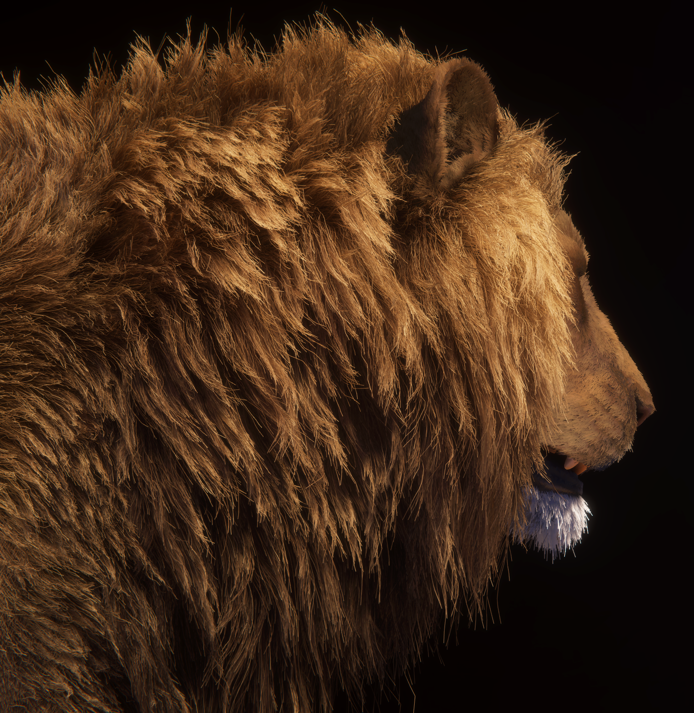
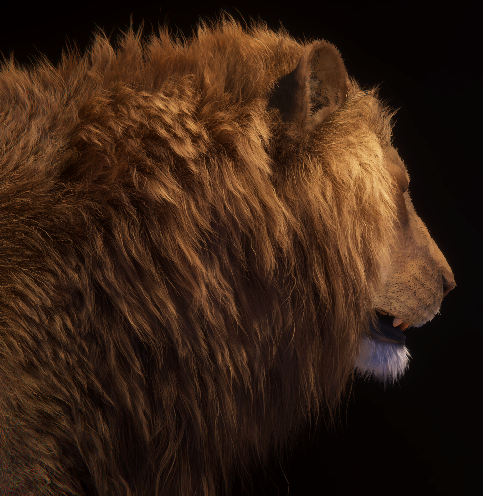

# Understand high quality line rendering

Rendering line topology via traditional hardware rasterization, for example to represent hair or fur, can easily suffer from image quality problems.

Use the **High Quality Line Rendering** override to draw line geometry with analytic anti-aliasing and transparent sorting.

An example of hardware lines.

An example of high quality lines.

The High Quality Line Renderer is a line segment software rasterizer designed for fast, high quality transparency and anti-aliasing.

Outlined below are the general steps of this raster algorithm.

1. The camera's view frustum is divided into many clusters. A single cluster is 8 pixels wide by 8 pixels high. The length is derived from the **Cluster Count**.
2. Each cluster computes a list of the visible line segments that intersect with it.
3. Clusters are processed in front-to-back order. For each cluster, the segment list is unpacked and sorted from front-to-back, and the **Sorting Quality** determines the maximum amount of segments sorted in a single cluster.
4. The sorted segment list is processed. For each segment pixel, HDRP computes the shading contribution, computes the analytically anti-aliased coverage mask, and blends the fragment behind the final tile result.
5. HDRP computes the average opacity of the tile. If the average opacity is greater than the **Tile Opacity Threshold**, the tile is complete. A threshold lower than 1.0 can greatly improve performance. 
6. HDRP repeats steps 3 to 5 until all tiles have been processed.

Refer to [Use high quality line rendering](use-high-quality-line-rendering.md) for more information.
