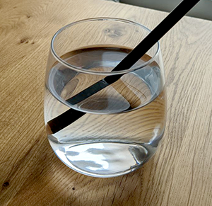

# Understand refraction

Refraction is when light bends as it passes from one material ('medium') into another. Your eye can see refraction only through a transparent material, because most light is absorbed or reflected in opaque materials.

Light rays bend as they travel through the different mediums of air, water, and glass, so the pencil appears deformed.

## How refraction works in HDRP

HDRP needs to find the color that's visible through each transparent pixel on an object. For each transparent pixel, HDRP starts from the Camera position, and follows the reverse direction of light to calculate how light is bent:

1. HDRP finds the view vector, which is the direction of light from the camera to the pixel.
2. When the light enters the object, HDRP bends the light. To calculate how much the light bends and how far it travels inside the object, HDRP uses simple shapes that approximate the object's internal dimensions (the [refraction model](refraction-models.md)), and the Material's [Surface Type](Surface-Type.md) settings.
3. When the light leaves the object, HDRP bends the light back, based on the simple shape that approximates the object's internal dimensions.
4. HDRP uses the intersection of the light with a [Proxy Volume](Reflection-Proxy-Volume.md) that contains a projection of the rendered scene, to find the color that's visible through the transparent pixel.

## Additional resources

- [Create a refractive Material](create-a-refractive-material.md)
- [Refraction models](refraction-models.md)
- [How HDRP calculates color for reflection and refraction](how-hdrp-calculates-color-for-reflection-and-refraction.md)
