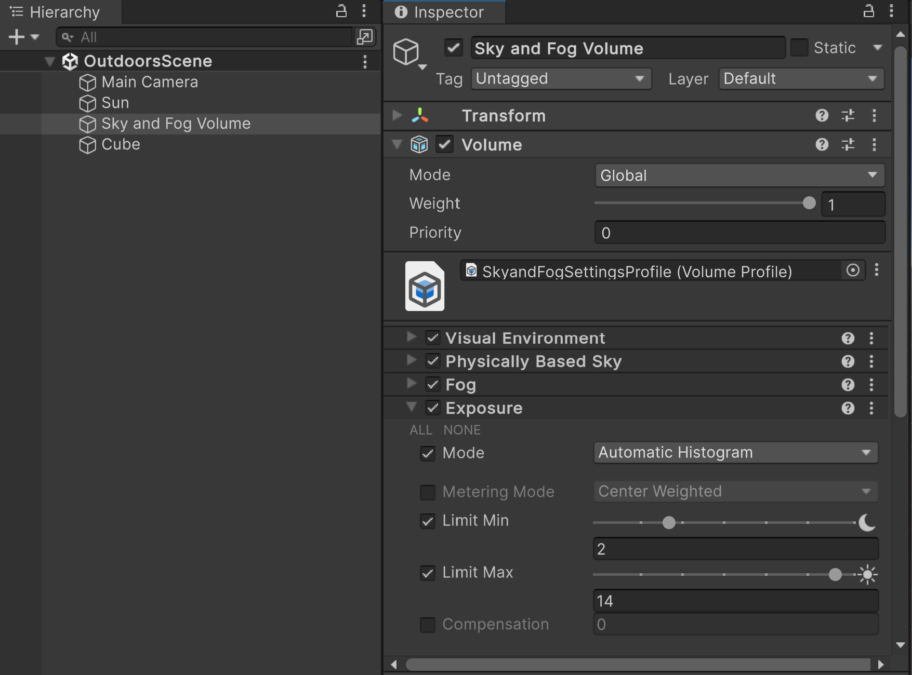

# Understand Volumes

The High Definition Render Pipeline (HDRP) uses volumes. Volumes allow you to partition your scene into areas, so you can control lighting and effects depending on the camera position relative to each volume, rather than tuning an entire scene.

You can add a Volume component to any GameObject. A scene can contain multiple GameObjects with Volume components. You can add multiple Volume components to a GameObject.

At runtime, HDRP goes through all the enabled Volume components attached to active GameObjects in the scene, and determines each volume's contribution to the final scene settings. HDRP uses the camera position and the Volume component properties to calculate the contribution. HDRP interpolates values from all volumes with a non-zero contribution to calculate the final property values.

## Global and local volumes

There are two types of volume:

- Global volumes affect the camera everywhere in the scene.
- Local volumes affect the camera only if the camera is near the bounds of the collider on the parent GameObject.

Refer to [Set up a volume](set-up-a-volume.md) for more information.

## Volume Profiles and Volume Overrides

Each Volume component references a Volume Profile, which contains scene properties in one or more Volume Overrides. Each Volume Override controls different settings.

The default **Sky and Fog Volume** GameObject in a new HDRP project. The GameObject has a global volume. The Volume Profile has **Visual Environment**, **Physically Based Sky**, **Fog** and **Exposure** Volume Overrides.

Refer to the following for more information:

- [Create a Volume Profile](create-a-volume-profile.md)
- [Configure Volume Overrides](configure-volume-overrides.md)

## Default volumes

All HDRP scenes have two default global volumes:

- The Default Volume for your whole project, which uses the Volume Profile set in Project Settings > **Graphics** > **HDRP** > **Volume** > **Default Profile**.
- The global volume for the active quality level, which uses the Volume Profile set in the active [HDRP Asset](HDRP-Asset.md) > **Volumes** > **Volume Profile**.

HDRP sets the default volumes to the lowest priority, so any volume you add to a scene overrides them.

Refer to the following for more information:

- [Configure the Default Volume](set-up-a-volume.html#configure-the-default-volume)
- [Configure the global volume for a quality level](set-up-a-volume.html#configure-the-global-volume-for-a-quality-level)
