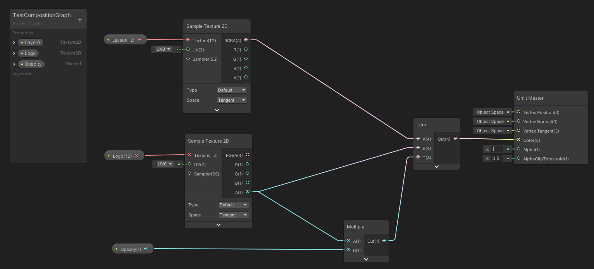
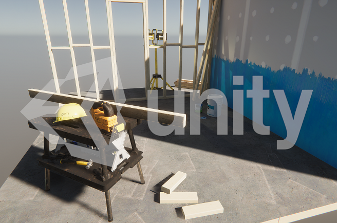

# Use the Graphics Compositor

Refer to [Understand the Graphics Compositor](understand-the-graphics-compositor.md) for more information about the Graphics Compositor.

## Open the Graphics Compositor window

To open the Graphics Compositor window in the Unity Editor, select **Window > Rendering > Graphics Compositor** from the menu. From this window, you can enable 
the Graphics Compositor and control its configuration.

The first time you enable the Graphics Compositor, it automatically uses a default pass-through composition profile that forwards the output of the main [Camera](hdrp-camera-component-reference.md) to the final composed frame. You can add more [Layers](#layer-types) to this profile and edit their properties or you can load another profile from disk. For information on the properties in the Compositor window, refer to [Graphics Compositor window reference](graphics-compositor-window-reference.md).

The composition output render in the Game view, while you can edit the scene in the Scene view. To have a live preview of the output, it's best practice to have the Scene view and Game view side-by-side, or undock the Game view from the Editor and put it on a separate monitor (if available).

If you set the Game view to show **Display 1**, , make sure the Graphics Compositor outputs (in the Compositor window) to **Display 1**. Furthermore, you should set any Cameras in the scene to output to other displays, such as **Display 2** or **Display 3**. This ensures that no unnecessary drawing operations occur and that there are no conflicts in the display output.

### Composition example

The following example uses the Graphics Compositor to render a watermark on top of a Unity Scene.



The composition graph.



The result.

## Alpha-based composition
Many compositing operations require an alpha channel. To use all features of the graphics compositor, it's recommended to:
* Set the color buffer format for Rendering to 16-bit half float (R16G16B16A16)
* Set the buffer format for post-processing to 16-bit half float (R16G16B16A16)

Both buffer format options are in the [HDRP Asset](HDRP-Asset.md). If the compositor detects a buffer format without an alpha channel, it displays a warning. For more information, seen [Alpha Output](Alpha-Output.md).

## Layer Types
The Graphics Compositor tool typically handles two types of layers:
* **Composition Layers**: The composition layers are the render targets (images) the compositor blends together to produce the final image. You can define them in the [Composition Graph](#composition-graph). The Composition Graph defines the number of layers and how to combine them but doesn't define each layer's content.
* **Sub-layers**: The sub-layers are responsible for generating the content of the composition layers. You can define them in the Graphics Compositor window, in the [Render Schedule](#render-schedule) section. You can stack multiple Sub-layers to define the content of a Composition Layer. In this case all Sub-layers share the same render target.


## Composition Graph
To produce the output image, the Graphics Compositor uses a graph of compositing operations that combine several Composition Layers. Specifically, the Graphics Compositor uses the [Shader Graph](https://docs.unity3d.com/Packages/com.unity.shadergraph@latest/index.html) with an [Unlit Master Node](https://docs.unity3d.com/Packages/com.unity.shadergraph@latest/index.html?subfolder=/manual/Unlit-Master-Node.html) as its target. To specify the output image, the Compositor uses the value you connect to the **Color** port. You don't need to connect any other ports on the Master Node.

**Note**: When the output of the composition is to a render target, the Material you create from the Master Node must be double-sided.

When you create a Composition Graph, there are two main types of input property you can expose:

* **Composition Layer**: Any **Texture2D** properties act as Composition Layers which correspond to a layer the graph composites to generate the final frame. These properties appear automatically as Composition Layers in the [Render Schedule](#render-schedule) section of the Graphics Compositor window. The **Mode** option for them in Shader Graph corresponds to the default value the Shader uses when you toggle off the visibility of the layer in the Render Schedule list.<br/> **Note**: By default, this value is set to white, but for many compositing operations and behaviors, you may want to set this to black instead.
* **Composition Parameters**: This refers to any exposed property that'sn't a Texture2D. Composition Parameters can control various aspects of the composition. Examples of Composition Parameters include a Float input to control the overall brightness or a Color input to tint a Texture2D. These properties appear automatically in the [Composition Parameters](#composition-parameters) section of the Graphics Compositor window.

The following graph contains examples of the property types described above. The **Logo** property is an example of a Composition Layer and the **Opacity** property is an example of an input property to control an aspect of the composition:


Unity saves the Graphics Compositor properties in a .asset file with the same name as the Composition Graph. When the Graphics Compositor loads a Composition Graph, it also loads the properties from the corresponding Asset file if one exists, otherwise, it creates a new Asset with default settings.

## Adding and removing Composition Layers
To add a new Composition Layer, create a new Texture2D input property in the [Composition Graph](#composition-graph). For convenience, you have to provide a short and indicative name (such as BackGround Layer) in the Reference field in the Node Settings of the Graph Inspector.
When you next save the Composition Graph, the new layer appears automatically in the [Render Schedule](#render-schedule) section of the Graphics Compositor window with the name that you have used as Reference. From there, you can control the [layer properties](graphics-compositor-window-reference.md#composition-layer-properties) and specify how to [fill the layer with content](#adding-content-to-composition-layers).

Similarly, to delete a Composition Layer, remove the corresponding Texture 2D property from the [Composition Graph](#composition-graph).

## Adding content to Composition Layers
Each Composition Layer can source its content from one or more Sub-layers. There are three types of Sub-layer:
* **Camera Sub-layer:** The source of the content is a Unity Camera. You can select which Camera to use in the properties of the Sub-layer.
* **Video Sub-layer:** The source of the content is a Unity Video Player. You can select which Video Player to use in the properties of the Sub-layer.
* **Image Sub-layer:** The source of the content is a static image. You can select which image to use in the properties of the Sub-layer.

To add a Sub-layer to a Composition Layer, select the Composition Layer and click the **Add** drop-down button. From the drop-down, you can select the type of Sub-layer.

To remove a Sub-layer, select the Sub-layer and click the **Delete** button.<br/>**Note**: You can only delete Sub-layers this way and not Composition Layers. Instead, to delete a Composition Layer, remove the corresponding Texture2D property from the Composition Graph.

## Post-Processing and Sub-Layers
Each one of the Sub-layers in a Composition Layer can have a unique set of post-processing effects. To configure this type of per-layer post-processing, you have to:
* Add a unique Volume in your scene for every Sub-Layer that requires unique post-processing effects.
* For each one of the Volumes, create and set a unique layer mask in the Unity Editor.
* In the properties of each Sub-Layer, override and set the appropriate volume mask.

When the compositor executes post-processing for a Sub-layer, the post-processing operations only affect pixels with an alpha value that's greater than zero. To ensure that post-processing only affects the pixels this Sub-layer drew, select the **Clear Alpha** option in the Sub-layer Properties. If you don't select the **Clear Alpha** option, then the post-processing also affects the Sub-layers that were drawn before the current one.

**Note**: Enabling resource-intensive post-processing effects (such as Depth of Field and Bloom) in multiple Sub-layers negatively impacts run-time performance. Therefore it's best practice to run post-processing for groups of layers when possible. To do this, use the **Clear Alpha** option in the Sub-layer Properties.

### Alpha-based composition and Bloom
The general rule for post-processing is that it only affects pixels with an alpha value greater than zero. An exception to this rule is the Bloom effect, where the glow that generates also spreads to pixels with zero alpha. However, only source pixels with an alpha that's greater than zero contribute to the bloom effect (with a contribution proportional to the alpha value).

## Camera Stacking
When you use more than one Sub-layer to specify the content of a Composition Layer, this "stacks" the Sub-layers on top of the same render target. To specify the size and format of the render target, you use the properties of the parent Composition Layer. The Sub-layers inherit the size and format from their parent Composition Layer and you can't change these properties independently for a particular Sub-layer. This means every stacked Camera/Sub-layer has the same size and format.

To change the stacking order, re-arrange the Sub-layers in the  [Render Schedule](#render-schedule) section of the Graphics Compositor window. The composition is depth-aware, which means that for layers with opaque surfaces, reordering the Sub-layers doesn't make any difference to the resulting image. This is as long as you don't select the Clear Depth option in the Sub-layer (which preserves depth between Sub-layers).

Choosing the correct order for a Sub-layer is important for elements that don't draw any depth (such as UI elements) and for getting proper screen-space reflections and transparency between layers. For example, a layer with semi-transparent UI elements that should render on top of the 3D world should appear last in the stacked sub-layers of a Composition Layer.

The [Sub-layer Properties](graphics-compositor-window-reference.md#sub-layer-properties) section controls the type of stacking operation.

## Render Schedule
The Render Schedule is a re-orderable list of Composition Layers and Sub-layers. Sub-layers appear indented below their corresponding parent Composition Layer, which makes it easier to see the hierarchical relationship. When multiple Sub-layers appear below a parent layer, they form a [camera stack](#camera-stacking). Unity renders layers at the top first. To re-order the list, you can click and move both Composition Layers and Sub-layers. You can use this to change the rendering order in a camera stack or move a Sub-layer from one parent Composition Layer to another.

## Composition Parameters
This section shows every exposed property that'sn't an input Composition Layer (for example, a Float to control the brightness of the final composition or a Color to tint a Texture2D). In this section, the window allows you to edit each property value outside of the Composition Graph. it's good practice to expose properties from the graph to the Graphics Compositor window, instead of hard-coding their values inside the Composition Graph. This helps you to share composition profiles between Projects because those you don't need to open the Composition Graph to edit any values.

## Composition of Screen Space UI
You can use the Graphics Compositor to compose screen space Canvas (UI) elements. When the Canvas uses the **Screen Space - Camera** render mode, you have to set the **Render Camera** (in the Canvas Inspector) to the Sub-layer camera that draws the UI. However, in this case, the camera Sub-layer that draws the UI:
* Should have a unique camera assigned to it. You shouldn't use this camera in any other sub-layer.
* Shouldn't override any camera state (antialiasing, culling mask, volume mask, etc). You can change these properties in the source camera that the sub-layer uses.

Furthermore, you can't use the **Output Camera** of the Graphics Compositor as the **Render Camera** to draw Canvas elements on top of the compositor's output. To achieve the same effect, you can add a new Sub-layer in the Render Schedule, use the camera of this layer as the **Render Camera** for the UI, and then compose the resulting layer with the available compositing operations (stacking or graph-bsed composition).

To use the **Screen Space - Overlay** render mode alongside the Graphics Compositor, you must make sure that the function to render the UI overlays is called by the engine, and not by SRP. If SRP calls the function, the Graphics Compositor's final compositing call overrides the UI. 

To force the engine to call the function rather than SRP, use the following line:

```
SupportedRenderingFeatures.active.rendersUIOverlay = false;
``` 

## Performance Considerations
The Graphics Compositor has a rather high CPU and GPU overhead and it's not recommended  to be used in performance critical applications such as video games.

Here are some tips that can help you improve the performance of applications that use the Graphics Compositor:

* Reduce the number of Sub-Layers in the Render Schedule. Every Sub-layer is internally using a unique camera. This is true even when you assign the same source camera to multiple Sub-layers in the UI.
* For Sub-layers that render simple objects:
    1. Select the source camera.
    2. In the Inspector select the **Custom Frame Settings**.
    3. Disable as many HDRP features as possible. For example you can disable the support for Screen Space Reflections (SSR) if you know that you aren't going to need SSR for this Sub-layer.
* Reduce the resolution of specific Composition Layers, while keeping the visually important elements in separate Layers at full resolution. This will affect all Sub-layers that are stacked on this Layer.
