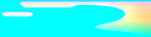
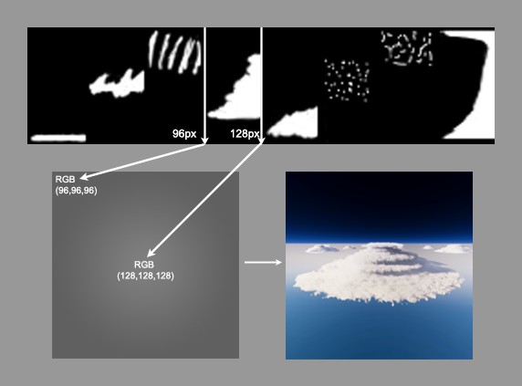

# Volumetric Clouds Volume Override reference

The Volumetric Clouds Volume Override lets you configure how HDRP renders volumetric clouds.

Refer to [Create realistic clouds (volumetric clouds)](create-realistic-clouds-volumetric-clouds.md) for more information.

## Properties

### General

| **Property** | **Description**                                       |
| ------------ | ----------------------------------------------------- |
| **State**        | When set to **Enabled**, HDRP renders volumetric clouds. |

### Shape

| **Property**                      | **Description**                                              |
| --------------------------------- | ------------------------------------------------------------ |
| **Cloud Control**                 | Specifies the mode to control volumetric cloud properties. The options are: &#8226; **Simple**: Uses sliders and input fields to customize volumetric cloud shape properties. This mode generates a cloud map from the various properties and uses HDRP's internal cloud lookup table. &#8226; **Advanced**: Uses separate Textures to specify each cloud type and their coverage. This mode generates a cloud map from the various Textures and uses HDRP's internal cloud lookup table. &#8226; **Manual**: Uses the cloud map and lookup table you supply to render the clouds. For more information on the cloud map and cloud lookup table, see [Cloud map and cloud lookup table](#cloud-map-and-cloud-lookup-table). |
| - **Cloud Preset**                | Specifies the preset to apply to the **Simple** mode properties. The options are:  &#8226; **Sparse**: Smaller clouds that are spread apart. &#8226; **Cloudy**: Medium-sized clouds that partially cover the sky. &#8226; **Overcast**: A light layer of cloud that covers the entire sky. Some areas are less dense and let more light through, whereas other areas are more dense and appear darker. &#8226; **Storm Clouds**: Large dark clouds that cover most of the sky. &#8226; **Custom**: Exposes properties that control the shape of the clouds.   This property only appears if you set **Cloud Control** to **Simple**. |
| - **Density Curve**        |  Controls the density (Y axis) of the volumetric clouds as a function of the height (X Axis) inside the cloud volume.   This property only appears if you set **Cloud Control** to **Simple**.|
| - **Erosion Curve**        |  Controls the erosion (Y axis) of the volumetric clouds as a function of the height (X Axis) inside the cloud volume.   This property only appears if you set **Cloud Control** to **Simple**.|
| - **Ambient Occlusion Curve**        |  Controls the ambient occlusion (Y axis) of the volumetric clouds as a function of the height (X Axis) inside the cloud volume.   This property only appears if you set **Cloud Control** to **Simple**.|
| - **Cumulus Map**                 | Specifies a Texture that defines the distribution of clouds in the lower layer.   This property only appears if you set **Cloud Control** to **Advanced**. |
| - **Cumulus Map Multiplier**      | The multiplier for the clouds specified in the **Cumulus Map**. A value of **0** completely hides the cumulus clouds.   This property only appears if you set **Cloud Control** to **Advanced**. |
| - **Alto Stratus Map**            | Specifies a Texture that defines the distribution of clouds in the higher layer.   This property only appears if you set **Cloud Control** to **Advanced**. |
| - **Alto Stratus Map Multiplier** | The multiplier for the clouds specified in the **Alto Stratus Map**. A value of **0** completely hides the alto stratus clouds.   This property only appears if you set **Cloud Control** to **Advanced**. |
| - **Cumulonimbus Map**            | Specifies a Texture that defines the distribution of anvil shaped cumulonimbus clouds.   This property only appears if you set **Cloud Control** to **Advanced**. |
| - **Cumulonimbus Map Multiplier** | The multiplier for the clouds specified in the **Cumulonimbus Map**. A value of **0** completely hides the cumulonimbus clouds.   This property only appears if you set **Cloud Control** to **Advanced**. |
| - **Rain Map**                    | Specifies a Texture that defines the distribution of rain in the clouds.   This property only appears if you set **Cloud Control** to **Advanced**. |
| - **Cloud Map Resolution**        | Specifies the resolution for the internal Texture HDRP uses for the cloud map. A lower resolution produces better performance, but less precise cloud type transitions.   This property only appears if you set **Cloud Control** to **Advanced**. |
| - **Cloud Map**                   | Specifies the cloud map to use for the volumetric clouds. For information on the format of this Texture, see [Cloud map and cloud lookup table](#cloud-map-and-cloud-lookup-table).   This property only appears if you set **Cloud Control** to **Custom**. |
| - **Cloud LUT**                   | Specifies the lookup table for the clouds. For information on the format of this Texture, see [Cloud map and cloud lookup table](#cloud-map-and-cloud-lookup-table).    This property only appears if you set **Cloud Control** to **Custom**. |
| - **Cloud Map Tiling**            | The **X** and **Y** UV tile rate for one or more cloud map Textures. HDRP uses the **X** and **Y** values to tile the clouds across the sky. When modifying those properties, cloud position is only maintained at the origin of the world (0,0,0).  If **Cloud Control** is set to **Advanced**, this affects **Cumulus Map**, **Alto Stratus Map**, **Cumulonimbus Map**, and **Rain Map**. If **Cloud Control** is set to **Custom**, this affects the Texture assigned to the **Cloud Map** property.  This property only appears if you set **Cloud Control** to **Advanced** or **Custom**. |
| - **Cloud Map Offset**            | The **X** and **Y** UV offset for one or more cloud map Textures. HDRP uses the **X** and **Y** values to offset the clouds across the sky. If **Cloud Control** is set to **Advanced**, this affects **Cumulus Map**, **Alto Stratus Map**, **Cumulonimbus Map**, and **Rain Map**. If **Cloud Control** is set to **Custom**, this affects the Texture assigned to the **Cloud Map** property.  This property only appears if you set **Cloud Control** to **Advanced** or **Custom**, or if you set it to **Simple** and then set **Cloud Preset** to **Custom**. |
| - **Density Multiplier**          | The global density of the volumetric clouds.   This property only appears if you set **Cloud Control** to **Advanced** or **Custom**, or if you set it to **Simple** and then set **Cloud Preset** to **Custom**. |
| - **Shape Factor**                | Controls the amount of shaping to apply to the cloud volume. A higher value produces less cloud coverage and smaller clouds.   This property only appears if you set **Cloud Control** to **Advanced** or **Custom**, or if you set it to **Simple** and then set **Cloud Preset** to **Custom**. |
| - **Shape Scale**                 | Controls the size of the noise HDRP uses in the shaping stage to generate the general cloud shapes.   This property only appears if you set **Cloud Control** to **Advanced** or **Custom**, or if you set it to **Simple** and then set **Cloud Preset** to **Custom**. |
| - **Shape Offset X**              | Controls the offset (world X-axis) applied when evaluating the larger noise passing through the cloud coverage. The values "0", "-1" and "1" will give the same result. |
| - **Shape Offset Y**              | Controls the offset (world Y-axis) applied when evaluating the larger noise passing through the cloud coverage. The values "0", "-1" and "1" will give the same result. |
| - **Shape Offset Z**              | Controls the offset (world Z-axis) applied when evaluating the larger noise passing through the cloud coverage. The values "0", "-1" and "1" will give the same result. |
| - **Erosion Factor**              | Controls the amount of erosion to apply on the edge of the clouds. A higher value erodes clouds more significantly.   This property only appears if you set **Cloud Control** to **Advanced** or **Custom**, or if you set it to **Simple** and then set **Cloud Preset** to **Custom**. |
| - **Erosion Scale**               | Controls the size of the noise HDRP uses in the erosion stage to add local details to the cloud edges.   This property only appears if you set **Cloud Control** to **Advanced** or **Custom**, or if you set it to **Simple** and then set **Cloud Preset** to **Custom**. |
| **Bottom Altitude**               | Controls the altitude of the bottom of the volumetric clouds volume in meters.|
| **Altitude Range**                | Controls the size of the volumetric clouds volume in meters. |
| **Fade In Mode**                  | Controls the mode in which the clouds fade in when close to the camera's near plane.|
| **Fade In Start**                 | Controls the minimal distance at which clouds start appearing.|
| **Fade In Distance**              | Controls the distance that it takes for the clouds to reach their complete density.|

### Wind

| **Property**                     | **Description**                                              |
| -------------------------------- | ------------------------------------------------------------ |
| **Global Horizontal Wind Speed**  | Sets the global horizontal wind speed in kilometers per hour. This value can be relative to the **Global Wind Speed** defined in the **Visual Environment**. |
| - **Orientation**                | Controls the orientation of the wind relative to the world-space direction x-axis. This value can be relative to the **Global Wind Orientation** defined in the **Visual Environment**. |
| - **Cloud Map Speed Multiplier** | The multiplier to apply to the speed of the cloud map.       |
| - **Shape Speed Multiplier**     | The multiplier to apply to the speed of larger cloud shapes. |
| - **Erosion Speed Multiplier**   | The multiplier to apply to the speed of erosion cloud shapes. |
| **Vertical Shape Wind Speed**    | Controls the vertical wind speed of the larger cloud shapes. |
| **Vertical Erosion Wind Speed**  | Controls the vertical wind speed of the erosion cloud shapes. |

### Quality

| **Property**                     | **Description**                                              |
| -------------------------------- | ------------------------------------------------------------ |
| **Temporal Accumulation Factor** | The amount of temporal accumulation to apply to the clouds. Temporal accumulation increases the visual quality of clouds by decreasing the noise. A higher value produces better quality clouds, but can create [ghosting](Glossary.md#ghosting). |
| **Ghosting Reduction**           | When you enable this property, HDRP removes the ghosting caused by temporal accumulation. This effect might cause a flickering effect when the **Temporal Accumulation Factor** value is low. |
| **Perceptual Blending**          | Blend the clouds with the environment. This might cause artifacts if the sky is overexposed. This setting only has an effect when you disable multi-sample antialiasing (MSAA). |
| **Num Primary Steps**            | The number of steps to use to evaluate the clouds' transmittance. Higher values linearly increase the resource intensity of the effect. |
| **Num Light Steps**              | The number of steps to use to evaluate the clouds' lighting. Higher values exponent increase the resource intensity of the effect. |

### Lighting

| **Property**                   | **Description**                                              |
| ------------------------------ | ------------------------------------------------------------ |
| **Ambient Light Probe Dimmer** | Controls the influence of light probes on the cloud volume. A lower value suppresses the ambient light and produces darker clouds overall. |
| **Sun Light Dimmer**           | Controls the influence of the sun light on the cloud volume. A lower value suppresses the sun light and produces darker clouds overall. |
| **Erosion Occlusion**          | Controls how much Erosion Factor is taken into account when computing ambient occlusion. The Erosion Factor parameter is editable in the custom preset, Advanced and Manual Modes. |
| **Scattering Tint**            | The color to tint the clouds.                                |
| **Powder Effect Intensity**    | Controls the amount of local scattering in the clouds. When clouds have a lot of local details due to erosion, a value of **1** provides a more powdery aspect. |
| **Multi Scattering**           | Controls the amount of multi-scattering inside the cloud. Higher values make lighting look more diffuse within the cloud. |

### Shadows

| **Property**                     | **Description**                                              |
| -------------------------------- | ------------------------------------------------------------ |
| **Shadows**                      | When enabled, HDRP evaluates the Volumetric Clouds' shadows. The Volumetric Clouds shadow is rendered independently of the shadow map toggle of the directional [Light](Light-Component.md). |
| - **Shadow Resolution**          | Specifies the resolution of the volumetric clouds shadow map. |
| - **Shadow Distance**            | The size of the area to render volumetric cloud shadows around the camera. |
| - **Shadow Opacity**             | The opacity of the volumetric cloud shadows.                 |
| - **Shadow Opacity Fallback**    | Controls the shadow opacity when outside the area covered by the volumetric clouds shadow. |

### Cloud map and cloud lookup table

The **Cloud Map** and **Clout LUT** Textures define the shape and look of volumetric clouds. Both of these Textures are [channel-packed](Glossary.md#channel-packing) where each channel contains a separate grayscale Texture with a specific purpose. These two maps are not trivial to author, so it is best to only set **Cloud Control** to **Manual** if your project requires very specific clouds and you can use tool assistance to generate the maps.

For the **Cloud Map**, the color channels represent:

* **Red**: Coverage. Specifies the density of the clouds across the Texture.
    * Values closer to **0** represent an area of the clouds less affected by noise.
    * values closer to **1** represent an area of the clouds more affected by noise.

* **Green**: Rain. Specifies the areas of the clouds that are lighter/darker.
    * Values closer to **0** represent an area of the clouds with less rain that are lighter in color.
    * Values closer to **1** represent an area of the clouds with more rain that are darker in color.
* **Blue**: Type. Maps along the cloud lookup table's horizontal axis to specify cloud properties at the world position the texel Texture represents.

For the **Cloud LUT**, the color channels represent:

* **Red**: Profile Coverage. Determines the density of the cloud based on its height within the cloud volume.
* **Green**: Erosion and shaping. Determines which areas of the cloud volume are more susceptible to erosion and shaping. Values closer to 1 mean the cloud is more susceptible to erosion and shaping.
* **Blue**: Ambient Occlusion. A multiplier that HDRP applies to the ambient probe when it calculates lighting for the volumetric clouds.

When importing these two map Textures, disable **sRGB**. For best results, do not use any compression.

As a reference, here is the procedurally generated cloud LUT used for advanced mode. You can clearly see the 3 types of clouds (mid-altitude on the left, high altitude in the middle and cumulonimbus on the right).
Also, there is variations in the green and blue channels to specify more of less erosion and ambient occlusion depending on the cloud profile. 

Here is an example cloud LUT that can be used in manual mode. On the top image, the LUT is divided into 8 32px wide parts, each representing a cloud type with a specific profile and altitude. (stratus on the left and cumulus on the right)
On the bottom left, the cloud map uses grayscale values to map which type of clouds is used. For exemple a radial gradient using thoses values creates a circular cloud as seen on the bottom right using the profile set on the cloud LUT.  
For more examples, you can get the [environment samples](HDRP-Sample-Content.html#environment-samples) from the package manager.   

**Note**: This cloud map is formatted differently to the cloud map that the [Cloud Layer](create-simple-clouds-cloud-layer.md) feature uses.

