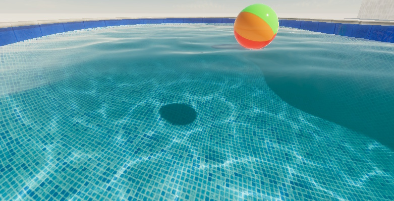
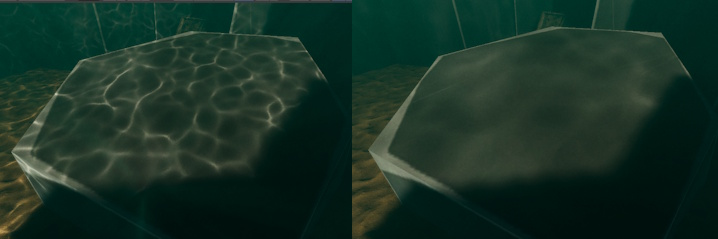

# Customize caustics in the water system



Customize the appearance of caustics, which are bright light patterns on GameObjects caused by the curved water surface reflecting and refracting light.

## Create caustics from larger waves

By default, the High Definition Render Pipeline (HDRP) uses the ripples [simulation band](water-water-system-simulation.md#simulation-bands) to calculate caustics.

To calculate caustics from larger waves in a river, ocean, sea, or lake, follow these steps:

1. Select the water surface GameObject.
2. In the **Inspector** window, go to **Appearance**. In the **Caustics** section, set the **Simulation Band** to a different band.
3. Increase **Virtual Plane Distance** until you get the desired result.

To prevent aliasing artifacts, set **Caustics Resolution** to a higher value.

<br/>
On the left, caustics with the simulation band set to **Ripples**. On the right, caustics with the simulation band set to **Swell First Band**.

## Add caustics above water

To add caustics to GameObjects above water, for example the parts of a boat that sit above the water surface, follow these steps: 

1. Create a [Decal Projector](understand-decals.md#decal-projector).
2. Add a script to the Decal Projector that uses the `GetCausticsBuffer` API to get the caustics texture from the water surface, and apply the texture as the Decal Projector texture.

For example:

```c#
using UnityEngine;
using UnityEngine.Rendering.HighDefinition;

public class ProjectCaustics : MonoBehaviour
{
    public WaterSurface waterSurface;

    void Update()
    {
        this.GetComponent<DecalProjector>().material.SetTexture("_Base_Color", waterSurface.GetCausticsBuffer(out float regionSize));
    }
}
```

Caustics have the following limitations with transparent GameObjects:

* When the camera is above a water surface, HDRP calculates caustics using the position of any opaque GameObject behind a transparent GameObject.
* HDRP doesn't apply caustics to transparent GameObjects when the camera is underwater.
* Caustics don't react to current maps and water masks.

## Make caustics less visible

You can reduce the absorption distance of the water surface. When water has a lower absorption distance, it's muddier and refracts less light, which makes caustics less visible.

To make caustics less visible, follow these steps:

1. Select the water surface GameObject.
2. In the **Inspector** window, in the **Refraction** section, decrease **Absorption Distance**.

## Additional resources

- [Settings and properties related to the water system](settings-and-properties-related-to-the-water-system.md)
