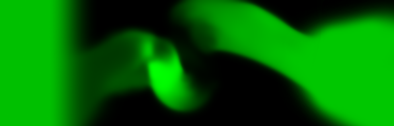
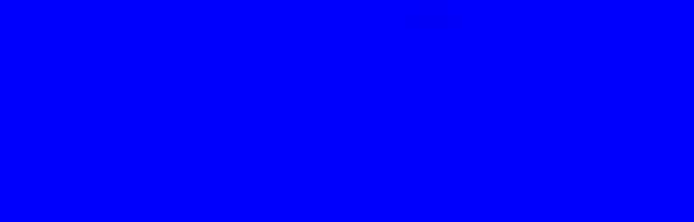
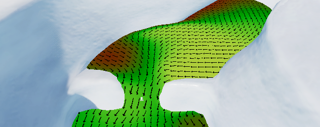

# Create a current in the water system
To create and control a current in the water system, apply a current map to a water surface.
A current map is a texture that modifies the local swell, agitation or ripples of a water surface current.
Current maps are different from flow maps because the water flow can’t stop and it always has a direction. In addition, the speed of the flow remains constant all along the surface.

To see a working current map, [open the River sample scene](#river-sample-scene).

## Open the River sample scene

HDRP includes the River sample scene which shows how a current map behaves.

To open the River sample scene:

1. Go to **Window** > **Package Manager**.
2. Select **High Definition RP**.
3. In the Samples tab, import the **Environment Samples**.
4. Open the scene named **River**.

## Create a current map texture

You can create a Current map texture in any  image-editing software. The image can be in any non sRGB format. The resolution of a current map texture has a small impact on the current effect.

The Red and Green channels contain the 2D direction of the current and the Blue channel contains the influence of the current map. 
The default direction is +X, as a result, the neutral value for a current map is (1, 0.5, 1). 
When importing a current map in the editor, make sure to that the sRGB checkbox is disabled in the texture importer.

The following images display each channel of the current map included in the River sample scene.
* The red channel of a current map: 
* The green channel of a current map: 
* The blue channel of a current map: 

## Create a current map texture in Krita

> **Attention**: The following concerns a product or service (each a “Third Party Product”) that is not developed, owned, or operated by Unity. This information may not be up-to-date or complete, and is provided to you for your information and convenience only. Your access and use of any Third Party Product is governed solely by the terms and conditions of such Third Party Product. Unity makes no express or implied representations or warranties regarding such Third Party Products, and will not be responsible or liable, directly or indirectly, for any actual or alleged damage or loss arising from your use thereof (including damage or loss arising from any content, advertising, products or other materials on or available from the provider of any Third Party Products).

The image-editing software Krita includes a brush type you can modify to author a current map:

1. Open the Brush Editor.

2. Select the arrow icon to open the **Presets** panel.

3. In **Engine**, select **Tangent Normal**.

4. Select the **Texture Normal Map preset** brush**.**

5. In the **General** section, select **Tangent Tilt.**

6. Set the **Tangent Encoding** properties to the following**:**

7. 1. **Red**: **-X**
   2. **Green**: **-Y**
   3. **Blue**: **-Z**

8. In **Tilt Options**, select **Direction**.

9. Select **Save New Brush Preset.**

This changes the color of the brush depending on the direction you draw in, allowing you to paint a current map.

## Apply a current Map to a water surface

To set the current map a water surface uses:

- Select a water surface to open its properties in the Inspector window
- Open the Simulation section
- In the Current Map property, select the picker (circle) and choose a texture to apply.

Current maps behave in a different way depending on the type of water surface:

- Ocean: Set the current map in the **Swell** subsection. This affects properties in the **First Band** and **Second Band** subsections. In the **Ripples** subsection, you can change the **Motion** property to I**nherit from Swell**, or set a custom current map in the **Swell** subsection.
- Rivers: Set the current map in the **Agitation** subsection. In the **Ripples** subsection, you can change the **Motion** property to **Inherit from Agitation**, or set a custom current map in the **Agitation** subsection.
- Pools: You can only set a current map in the **Ripples** subsection.

## Make an object follow a current map

When using [Script Interactions](water-scripting-in-the-water-system.md) to make an object float on the surface, you can get the current at the resulting location to make the object move with the flow of the water.

The [River sample scene](#river-sample-scene) includes a script that extends the Float script to make objects float along the current map.

# Debug a current map

To visualize the effect of a current map on a water surface:

- Select a water surface to view its properties in the Inspector.
- Open the **Miscellaneous** section.
- Locate **Debug Mode** and select **Current.**

