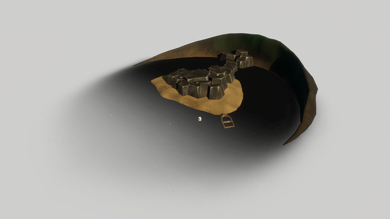
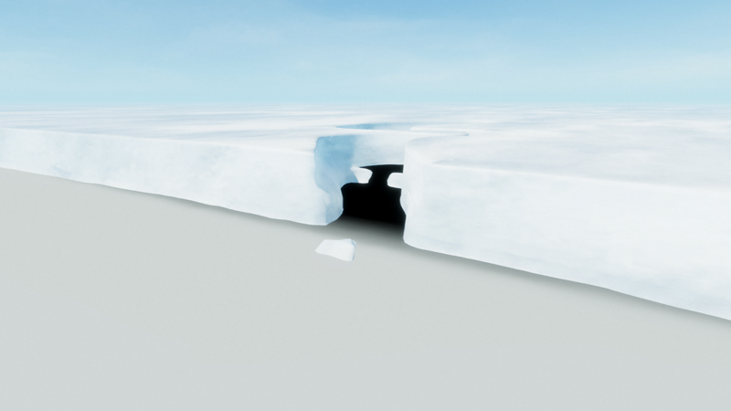
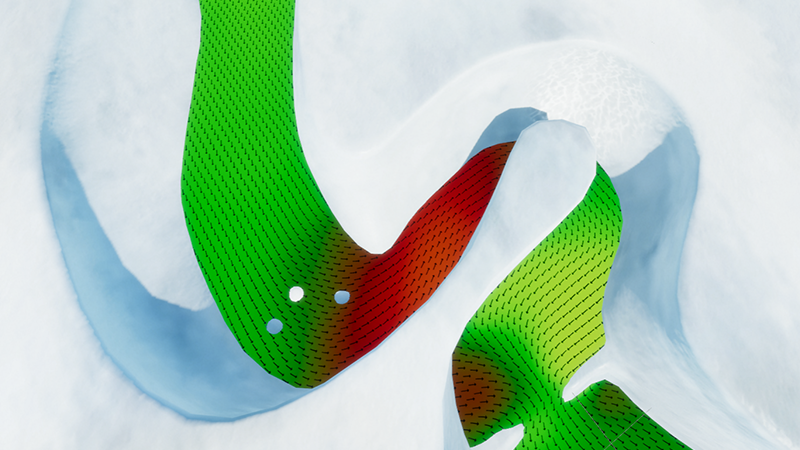
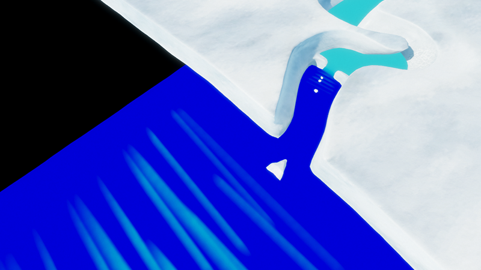
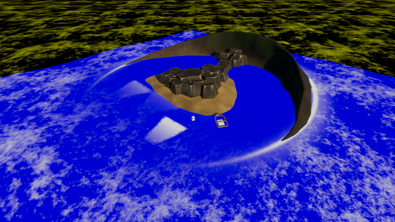

# Debug Modes

For authoring purposes, the water surface component has debug view modes. Those views are available in Miscellaneous section in the water surface component. 
They are especially useful for placing the different areas (Mask, Deformation, Foam) precisely. 

## Simulation Mask
The Simulation Mask mode displays the reduction of each simulation band. White means no reduction. Black means 100% reduction. 
You can select which channel of the water mask to debug by using the **Simulation Mask Mode** dropdown. 
Note that, for saving texture space, the red channel always attenuate the first band (First swell band for oceans, Agitation for rivers, Ripples for pools), green channel, the second band (Second swell band for oceans, ripples for rivers)... etc

## Simulation Foam Mask
The Simulation Foam Mask mode shows where the simulation foam is rendered on your water surface.  

## Current
The Current mode shows in which direction the current flows. You can select between swell or agitation and ripples to debug.
Note that this mode does not take into account the chaos parameter set in the simulation section.

## Deformation
The Deformation mode shows the deformation area and the deformation height of the water surface. 

## Foam
The Foam mode shows the foam are and where the generated foam (both foam from foam generated and simulation foam) are rendered. 
You can select to show Surface Foam or Deep Foam using the **Water Foam Mode**. 

