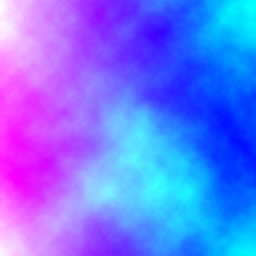
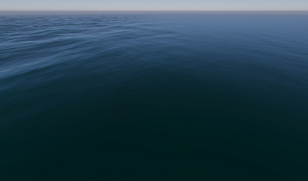

# Decals and masking in the water system

## Masks
You can use a **Water Mask** to affect the influence the simulation has on specific areas of the water surface.

Masks take into account the **Wrap Mode** of the texture on the importer. For **Ocean, Sea, or Lake** water surface types, choose **Clamp** rather the default, **Repeat**.

<table>
<tr>
<td>

</td>
<td>

</td>
</tr>
<tr>
<td colspan="2">
In this example, the Red channel attenuates the First and Second bands with a gradient. The noise on the Green channel attenuates ripples. See the <a href="settings-and-properties-related-to-the-water-system.md#watermask">Water Mask property description</a> for more information.
</td>
</tr>
</table>

## Decals
You can use a [decal](decals.md) with a water surface in the form of a **Decal Layer Mask**. You might use this to imitate debris floating on the water, for example.
**Global Opacity** determines the amount of influence the decal has on the appearance of the water surface.

Certain [Decal Shader](decal-material-inspector-reference.md) Surface Options do not work with water surfaces:
* **Affect Metal**
* **Affect Ambient Occlusion**
* **Affect Emission**
* **Affect Base Color** only produces monochromatic output.
