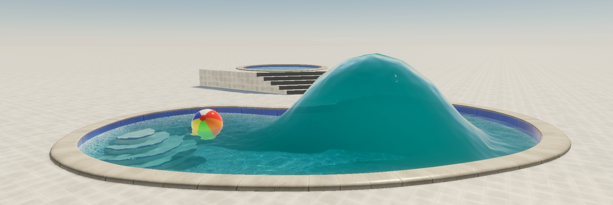
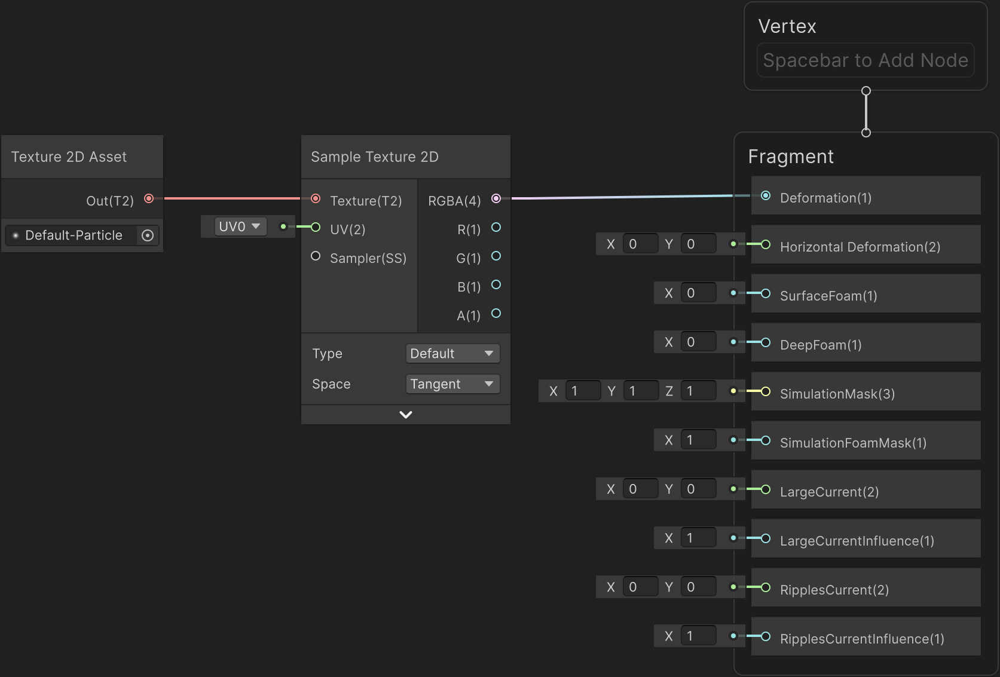
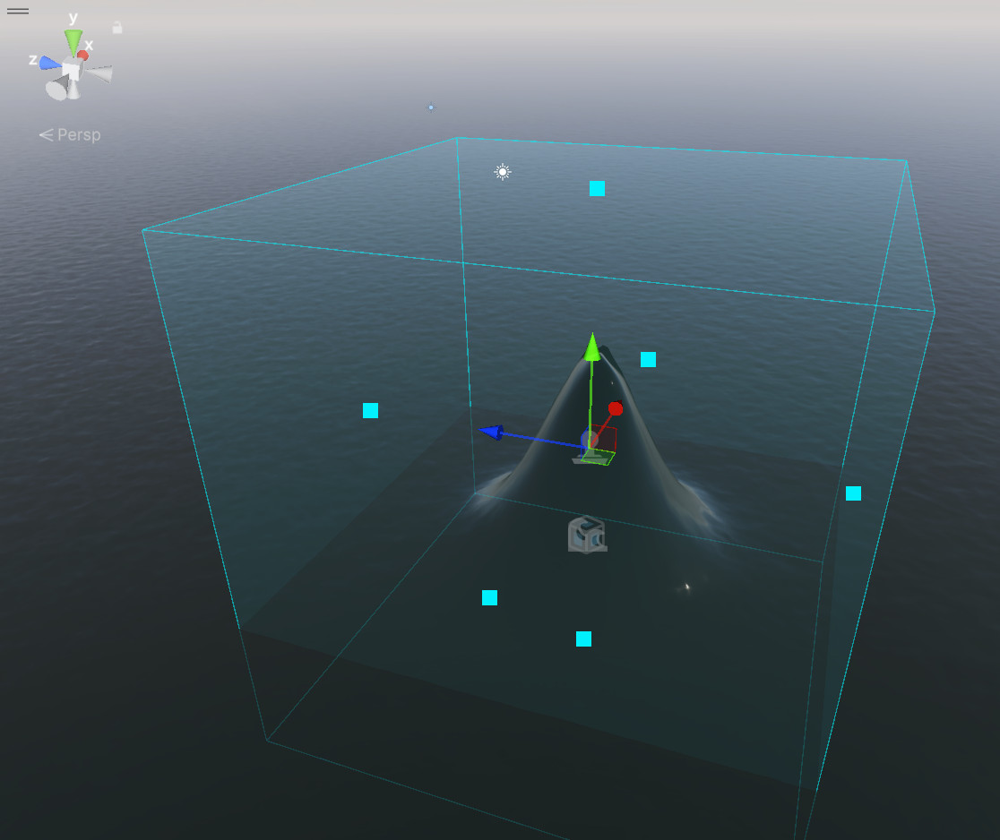
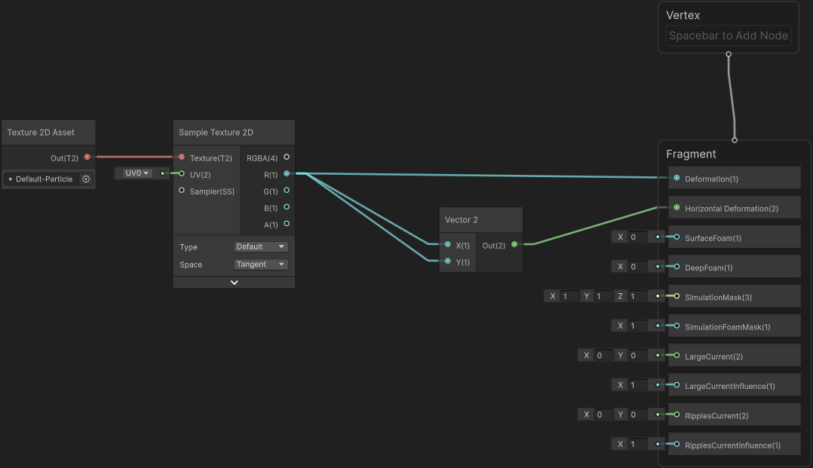
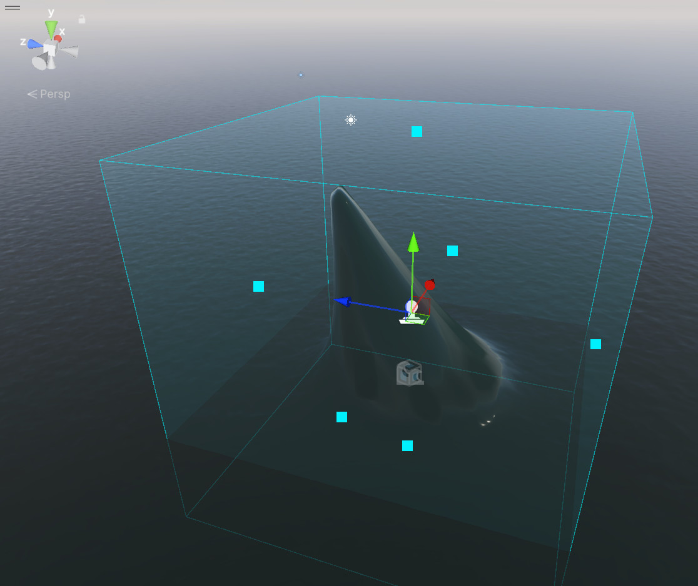

# Deform a water surface

You can use water decals to achieve deformation effects on the water surface. Water decals use textures and Shader Graph materials to modify the water's appearance dynamically.

## Deform a water surface vertically

To deform a water surface vertically:

1. Create a [water surface](water-use-the-water-system-in-your-project.md).

1. In the **Inspector** window of the water surface, go to **Water Surface (Script)** > **Water decals**, and enable **Deformation**.

	To add a deformation only, disable **Foam**.

1. In the main menu, go to **GameObject** > **Water** > **Water Decal**.

    Unity adds a **Water Decal** GameObject to your hierarchy and the water deformation appears in the **Scene** view.

1. In the **Inspector** window of the **Water Decal**, expand the **Water Decal (Script)** section.

1. To create a new **Water Decal** material, do one of the following:

	- To start from the template shader graph, select **New** > **Deformer and Foam Water Decal**.

	- To create a new material from scratch, select **New** > **Empty Water Decal**.

	A new material using the [water decal master stack](understand-decals.md) is created in your assets subfolder.

1. In the **Inspector** window of the **Water Decal**, select **Edit** next to the water decal shader graph, then edit the shader graph as needed.

For example, connect the following gradient texture with your deformation pattern with the Deformation fragment.

	
This results in the following deformation along the Y-axis:

## Deform a water surface horizontally

Enabling horizontal deformation has the following effects:

- HDRP creates a new buffer, which increases the amount of memory HDRP uses.
- The results of water scripts, [underwater effects](water-underwater-view.md), and [script interactions](float-objects-on-a-water-surface.md) might be less accurate.

Follow these steps:

1. In the main menu, go to **Edit** > **Project Settings**.
1. In the **Project Settings** window, go to **Quality** > **HDRP** > **Rendering** > **Water**, then enable **Horizontal Deformation**.

1. If the **Fragment** context doesn't contain a **Horizontal Deformation** block, right-click the **Fragment** context and select **Add Block Node** > **Horizontal Deformation**.
1. Connect a gradient texture to the **Horizontal Deformation** block. HDRP uses the yellow and blue channels of the texture to deform the x-axis and z-axis of the water surface.
    
	For example, connect the red channel of the default HDRP **Default-Particle** texture to both the x-axis and z-axis:

    

	This results in deformation along the x-axis and z-axis, built on top of existing vertical deformation.

	
    
You can also view an advanced example of how to apply a 3D deformation to a water surface in the rolling wave [water sample](HDRP-Sample-Content.md).

## Configure the Deformer and Foam Water Decal template

The properties used in the water decal material **Inspector** window change based on the type you select.

## Box

Use the following properties to control the Box type in the Water Decal template shader graph.

| **Property**           | **Description**                                              |
| ---------------------- | ------------------------------------------------------------ |
| **Box Blend Distance** | Control the range in meters over which HDRP blends this water decal between its height and amplitude. For example, if you set these values to half the values in the Region size property, it results in a pyramid shape. |
| **Cubic blend**        | Set the blend between the water surface and the water decal’s amplitude to a cubic profile. When disabled, the blend is linear. |

## Bow Wave

Use the following property to control the Bow Wave type in the Water Decal template shader graph.

| **Property**           | **Description**                                          |
| ---------------------- | -------------------------------------------------------- |
| **Bow Wave Elevation** | Controls the maximum height, in meters, of the bow wave. |

To make a bow wave move with a boat’s bow, set the Bow Wave as a child of the boat GameObject. However, the Bow Wave water decal can only move within the area defined in the **Inspector** window of the water surface, in **Deformation** > **Area Size**. To preserve the deformation’s resolution, you can use a script to make the `deformationAreaOffset` follow the boat position.

## Shore Wave

Use the following properties to control the Shore Wave type in the Water Decal template shader graph.

| **Property**            | **Description**                                              |
| ----------------------- | ------------------------------------------------------------ |
| **Wavelength**          | Controls the height, in meters, of the bow wave.             |
| **Skipped Waves**       | Sets the proportion of skipped shore waves.                  |
| **Speed**               | Sets the translation speed of the shore waves in kilometers per hour along the local X axis. |
| **Offset**              | Sets the local translation offset of the shore waves along the wave direction. |
| **Blend Range**         | Specifies the range on the local Z axis where the shore waves have their maximal amplitude. |
| **Breaking Range**      | Controls the range on the X axis where the shore wave should break. The wave reaches its maximum amplitude at the start of the range, generates surface foam inside it and loses 70% of its amplitude at the end of the range. |
| **Deep Foam Range**     | Controls the range on the X axis where the shore wave generates deep foam. This property has no effect if [foam](water-foam-in-the-water-system.md) is disabled. |
| **Surface Foam Dimmer** | Controls the dimmer for the surface foam generated by the water decal. Does this property require Foam setup? If so, explain that and link out to [Foam in the water system](water-foam-in-the-water-system.md). |
| **Deep Foam Dimmer**    | Controls the dimmer for the deep foam generated by the water decal. This property has no effect if [foam](water-foam-in-the-water-system.md) is disabled. |

## Texture

These properties are specific to the Texture type in the Water Decal template shader graph.

| **Property**    | **Description**                                                                                                                                                                                                                                                                                                                                                        |
|-----------------|------------------------------------------------------------------------------------------------------------------------------------------------------------------------------------------------------------------------------------------------------------------------------------------------------------------------------------------------------------------------|
| **Range Remap** | Specifies the range of the water decal in the [-1, 1] interval. The input texture values will be remapped from [0,1] to the specified range.                                                                                                                                                                                                                              |
| **Texture**     | The texture used by the water decal. This is a single channel texture that contains the amplitude of the deformation relative to the water decal’s amplitude. This texture can be a regular texture or a Render Texture, which can be updated at runtime by modifying a render target with a compute shader for example. For a Render Texture, use the R16_UNorm format. |

## Additional resources

- [Materials and surfaces](materials-and-surfaces.md)
- [Shader Graph](https://docs.unity3d.com/Packages/com.unity.shadergraph@17.2)

