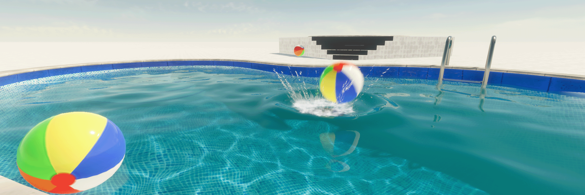

# Deform a water surface

You can use a deformer to control the shape of a water surface. A Deformer is a GameObject that changes the shape of the water surface. You can create a deformer based on one of the predefined [shapes](#deformer-type), or use a shadergraph to make a completely custom Deformer.

Water deformers can affect each other additively if they are placed at the same location. For example, if you put two 1 meter box deformers on top of each other, it is the same as creating a single box deformer two meters in height.

HDRP limits the maximum number of deformers active at the same time in a scene. You can control the maximum amount in the [HDRP Asset](HDRP-Asset.md) in **Rendering** > **Water** > **Deformation** > **Maximum Deformer Count**.

The region of a water surface that can receive deformation is limited. You can select the size and offset of the rectangular region that supports deformation in the **Deformation** section of the water surface Inspector window. To highlight this region for debug purposes, go to **Miscellaneous** > **Debug Mode** and select **Deformation**.

Also, there is a maximum number of deformer you can have in a scene. This limit can be set directly in the HDRP Asset under **Water** > **Deformation** > **Maximum Deformer Count**. 

## Create a Water Deformer

To create a Deformer:

1. Go to **GameObject** > **Water** > **Deformer.**
2. Select the type of deformer you want to use.

**Note**: You can also change the Deformer type in the Water Deformer inspector window.

To make a water deformer affect a water surface:

1. Select the Water Surface to open it in the Inspector.
2. Select the Deformation drop-down.
3. Select the **Enable** toggle.

You must also make sure it is enabled in your Project’s HDRP Asset and in the Frame Settings:

1. Select the HDRP Asset in the Project window and, in the Inspector, go to **Rendering** > **Water** and enable the **Deformation** checkbox.
2. To enable Deformation for all Cameras, Go to **Edit** > **Project Settings** > **Graphics** > **Pipeline Specific Settings** > **HDRP** > **Frame Settings (Default Values)** > **Camera** > **Rendering** > , then enable the **Water Deformation** checkbox.

Lastly, make sure that your deformer is inside the deformation area. To see the area, you can select deformation in the debug dropdown in the Miscellaneous foldout at the bottom of the water surface inspector.

## Configure a Deformer type

The properties in the Water Deformer inspector window change based on the type you select.

**Note**: The **Move** tool only moves a water deformer along the X and Z axes. To make a deformer move above or below the water surface, change the **Amplitude** value.

### Common properties

The following properties exist in all Deformer types.

| **Property**    |                | **Description**                                              |
| --------------- | -------------- | ------------------------------------------------------------ |
| **Scale Mode**  |                | The scaling mode to apply to the deformer. The options are:• **Scale Invariant**: Ignores the scale set in the Transform component and uses the region size directly.• **Inherit from Hierarchy**: Multiplies the Deformer’s region size by the [lossy scale](https://docs.unity3d.com/ScriptReference/Transform-lossyScale.html) of the Transform. Note that since the Deformer uses a top down projection, if the transformation hierarchy is [skewed](https://docs.unity3d.com/Manual/class-Transform.html), the deformer does not scale correctly. |
| **Region Size** |                | Control the size of the deformer in meters.                  |
| **Type**        |                |                                                              |
|                 | **Sphere**     | Create a deformer in the shape of a sphere.                  |
|                 | **Box**        | Create a deformer in the shape of a cube. For information about the properties specific to this type, see [Box](#deformer-type-box). |
|                 | **Bow Wave**   | Create a deformer in the shape of the front of a boat.  For information about the properties specific to this type, see [Bow Wave](#deformer-type-bowwave). |
|                 | **Shore Wave** | Create a deformer in the shape of waves that move in a specific direction. For information about the properties specific to this type, see [Shore Wave](#deformer-type-shorewave). |
|                 | **Texture**    | Customize the shape of a deformer with a texture. For information about the properties specific to this type, see [Texture](#deformer-type-texture). |
|                 | **Material**   | Customize the shape of a deformer with a ShaderGraph. For information about the properties specific to this type, see [Texture](#deformer-type-material). |
| **Amplitude**   |                | Control the height of the water surface.                     |

## Box

Use the following properties to control the Box deformer type.

| **Property**           | **Description**                                              |
| ---------------------- | ------------------------------------------------------------ |
| **Box Blend Distance** | Control the range in meters over which HDRP blends this deformer between its height and amplitude. For example, if you set these values to half the values in the Region size property, it results in a pyramid shape. |
| **Cubic blend**        | Set the blend between the water surface and the deformer’s amplitude to a cubic profile. When disabled, the blend is linear. |

## Bow Wave

Use the following property to control the Bow Wave deformer type.

| **Property**           | **Description**                                          |
| ---------------------- | -------------------------------------------------------- |
| **Bow Wave Elevation** | Controls the maximum height, in meters, of the bow wave. |

To make a bow wave move with a boat’s bow, set the Bow Wave as a child of the boat GameObject. However, the Bow Wave deformer can only move within the area defined in the Water surface Inspector in **Deformation** > **Area Size**. To preserve the deformation’s resolution, you can use a script to make the `deformationAreaOffset` follow the boat position.

## Shore Wave

Use the following properties to control the Shore Wave deformer type.

| **Property**            | **Description**                                              |
| ----------------------- | ------------------------------------------------------------ |
| **Wavelength**          | Controls the height, in meters, of the bow wave.             |
| **Skipped Waves**       | Sets the proportion of skipped shore waves.                  |
| **Speed**               | Sets the translation speed of the shore waves in kilometers per hour along the local X axis. |
| **Offset**              | Sets the local translation offset of the shore waves along the wave direction. |
| **Blend Range**         | Specifies the range on the local Z axis where the shore waves have their maximal amplitude. |
| **Breaking Range**      | Controls the range on the X axis where the shore wave should break. The wave reaches its maximum amplitude at the start of the range, generates surface foam inside it and loses 70% of its amplitude at the end of the range. |
| **Deep Foam Range**     | Controls the range on the X axis where the shore wave generates deep foam. This property has no effect if [foam](water-foam-in-the-water-system.md) is disabled. |
| **Surface Foam Dimmer** | Controls the dimmer for the surface foam generated by the deformer. Does this property require Foam setup? If so, explain that and link out to [Foam in the water system](water-foam-in-the-water-system.md). |
| **Deep Foam Dimmer**    | Controls the dimmer for the deep foam generated by the deformer. This property has no effect if [foam](water-foam-in-the-water-system.md) is disabled. |

## Texture

These properties are specific to the Texture deformer type.

| **Property** | **Description**                                              |
| ------------ | ------------------------------------------------------------ |
| Range Remap  | Specifies the range of the deformer in the [-1, 1] interval. The input texture values will be remapped from [0,1] to the specified range. |
| Texture      | The texture used by the deformer. This is a single channel texture that contains the amplitude of the deformation relative to the deformer’s amplitude. This texture can be a regular texture or a Render Texture, which can be updated at runtime by modifying a render target with a compute shader for example. For a Render Texture, use the R16_UNorm format . |

## Material

These properties are specific to the Material deformer type.

| **Property** | **Description**                                              |
| ------------ | ------------------------------------------------------------ |
| Resolution   | The material specified by this deformer will be blit into the intermediate deformer atlas to be used later by the water system. This property specifies the size that it should occupy in the atlas. |
| Update Mode  | The frequency at which the material should be rendered inside the atlas. When update mode is **On Demand**, you can use the **RequestUpdate** function on the **Deformer** script to trigger an update.  |
| Material      | The material used by the deformer. This should be a Material with a shader created from the ShaderGraph Water Decal master node. Use the **Deformation** output with values between [0,1] that can be remapped using **Range Remap** property and multliplied by the **Amplitude**. |
