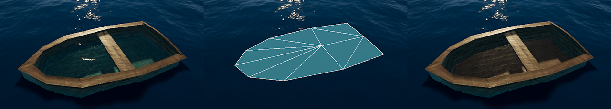

# Exclude part of a water surface

Sometimes you might want to prevent water from appearing on top of other surfaces. For static environments, you can use a [water mask](water-decals-and-masking-in-the-water-system.md) to make sure the water stays under the terrain. For dynamic objects, it’s more practical to use a water excluder. A water excluder is a GameObject that marks pixels on screen that should not receive a water surface. 

You can use a water excluder to remove a water surface inside a floating object. The following example shows a water excluder applied to the inside of a boat.

This image shows the following, from left to right: 

- A boat with no water excluder. The water surface appears inside the boat and creates an artifact.
- The water excluder used for this boat. It’s a custom mesh that fits the shape of the inside of the boat.
- The boat with the water excluder inside it. This makes the water surface inside it invisible.

The water excluder is a child GameObject of the boat so that the excluder moves with the boat.

**Note**: A water excluder only affects the water surface from above. This means it does not exclude the underwater view of the surface.

## Set up exclusion in your project

To use water exclusion, you need to enable it in the following locations:

- Enable exclusion in a scene in the HDRP Asset:

1. Select the HDRP Asset in the Project window.
2. In the Inspector, go to **Rendering** > **Water** > **Exclusion.**
3. Enable **Exclusion**.

- Enable exclusion for all Cameras in the Frame Settings: 

1. Go to **Edit** > **Project Settings** > **Graphics** > **Pipeline Specific Settings** > **HDRP**.
2. Go to the **Frame Settings (Default Values)** > **Camera** section. 
3. In the **Rendering** section, enable **Water Exclusion**.

To override the Frame Settings for an individual Camera:

1. Click on a Camera in the Scene view or Hierarchy window to view its properties in the Inspector.
2. Go to the **Rendering** section and enable **Custom Frame Settings**. This exposes the Frame Settings Overrides, which you can use to customize this Camera.
3. In the **Frame Setting Overrides** section, open the **Rendering** drop-down
4. Enable **Water Exclusion**.

## Create a water excluder

To add a water excluder to your scene go to **GameObject** > **Water** > **Excluder.**
This adds a water excluder on a plane mesh. To change the shape of the water excluder:

1. Click on the water excluder in the Scene view or Hierarchy window to view its properties in the Inspector.
2. In the **Mesh** property, select the mesh picker (circle).
3. Select the mesh you want to apply to this water excluder.

You can also right-click on a GameObject in the Hierarchy and select **Water** > **Excluder** to make the excluder copy the mesh of that GameObject.

## Change the shape of a Water Excluder 

If you want to exclude water from the inside of a boat, you will probably need to author a custom mesh that fits the shape of your boat. To do this, create a simplified version of the inside of your boat in a 3D modelling software, then assign the mesh to a Water Excluder object.