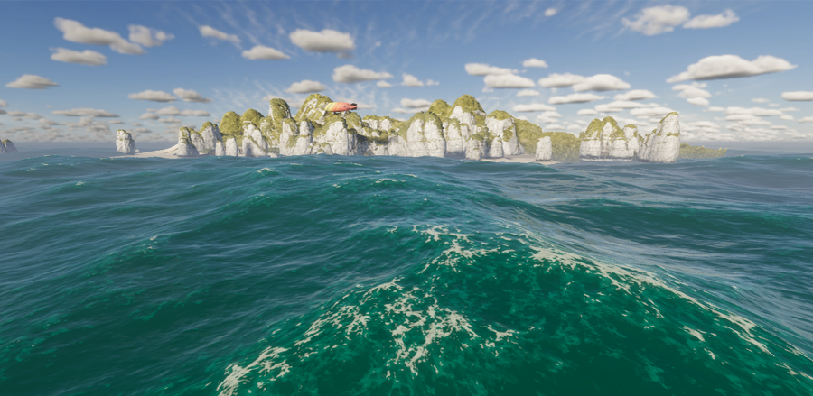
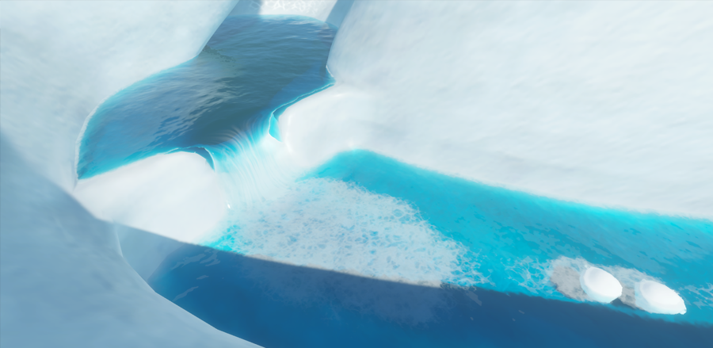

# Foam in the water system

The foam properties make it possible to control how much foam appears on your water surface and to make small adjustments to the foam's appearance.
On the water system there is two different type of foam: Simulation foam and Generated foam. 

## Simulation Foam

The simulation foam automatically appears on local maximum on high amplitude waves crests depending on the properties set below.  
It is currently best practice to only adjust two of the foam settings: **Simulation Foam Amount** and the **Wind Speed Dimmer**.

**Simulation Foam Amount** determines foam patch size.
### Wind Speed Dimmer
This control determines the amount of foam that **Distant Wind Speed** values produce.

 
* A: **Distant Wind Speeds** at the bottom of the curve do not produce any foam.
* B: **Distant Wind Speeds** in the range where the curve rises produce some foam.
* C: **Distant Wind Speeds** in the range at the top of the curve produce lots of foam.
* D: The x axis of this graph represents normalized **Distant Wind Speed**.
* E: The y axis of this graph represents the percentage of the maximum foam amount.

## Generated Foam

The generated foam is foam injected at specific location using a foam generator with a specific shape. 
Note that the [Shore Wave Deformer](WaterSystem-waterdeformer.md#deformer-type-shorewave) has a foam generator included to generate foam behind the waves.   
This foam persistence can be adjusted and can also follow the swell's current direction.

### Create a Foam Generator

To create a Foam Generator:

1. Go to **GameObject** > **Water** > **Foam Generator.**

To make a foam generator affect a water surface:

1. Select the Water Surface to open it in the Inspector.
2. Select the Foam drop-down.
3. Select the **Enable** toggle.

You must also make sure it is enabled in your Project’s HDRP Asset :

1. Select the HDRP Asset in the Project window and, in the Inspector, go to **Rendering** > **Water** and enable the **Foam** checkbox.

Lastly, make sure that your foam generator is inside the foam area. To see the area, you can select foam in the debug dropdown in the Miscellaneous foldout at the bottom of the water surface inspector.

### Configure a Foam Generator

The properties in the Water Deformer inspector window change based on the type you select.

**Note**: The **Move** tool only moves a water deformer along the X and Z axes. To make a deformer move above or below the water surface, change the **Amplitude** value.

### Common properties

The following properties exist in all Deformer types.

| **Property**    |                | **Description**                                              |
| --------------- | -------------- | ------------------------------------------------------------ |
| **Scale Mode**  |                | The scaling mode to apply to the deformer. |
|                 | **Scale Invariant** | Ignores the scale set in the Transform component and uses the region size directly.
|                 | **Inherit from Hierarchy** | Multiplies the Deformer’s region size by the [lossy scale](https://docs.unity3d.com/ScriptReference/Transform-lossyScale.html) of the Transform. Note that since the Deformer uses a top down projection, if the transformation hierarchy is [skewed](https://docs.unity3d.com/Manual/class-Transform.html), the deformer does not scale correctly. |
| **Region Size** |                | Control the size of the foam generator in meters.                  |
| **Type**        |                |                                                              |
|                 | **Disk**     | Create a foam generator in the shape of a disk.                  |
|                 | **Rectangle**        | Create a foam generator in the shape of a Rectangle. |
|                 | **Texture**    | Customize the shape of a foam generator with a texture. For information about the properties specific to this type, see [Texture](#foam-generator-type-texture). |
|                 | **Material**   | Customize the shape of a foam generator with a ShaderGraph. For information about the properties specific to this type, see [Material](#foam-generator-type-material). |
| **Surface Foam Dimmer**   |                | Control the dimmer for the surface foam. The higher the value, the more surface foam appears.                     |
| **Deep Foam Dimmer**   |                | Control the dimmer for the deep foam. The higher the value, the more deep foam appears.                     |

### Texture

These properties are specific to the Texture foam generator type.

| **Property** | **Description**                                              |
| ------------ | ------------------------------------------------------------ |
| Texture      | Specifies the texture used to generate the foam. The red channel holds the surface foam and the green channel holds the deep foam. This texture can be a regular texture or a Render Texture, which can be updated at runtime by modifying a render target with a full screen shader graph for example. For a Render Texture, use the R16_UNorm format. |

### Material

These properties are specific to the Material foam generator type.

| **Property** | **Description**                                              |
| ------------ | ------------------------------------------------------------ |
| Resolution   | The material specified by this foam generator will be blit into the intermediate foam atlas to be used later by the water system. This property specifies the size that it should occupy in the atlas. |
| Update Mode  | The frequency at which the material should be rendered inside the atlas. When update mode is **On Demand**, you can use the **RequestUpdate** function on the **Deformer** script to trigger an update.  |
| Material      | The material used by the foam generator. This should be a Material with a shader created from the ShaderGraph Water Decal master node. Use the **Surface foam** and **Deep foam** output to inject foam. |

## Limitations
This foam implementation is monochromatic. You cannot add a tint to represent algae, for example.

The foam injected using the custom foam input in the water shader graph is not affected when disabling foam on a water surface. 

## Additional resources
* <a href="settings-and-properties-related-to-the-water-system.md">Settings and properties related to the water system</a>