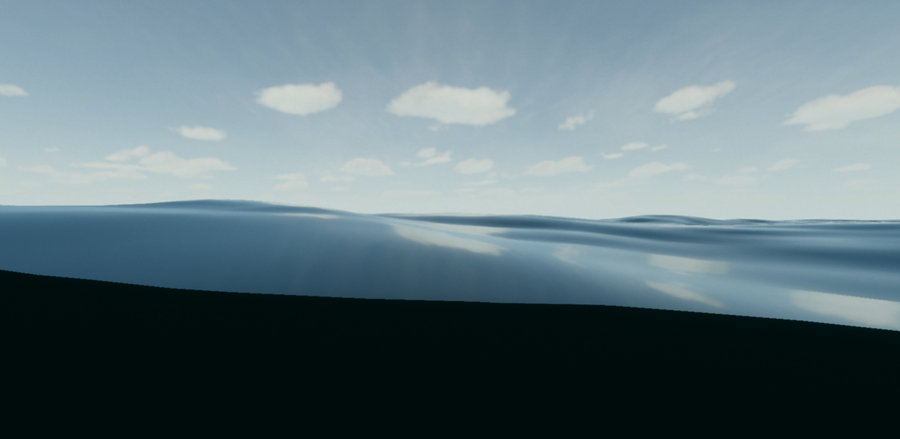

# Underwater view

The underwater view is rendered as a full-screen post-processing effect. The view is rendered in one of the following ways:

* Using a simple analytic formula to estimate light absorption by the water volume.

* If volumetric fog is enabled, the underwater view is included in the volumetric buffer and rendered using volumetric lighting, supporting light shafts and light shafts from shadows.

## Define the underwater area

To change the area where the camera displays an underwater view for a non-infinite water surface, use the **Volume Bounds** setting. Follow these steps:

1. Create a GameObject with a collider component, for example a cube with a **Box Collider** component.
2. Place the GameObject where you want the underwater view to be visible.
3. In the collider component, select **Edit Collider** to set the size of the visible underwater area. 
4. Select the water GameObject.
5. In the **Inspector** window, under **Appearance**, under **Underwater**, set **Volume Bounds** to the GameObject you created.

To set the area of the underwater view for an ocean, follow these steps:

1. Select the ocean GameObject.
2. In the **Inspector** window, under **Appearance**, enable **Underwater**.
3. Adjust **Volume Depth**.

# Water line

When the camera is at the limit of the water's surface, the underwater view adds a boundary when transitioning from below to above the water's surface. 

To customize the water line even more, you can sample the generated underwater buffer in a [Custom Pass](Custom-Pass.md) by using the [HD Sample Buffer](https://docs.unity3d.com/Packages/com.unity.shadergraph@latest/index.html?subfolder=/manual/HD-Sample-Buffer-Node.html) node from the Shader Graph using the **IsUnderwater** option from the Source Buffer dropdown.

Refer to the Waterline scene in the [HDRP Water samples](HDRP-Sample-Content.md#water-samples) for more details.

## Limitations

* When using a custom mesh, underwater doesn't behave as expected if the mesh's Y position isn't at 0, or if the mesh isn't flat.
* The **Receive Fog** option on transparent materials also disables underwater. This can be useful to disable absorption on objects when using excluder underwater (like a porthole in the hold of a boat), or as an optimization when you know that fog doesn't affect the object's color.

# Additional resources
* [Settings and properties related to the water system](settings-and-properties-related-to-the-water-system.md)
