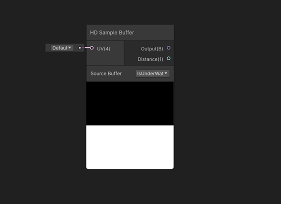

# Underwater view

To view non-infinite water surfaces from underwater, you have to specify a [collider](https://docs.unity3d.com/Manual/Glossary.html#Collider). You can either use the box collider HDRP automatically provides or select a box collider in the scene to use for this purpose.

To view infinite water surfaces from underwater, you have to specify a **Volume Depth**.

# Water line

When the camera is at the limit of the water surface, the underwater view adds a boundary when transitioning from below to above the water's surface. 

Additionaly, to customize even more the water line, you can sample the generated underwater buffer in a [Custom Pass](Custom-Pass.md) by using the [HD Sample Buffer](https://docs.unity3d.com/Packages/com.unity.shadergraph@latest/index.html?subfolder=/manual/HD-Sample-Buffer-Node.html) node from the Shader Graph using the "IsUnderwater" option from the Source Buffer dropdown.

See the Waterline scene in the [HDRP Water samples](HDRP-Sample-Content.md#water-samples) for more details.

## Limitations

* When using a custom mesh, underwater will not behave as expected if mesh is not at 0, or if the mesh isn't flat.
* Fog and Volumetric Fog is not evaluated when the camera is underwater. A simpler attenuation is used when underwater: to control it, use **Absorption Distance Multiplier**. Additionnally, the **Receive Fog** option on materials also affects this simpler attenuation. This can be useful to disable absorption on objects when using excluder underwater (like a porthole in the hold of a boat).

# Additional resources
* [Settings and properties related to the Water System](settings-and-properties-related-to-the-water-system.md)
