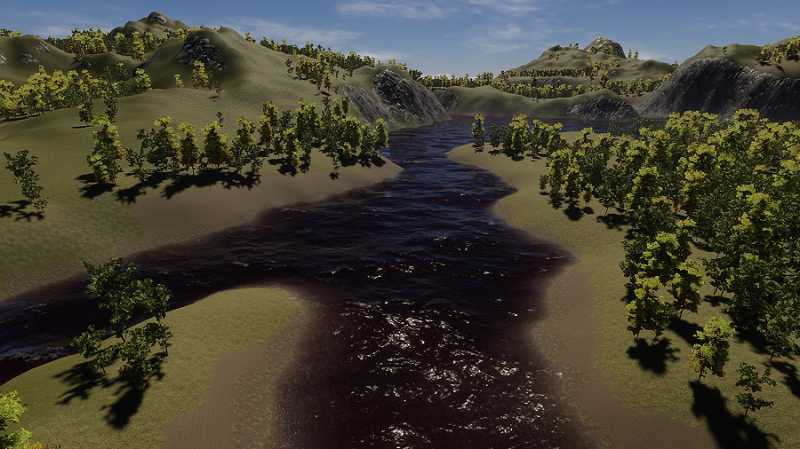
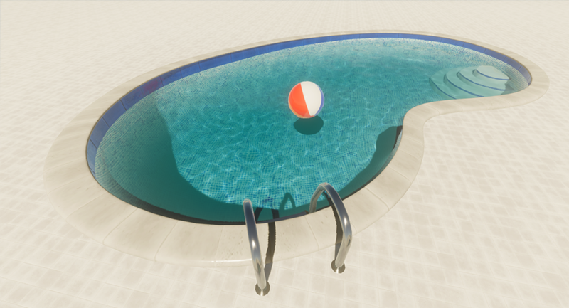
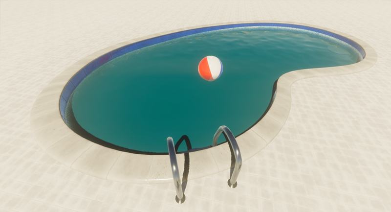

# Use the water system in your Project

This page provides an overview of the basic workflow to include a water surface simulation in your project, along with three configuration examples that may help you better understand how to adjust water properties to meet your needs.

## A basic water workflow

### Enable water in the HDRP Asset's Quality settings
1. Open the Project Settings.
2. In **Quality** > **HDRP**, open the **Rendering** section.
3. Enable **Water**. 

### Enable water in the Frame Settings
1. Open the Project Settings.
2. Go to **Edit** > **Project Settings** > **Graphics** > **Pipeline Specific Settings** > **HDRP** > **Frame Settings**, then enable water in three places:
* **Camera** > **Rendering**.
* **Realtime Reflection** > **Rendering**.
* **Custom or Baked Reflection** > **Rendering**.

This is especially important when you upgrade your project from an earlier version of Unity, because water is inactive by default. If your project originates in HDRP 14 (Unity 2022.2)  or later, the water implementation may work even if you only enable it in the **Quality** settings.

### Add the water Volume Override to the global volume

1. Select a global Volume in your scene, such as the **Sky and Fog Volume**.
2. Click **Add Override**.
3. Select **Lighting** > **Water Rendering**.
4. In the **Water Rendering** component, set **State** to **Enabled**.

This is especially important when you upgrade your project from an earlier version of Unity, because water is inactive by default. If your project originates in HDRP 14 (Unity 2022.2) or later, the water implementation may work even if you only enable it in the **Quality** settings.

### Add a water surface to a scene

Open **Game Object** > **Water Surface** and select a surface type.

You can also use a [Water shader graph](settings-and-properties-related-to-the-water-system.md) to create a Water material.

### Adjust Scene view Effects options
If water surface movement lags and stutters in the Scene view, open the <b>Effects</b> menu in the [View Options](https://docs.unity3d.com/Manual/ViewModes.html) toolbar and enable the **Always Refresh** option.

## Configuration examples
You can adjust the <a href="settings-and-properties-related-to-the-water-system.md">properties</a> to simulate the appearance of a calm or stormy day, clean or dirty water. Here are a few examples of the kinds of adjustments you might make to simulate different water conditions.
 

### Stormy ocean, sea, or lake on an overcast day
To simulate stormy conditions, you might:
* Increase the **Distant Wind Speed**,  the **Local Wind Speed**, and both of the **Amplitude Multiplier** properties to imitate the effect of rising winds.
* Increase **Current** speed.
* Choose darker **Color** values for **Refraction** and **Scattering**.
* You can also enable **Foam**.

### Dirty river
To simulate a polluted or silty river, you could:
* Choose dark brownish **Color** values for **Refraction** and **Scattering**, to resemble water full of mud or other particulates.
* Lower the **Absorption Distance**, to make the water less transparent.
* Disable **Caustics**.
* You can also add a [Decal](decals.md) that resembles fragments of debris.

### Calm, clean swimming pool on a sunny day
To simulate a clean outdoor swimming pool on a clear day with little wind:
* Choose a light **Color** value for **Scattering**.
* For **Refraction**, choose a significantly lighter color than for **Scattering**.
* Enable **Caustics**.
* Set **Local Wind Speed** relatively low. Lower values result in tighter caustics.
* Adjust the **Virtual Plane Distance** to a value appropriate to the depth of your pool.
* In the **Refraction** properties, reduce **Absorption Distance**, to make the water more transparent. Increase **Maximum Distance** to extend the range of the refraction effect, especially if you have scenery in the water.

### A deep swimming pool
* Somewhat darken the **Color** properties for **Scattering** and **Refraction**.
* Reduce the **Absorption Distance** slightly.
* Increase **Maximum Distance** if there are caustics or objects in the water that make the refraction effect visible.

## Additional resources
* <a href="settings-and-properties-related-to-the-water-system.md">Settings and properties related to the water system</a>
