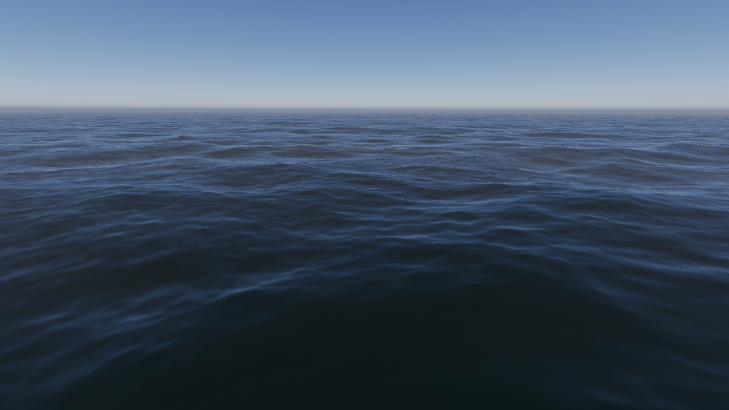
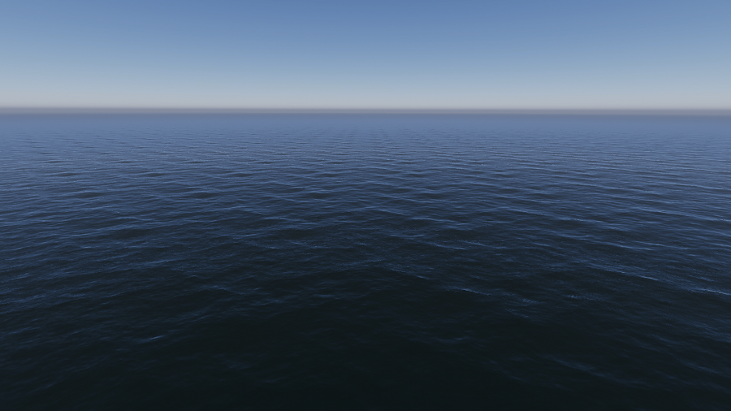
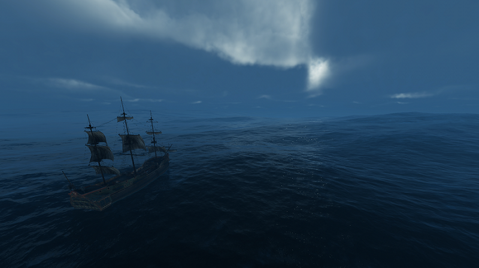

## Water system simulation
The core of HDRP's water implementation is a simulation of the way environmental factors displace water surfaces.

## Simulation
In this context, a simulation is an adjustable mathematical construct.

This particular simulation shields you from some of the complexity inherent in fluid dynamics, because it provides you with a set of simplified inputs&mdash;wind and current.

As you modify the simulation inputs the simulation displaces the water mesh.

## Wind and wave types
There are two types of wind in the HDRP water implementation: distant wind and local wind. Local wind produces **Ripples**, small waves that are close together. Distant wind produces **Swells** (for **River, Sea, or Ocean** surface types) or **Agitation** (for **River** surface types), broader waves that are farther apart.

An **Ocean, Sea, or Lake** surface that only has **Swells**. These **Swells** significantly displace the water surface.

An **Ocean, Sea, or Lake** surface that only has **Ripples**. These **Ripples** do not significantly displace the water surface.

An **Ocean, Sea, or Lake** surface with both Swells and Ripples.

## Simulation bands
A frequency is a measure of the number of vibrations that pass through a specific point in one second. A band is a specific range of frequencies within a broader spectrum. You may have heard of the FM radio broadcast band, for example.

In the context of the HDRP water implementation, a **Simulation Band** is a specific range of wave frequencies.

Waves that are closer together, like **Ripples**, are more frequent; they have a higher frequency. Waves that are farther apart, like **Swells**, are less frequent; they have a lower frequency.

**Ocean, Sea, or Lake** water surfaces have three simulation bands, two for **Swell** waves and one for **Ripples**.

**River** surfaces have two simulation bands (although they are not labeled as such in the UI), one for **Agitation** (the equivalent of **Swell**) and one for **Ripples**.

**Pool** surfaces only have one band, for **Ripples**, also not noted as such in the UI. This because pools are usually much smaller than the bodies of water that the other surface types simulate, and so do not experience the effects that wind can cause from a distance as it blows continuously on a surface tens or even thousands of kilometers across.

Because they separate higher and lower frequency waves, **Simulation Bands** make it easier to produce realistic wave behavior on both large and small water surfaces.

## Current
In the real world, factors other than wind can displace water, like gravity, temperature, salinity, and topography. The **Current** control accounts for this. Currents can flow in an orientation independent of the wind orientation settings.

On **River** and **Ocean, Sea, or Lake** water surfaces, **Swell** and **Agitation** band settings for **Current** override **Current** values for **Ripples** by default.

## Chaos
To break up overly regular patterns of waves, you can increase the **Chaos** value, which is the inverse of the wave's directionality.
* At a **Chaos** value of 0, the waves (ripples and swell) follow the wind direction 100%.
* At a **Chaos** value of 0.5, the waves (ripples and swell) follow the wind direction 50% and otherwise behave chaotically.
* At a **Chaos** value of 1, the waves (ripples and swell) disregard wind direction, and behave entirely chaotically.

## Patch and Grid
The Volume Override uses the terms Patch and Grid. The Patch is the size of the area on which Unity runs the simulation for a particular Simulation Band. The Grid is the geometry Unity uses to render the water, which is always a rectangle.

## Scripting with the water simulation
You can query a water surface for position and current direction which you can use in scripts, for example to create a customized buoyancy effect that makes it possible to float a ball on the waves (for example). The [River sample scene](#river-sample-scene) includes a script that extends the Float script to make objects float along the current map.

## Additional resources
* [Settings and properties related to the water system](settings-and-properties-related-to-the-water-system.md)

