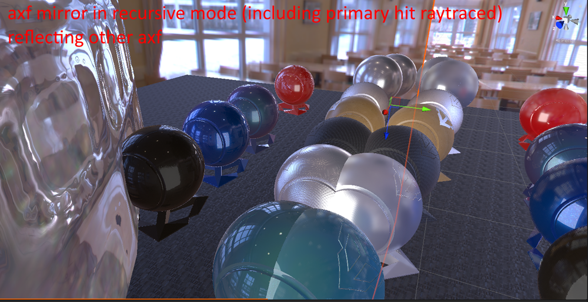

# What's new in HDRP version 11 / Unity 2021.1

This page contains an overview of new features, improvements, and issues resolved in version 11 of the High Definition Render Pipeline (HDRP), embedded in Unity 2021.1.

## Features

The following is a list of features Unity added to version 11 of the High Definition Render Pipeline, embedded in Unity 2021.1. Each entry includes a summary of the feature and a link to any relevant documentation.

### SRP packages are part of the core

With the release of Unity 2021.1, graphics packages are relocating to the core of Unity. This move simplifies the experience of working with new Unity graphics features, as well as ensuring that your projects are always running on the latest verified graphics code.

For each release of Unity (alpha / beta / patch release) the graphics code is embedded within the main Unity installer. When you install the latest release of Unity, you also get the latest URP, HDRP, Shader Graph, VFX Graph, and more.

Tying graphics packages more closely to the main Unity release allows better testing to ensure that the graphics packages you use have been tested extensively with the version of Unity you have downloaded.

You can also use a local copy or a custom version of the graphics packages by overriding them in the manifest file.

For more information, see the following post on the forum: [SRP v11 beta is available now](https://forum.unity.com/threads/srp-v11-beta-is-available-now.1046539/).

### Mixed cached shadow maps

From HDRP 11.0, it is possible to cache only a portion of non-directional shadow maps. With this setup, HDRP renders shadows for static shadow casters into the shadow map based on the Light's Update Mode, but it renders dynamic shadow casters into their respective shadow maps each frame.

This can result in significant performance improvements for projects that have lights that don't move or move not often, but need dynamic shadows being cast from them.

For more information about the future, see the [Shadow](Shadows-in-HDRP.md) section of the documentation.

## Improvements

### Support for exposure for planar reflection probe.

From HDRP 11.0, [Planar Reflection Probes](Planar-Reflection-Probe.md) now consider exposure mode when they calculate reflections for emissive Materials. Previously, Planar Reflection Probes did not correctly reflect emissive Materials that had expose weight attenuations of 0.0 due to using the wrong exposure value.

### AxF Material

From HDRP 11.0, the AxF Material supports ray tracing. It also supports rasterized area light shadows.



### Decal widget

From HDRP 11.0, the decal widget includes more functionality to help you create decals in a Scene. It now includes pivot point manipulation (both in the Inspector and Scene view), UV manipulation (in the Scene view only), and color and intensity customization.


### Cubemap fields in Volume components

Cubemap fields now accept both [RenderTextures](https://docs.unity3d.com/Manual/class-RenderTexture.html) and [CustomRenderTextures](https://docs.unity3d.com/Manual/class-CustomRenderTexture.html) if they use the cubemap mode / dimension. This change affects the `HDRI Sky` and `Physically Based Sky` components and allows you to animate both skies.

For more information, see the [HDRI Sky](create-an-hdri-sky.md) and [Physically Based Sky](create-a-physically-based-sky.md) sections of the documentation.

### Volume System API

#### Nested Volume Component Parameters

The volume system will now search for volume parameters declared inside nested classes.

```cs
public class ExampleComponent: VolumeComponent
{
    [Serializable]
    public class NestedClass
    {
        public FloatParameter number = new FloatParameter(0.0f);
    }

    public NestedClass nested = new NestedClass();
}
```

#### Volume Component Init Callback

From HDRP 11.0, the Volume Components support an Init callback which can be used to initialize static resources, for example to have a default value on a texture parameter.
It is executed only once at runtime and at every script reload inside the editor.
```cs
public class ExampleComponent : VolumeComponent
{
    static Texture s_DefaultTexture = null;
    public TextureParameter texture = new TextureParameter(s_DefaultTexture);
    static void Init()
    {
        s_DefaultTexture = //...
    }
}
```

## Issues resolved

For information on issues resolved in version 11 of HDRP, see the [changelog](https://docs.unity3d.com/Packages/com.unity.render-pipelines.high-definition@11.0/changelog/CHANGELOG.html).
