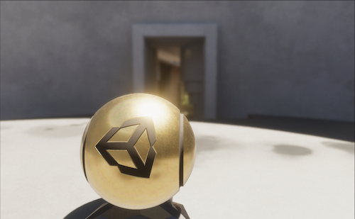

# What's new in HDRP 13.x / Unity 2022.1

This page contains an overview of new features, improvements, and issues resolved in version 13 of the High Definition Render Pipeline (HDRP), embedded in Unity 2022.1.

## Added

### New Runtime APIs

#### Materials

From 13.x, you can use new APIs to run shader validation steps from a script at runtime, both in the editor and in standalone builds. You can use this to change the keyword state or properties of a Material, to enable or disable HDRP shader features on the Material.

For more information, see the [Modify materials at runtime documentation](modify-materials-at-runtime.md).

#### Diffusion Profiles

From 13.x, all properties of diffusion profiles are public. You can modify them at runtime or in the Editor.

See all the available properties in the [scripting reference](xref:UnityEngine.Rendering.HighDefinition.DiffusionProfileSettings).

#### Lights

From 13.x, you can access a light IES profile in the editor in the following ways:

* Use [HDLightUtils](xref:UnityEditor.Rendering.HighDefinition.HDLightUtils)
* Manually set the [IES texture](xref:UnityEngine.Rendering.HighDefinition.HDAdditionalLightData) at runtime or in the Editor.

### Material Variants

HDRP 13.x supports Material Variants for all Shaders and Shader Graphs. You can use Material Variants to create a set of predefined variations of a Material, in which you can override specific properties.

You can also put a lock on a Material property to prevent child GameObjects from being able to modify the value. To do this:

1. Open a Material in the Inspector window.
2. Right-click on a property.
3. Select **Lock in children** in the dropdown.

For more information about Material Variants, see [Material Variants](materialvariant-HDRP).

### Access main directional light from Shader Graph

From version 13.x, [Shader Graph](https://docs.unity3d.com/Packages/com.unity.shadergraph@13.1/manual/index.html) includes a new node called **Main Light Direction** that you can use to control the direction of the main light.

For more information, see the [Main Light Direction Node](https://docs.unity3d.com/Packages/com.unity.shadergraph@13.1/manual/Main-Light-Direction-Node.html).

### HDR Output Support

From 13.x, HDRP supports HDR display output, including both the HDR10 and scRGB standards.

This means that HDRP can use the higher brightness contrast and wider color gamut capabilities of HDR displays.

You can use the customization options under **HDR Output** to adapt your project for a variety of displays based on device metadata or user preferences.

For more information, see [HDR Output](HDR-Output.md).

### Custom Pass

When you sample the custom buffer, it sometimes results in incorrect scaling. HDRP 13.x adds the `CustomPassSampleCustomColor` and `CustomPassLoadCustomColor` functions, which fix incorrect scaling automatically. Use these functions instead of the standard texture sampling functions. For more information about the new functions, see the [Creating a Custom Pass](Custom-Pass-Creating.md) documentation.

## Updated

### Support for full ACES tonemapper

From 13.x, you can enable the full ACES tonemapper rather than use the approximation, which is enabled by default. To enable the full ACES tonemapper:

1. Open a Volume from your scene in the Inspector window and go to the **Tonemapping** override.
2. Go to the More menu (&#8942;) and select **Show Additional Properties**.
3. Enable **Use Full ACES**.

The full ACES tonemapper is more resource intensive than the approximation but it helps the results from HDRP to match more closely with other renderers that use full ACES. This is important for projects in certain industries where color reproduction is crucial, such as the film or automotive industries.

### Depth Of Field

HDRP 13.x includes optimizations for the physically based depth of field effect that significantly speed up render GPU time, without visibly reducing the image quality. For example, HDRP computes image regions that are out-of-focus at a lower resolution, while in-focus regions keep the full resolution.

**Note**: You can only see this improvement when you use the GPU Profiler. All profilers in Unity display CPU by default.

### Mixed Cached Shadows for Directional Lights

From 13.x, you can choose to cache only some of the shadow map for directional lights, using the [Always Draw Dynamic](Shadows-in-HDRP#mixed-cached-shadow-maps) option. This allows you to cache shadow maps for static objects, while allowing the shadow update for dynamic objects. In previous versions you can only do this for non-directional lights.

To enable this feature for directional lights:

1. Open your HDRP Asset in the Inspector window.
2. Go to **Lighting** > **Shadows** > **Directional Light Shadows** > **Allow Mixed Cached Shadows**.

### Path Tracing

From 13.x, you can use the new `public bool IsFrameCompleted(HDCamera hdCamera)` and `public void ResetPathTracing()` functions to check the path accumulation progress and reset it. For more information about these functions, see [HDRenderPipeline](xref:UnityEngine.Rendering.HighDefinition.HDRenderPipeline)

From 13.x, the path tracer fully supports Orthographic views.

Volumetric scattering now takes the fog color into account and adds scattered contributions on top of the non-scattered result. This version also improves the sampling quality when you use multiple light sources.
