# What's new in HDRP version 14 / Unity 2022.2

This page contains an overview of new features, improvements, and issues resolved in version 14 of the High Definition Render Pipeline (HDRP), embedded in Unity 2022.2.

## Added

### Ray Tracing Acceleration Structure Culling

In HDRP 14, the [Ray Tracing Settings](Ray-Tracing-Settings.md) volume includes new **Culling Mode** properties to define the algorithm that performs Ray Tracing culling. You can use these settings to optimise how HDRP builds the ray tracing acceleration structure.

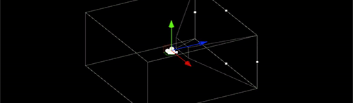

### Fullscreen Shader Graph

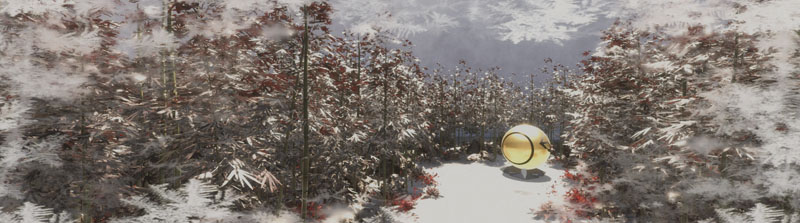

HDRP 14 introduces a new **Fullscreen** Material type in ShaderGraph.
You can use Fullscreen shaders in fullscreen custom passes, custom post processes and C# scripting.

For more details on how to use fullscreen shaders, see [Create a fullscreen Shader Graph](create-a-fullscreen-material.md#create-fullscreen-shadergraph).

#### Fullscreen Sample set

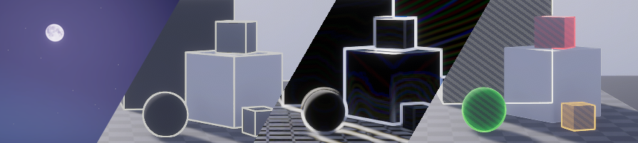

HDRP 14 includes a Fullscreen Shadergraph sample set which you can download from the Package Manager.
Each shader is associated with a prefab that demonstrates how to implement it in the scene in the following ways:

- [Custom pass](Custom-Pass-Creating.md).
- [Custom post process](Custom-Post-Process.md).
- Custom render target.

### Transparency Material Sample Scene

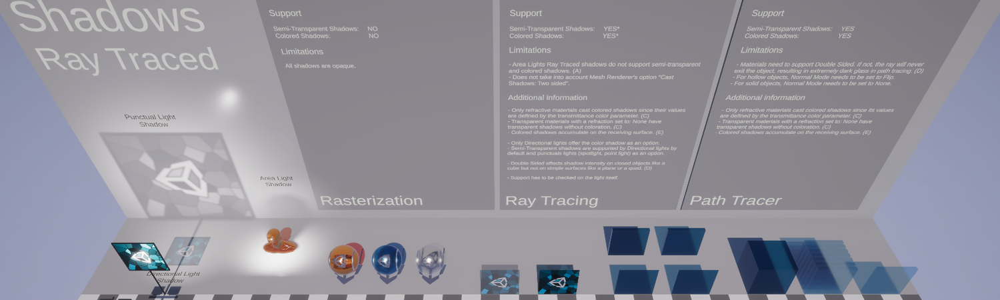

HDRP 14 includes new sample scenes that demonstrates transparent Materials using different rendering methods:
- Rasterization.
- [Ray Tracing](Ray-Tracing-Getting-Started.md).
- [Path Tracing](Ray-Tracing-Path-Tracing.md)

These scenes include examples and information to help you to set up transparent GameObjects that use different rendering methods (Rasterization, Ray Tracing, Path Tracing).

To see the ray traced examples, you need a GPU that supports [Ray Tracing](Ray-Tracing-Getting-Started.md).

### Transmission Mask

HDRP 14 adds the **Transmission Mask** property to Lit Materials and Shader Graph. Use this property to mask out the transmitted light on specific regions of a Material.
You can only use **Transmission Mask** on Materials that use **Translucent** or **Subsurface Scattering** with **Transmission**.

### Color Monitors

HDRP 14 includes a set of industry-standard color monitors that you can use to control the overall look and exposure of a scene.
You can find these monitors in the Rendering Debugger window (menu: **Windows > Analysis > Rendering Debugger**) in the **Rendering** tab.

- **Waveform**: Displays the full range of luma information in the render
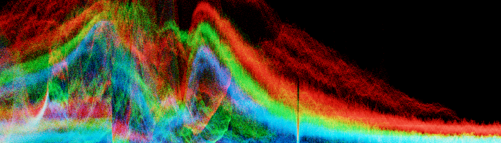
- **Parade**: Splits the image into red, green and blue separately
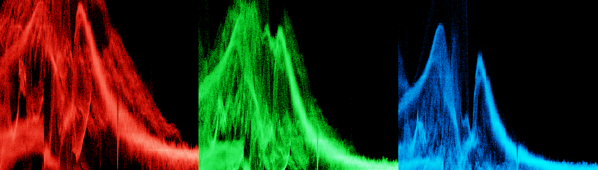
- **Vectorscope**: Measures the overall range of hue and saturation within the image
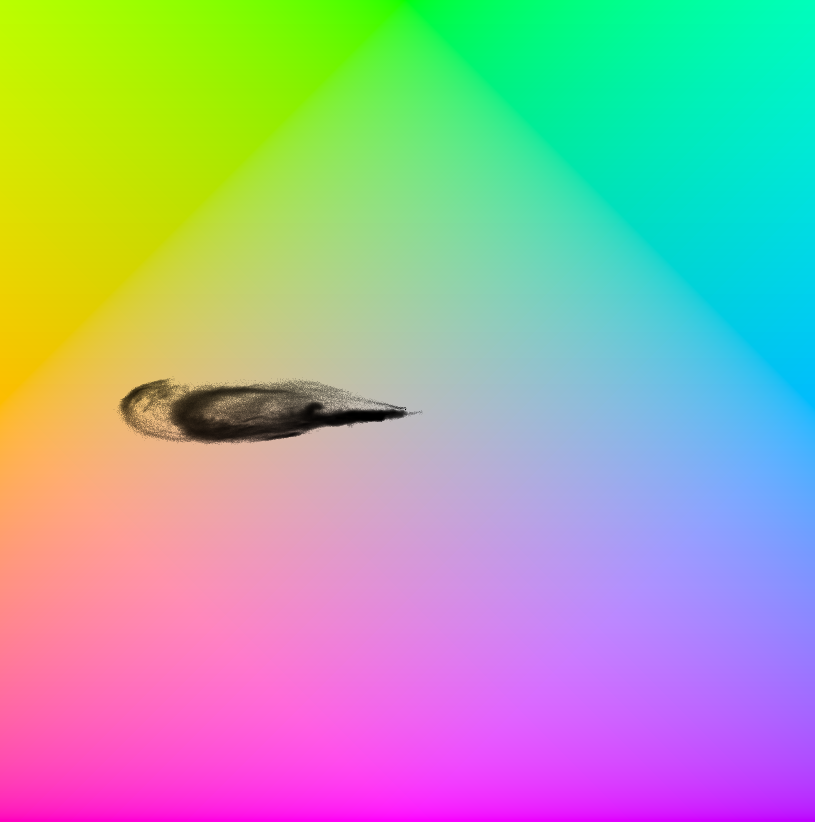

### Denoising in Path Tracing

HDRP 14 adds denoising for frames that use path tracing. You can choose from the following denoising methods:
- Optix Denoiser.
- Intel Open Image Denoise.

### Volumetric Materials

in HDRP 14, Local Volumetric Fog volume supports Materials you create in ShaderGraph.

You can use this to create dynamic fog effects. For more information, see [Volumetric Material](create-a-fog-volume-shader.md)
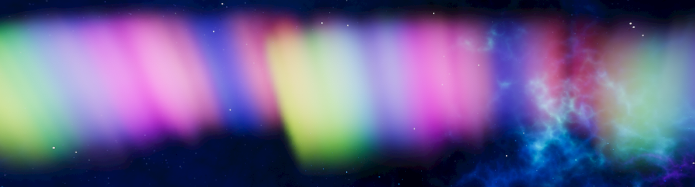

### Local Volumetric Fog blending

HDRP 14 adds a **Blending mode** to the [Local Volumetric Fog](create-a-local-fog-effect.md) component. You can use this property to create various effects, for example, to remove fog inside a house.

This version also adds a **Priority** property that you can use to control the order in which HDRP blends multiple volumes.

## Updated

### Screen Space Reflection

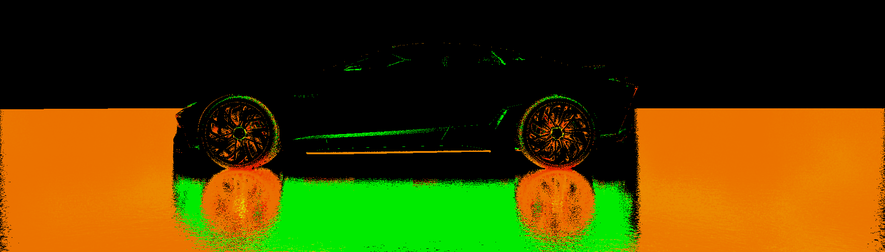

HDRP 14 adds new properties to the Screen Space Reflection component that you can use to control how the PBR Accumulation SSR algorithm behaves. For example, enable **World Space Speed Rejection** to reject samples based on speed in world space.

To use these properties, set **Algorithm** to **PBR Accumulation** and enable **Additional Properties** from the contextual menu.

HDRP 14 also includes the **Screen Space Reflection Speed Rejection** full-screen debug mode that you can use to visualize the effect of these properties.

For more information, see [Screen Space Reflection](Override-Screen-Space-Reflection.md).

### Diffusion Profile Scattering Distance

HDRP 14 replaces the [Diffusion Profile](diffusion-profile-reference.md) **Scattering Color** HDR color picker with an LDR color picker. The LDR color picker includes a **Multiplier** slider.

When you upgrade to HDRP 14, it automatically migrates any existing diffusion profiles.

### Materials

#### Materials and Diffusion Profiles

HDRP 14 makes the following changes to diffusion profiles:

- Renames **Diffusion Profile Override** to [**Diffusion Profile List**](Override-Diffusion-Profile.md).

- Automatically migrates the components in a scene that uses a **Diffusion Profile List**. If you reference a Diffusion Profile override in a C# script, HDRP displays a warning in the Console window. This warning might stop your Project compiling in future HDRP versions. To resolve this warning, modify  your code to target the **Diffusion Profile List** component.

- The **Diffusion Profile List** component interpolates in a different way from the **Diffusion Profile Override**. The Diffusion Profile override completely replaced the list of profiles, whereas the Diffusion Profile list additively accumulates all active volumes in the scene when it combines them.

- If there are more than 15 diffusion profiles,  HDRP only uses profiles with the highest **Priority**. As a result, this change does not break existing projects.

- Removes the Diffusion Profile List from the [Global Settings](Default-Settings-Window.md). Instead, control Diffusion Profiles through the [Diffusion Profile List overrides](Override-Diffusion-Profile.md) in the scene, or in the default volume you define in the Global Settings.

- When you import a Material that has a diffusion profile, HDRP 14 automatically registers the Material's diffusion profile in the Global Settings. To disable this behaviour:

1. Open the Global Settings.
2. Open the **Miscellaneaous** section .
3. Disable the **Auto Register Diffusion Profiles** property.

- Materials that use an unregistered diffusion profile now appear magenta instead of green.

#### Unity Material Ball

Sample scenes from HDRP 14 include a Unity Material ball with the new Unity logo.

You can find the new Unity material ball asset in `com.unity.render-pipelines.high-definition/Runtime/RenderPipelineResources/Prefab`.

#### Planar and Triplanar Mapping

From HDRP 14, the [Lit Material](lit-material.md) options include the **Emission UV Mapping** property to perform planar and triplanar mapping in Object space. Use these options to keep the texture mapping consistent when a you change a GameObject's transform.

#### Hair Material Samples

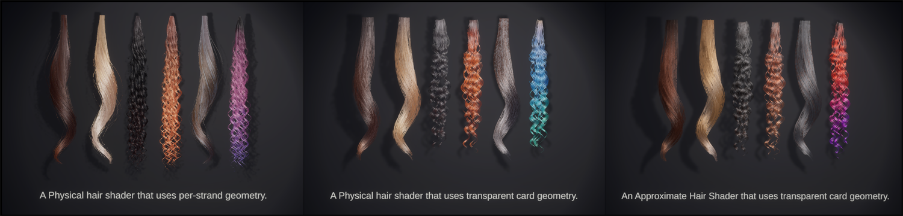

HDRP 14 updates the Hair Sample scene to include the new Physical Hair Shader.

To access this sample scene, download the Material Samples in the Package manager (menu: **Window** > **Package Manager** > **High Definition RP** > **Samples** > **Material Samples**).

### Path Tracing

HDRP 14 makes the following changes to settings for Materials that use Path tracing:

- Adds the **Use AOVs** setting to Material shaders that use path tracing to support the new path tracing denoisers. When you enable this setting, HDRP puts albedo and normal values into [Arbitrary Output Variables (AOVs)](AOVs.md).

The scene for Hair shading in the Material Samples has been updated and now showcases the newest Physical Hair Shader.
- Increases the max **Maximum Depth** property value to 32. To do this, HDRP spawns continuation (indirect) rays from the ray generation shader instead of shooting rays recursively from the `closesthit()` function.

#### Path Tracer Transparency fallbacks

HDRP 14 improves the fallbacks for refractive transparent Materials. These improvements simplify the setup for transparency and make objects appear similar in the rasterization, recursive rendering and path tracing rendering paths:
- Single-sided objects now automatically use the **Thin** refraction model. This makes sure the ray exits the object. If a ray never exits the object, the glass appears incorrectly dark.
- For a double-sided object that uses the **Planar** or **Sphere** refractive model, the normal mode is now forced to **None** to match the correct setup for solid objects.

### Cloud Layer

HDRP 14 makes the following improvements to the [Cloud Layer](create-simple-clouds-cloud-layer.md):

- The sun light color correctly takes atmospheric attenuation into account when you use the Cloud Layer in combination with the physically based sky.
- The sun light color now always impacts the color of the clouds, even if raymarching is disabled.
- Changes the **Thickness** property name to **Density**.
- Changes the **Distortion** property name to **Wind**.
- Changes the raymarching algorithm to improve scattering, and to give more consistent results when you change the number of steps. Depending on your lighting conditions, you might have to tweak the **Density** and **Exposure** sliders to get the same result as earlier HDRP versions.

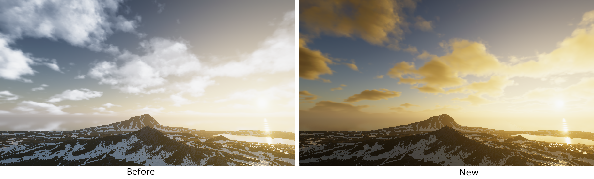

### Renderer bounds access in ShaderGraph

The [Object Node](https://docs.unity3d.com/Packages/com.unity.shadergraph@13.1/manual/Object-Node.html) in Shader Graph can now access the bounds of the GameObject HDRP is currently rendering. You can use this information to calculate refraction and similar effects.

**Note**: These bounds are only available in world space.

### Lens Flare

HDRP 14 adds the **Occlusion remap Curve** property to the Lens Flare component. This property's curve to remaps the result of Lens Flare occlusion to another value. You can use this to occlude the Lens flare more intensely. The occlusion value is between 0 and 1 by default.

### New Eye Shader Subtype

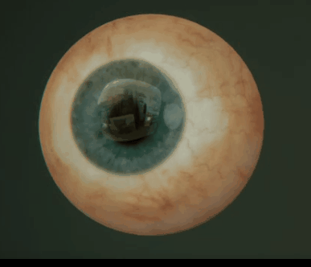

HDRP 14.0 includes a new Eye Shader type called **Eye Cinematic with Caustic**. This Eye Shader uses caustics to give a more realistic effect. This makes it more resource-intensive than other HDRP Eye Shaders.

### DLSS

From version 14, HDRP can apply DLSS after post processes. This significantly improves performance on scenes bound by full screen post processing effects, but it can cause visual artifacts and instability.

For more information, see the new  **Injection Point** parameter in the [HDRP Asset](HDRP-Asset.md) in the DLSS section.

### Optimizations

HDRP 14 adds a node to Shader Graph that you can use to strip `FragInputs`. This node strips out any unused interpolators that use a lot of memory to improve GPU performance .

### Adaptive Probe Volume

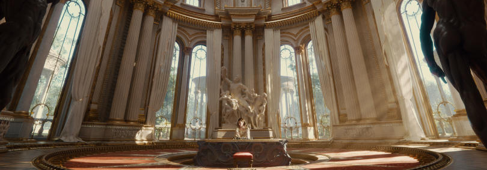

HDRP 14 makes the following changes to Adaptive Probe Volume (APV):

- Adds a system that reduces leaks based on probe validity. This includes the new **Probe Touchup Volume** that you can use to tune values in specific areas.
- Allows you to bake separate lighting scenarios and blend between them.
- Uses a more efficient data layout to optimize asset loading time.
- Improves the UX.

### Custom Passes

In HDRP 14 adds the following properties to the **Draw Renderers** custom pass:

- An **Override Mode** called **Shader**. Use it to override Shaders instead of Materials in your custom pass. The **Shader** mode acts like the [Camera.RenderWithShader](https://docs.unity3d.com/ScriptReference/Camera.RenderWithShader.html) function and keeps the Material properties of the renderer when it applies the override Shader.

- An option in **Filters** > **Queue**  called **Overlay**. Use this to select GameObjects that HDRP renders in the Overlay render queue.

### Decal Projectors

HDRP 14 improves the precision of the Decal Projector's **Angle Fade** property.

### Improve area light soft shadows

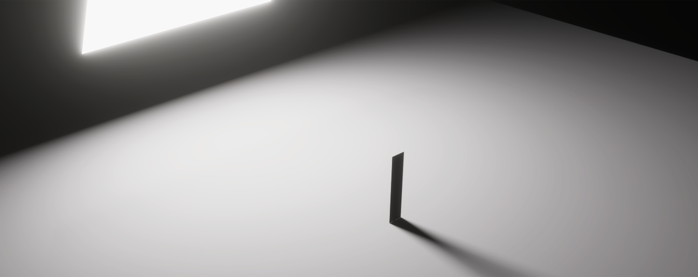

In HDRP 14, soft area shadows are more accurate to the raytraced reference. This version also makes the following changes:
- **Shadow Filtering Quality** only affects the quality of regular lights.
- Adds the **Area Shadow Filtering Quality** setting to control the quality of area lights. Set this property to **High** to use the improved soft area shadows.

### Ray-Tracing and Terrain

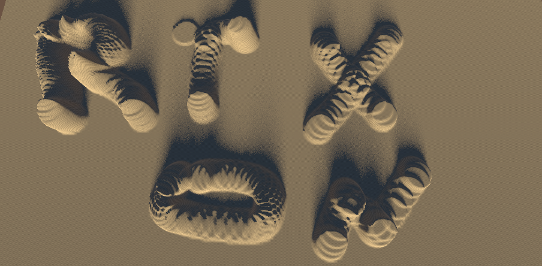

From HDRP 14, all raytracing effects support Terrain.

### Reflection probes

#### Real-time reflection probes

HDRP 14 adds the **Time slicing** property to the [Reflection Probe](Reflection-Probe.md) component. To see this property, set the Reflection probe's **Type** to **Realtime**. Use this to update the Cubemap and perform convolution across several frames.

#### Reflection probe atlas

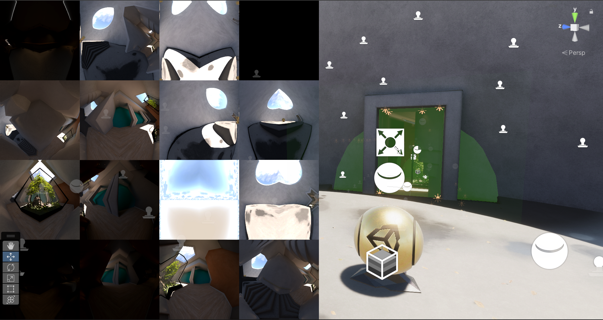

HDRP 14 replaces the cube reflection probe cache array with a 2D texture atlas cache in octahedral projection.

Planar reflection probes now use the same 2D texture cache. This means you can control the cube probe resolution for each reflection probe to save memory.

### Water system
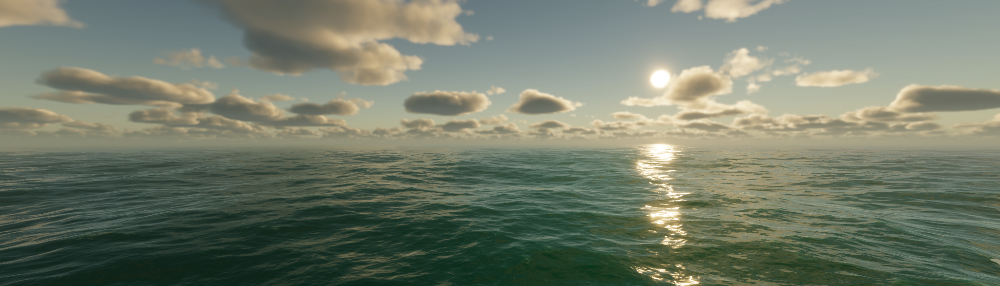

HDRP 14 introduces the water system. This feature allows you to render highly realistic water surfaces and interact with them. Among the various features that this version includes:

- A shader graph interaction for advanced visual customizations.
- A mirrored simulation on the CPU for high-fidelity game interactions.
- Simulation-based caustics.
- Underwater rendering.
- Presets and intuitive controls.
