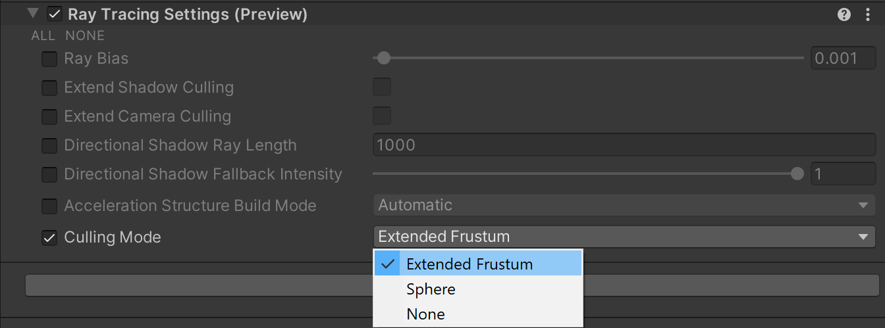

# What's new in HDRP version 14 / Unity 2022.2

This page contains an overview of new features, improvements, and issues resolved in version 14 of the High Definition Render Pipeline (HDRP), embedded in Unity 2022.2.

## Added

### Material Samples Transparency Scenes

Transparent Shadows

Transparent Stacking

These new scenes include examples and informations on how to setup properly transparents in your projects using different rendering methods (Rasterization, Ray Tracing, Path Tracing).
To take advantage of all the content of the sample, a GPU that supports [Ray Tracing](Ray-Tracing-Getting-Started.md) is needed.

### Ray Tracing Acceleration Structure Culling

In order to control the cost of building the ray tracing acceleration structure, new parameters have been added to the [Ray Tracing Settings](Ray-Tracing-Settings.md) volume component that allow you to define the algorithm that is going to perform the culling.

HDRP can either extend the camera frustum, perform sphere culling or skip the culling step.

### Fullscreen Shader Graph

HDRP 14.0 introduces a new material type in ShaderGraph to create fullscreen effects.
Shaders of the fullscreen type can be used in fullscreen custom passes, custom post processes and C# scripting.

For more details on how to use fulscreen shaders, see [FullScreen Shader Graph](Fullscreen-Shader-Graph.md).

### Transmission Mask

HDRP 14.0 introduces a new parameter on Lit shaders and shadergraphs to mask out the transmitted light on specific regions of a material.
This parameter is only available for Materials using **Translucent** or **Subsurface Scattering** with **Transmission**.

### Diffusion Profile Scattering Distance

The HDR picker used to control the scattering distance on diffusion profiles was replaced by a LDR color picker and a multiplier was added. The migration of existing profiles is automatic.

### Materials and Diffusion Profiles

When importing a material with a diffusion profile that is not referenced in the HDRP Global Settings, rendering cannot be made correctly. With HDRP 14, these diffusion profiles are automatically registered in the Global Settings to ease importing of external assets. This can be disabled by unticking the box **Auto Register Diffusion Profiles** in the **Miscellaneaous** section of the Global Settings.
Additionally, materials using a non registered diffusion profile are now displayed in fushia instead of green to better highlight them.

### Color Monitors

HDRP 14.0 includes a set of industry-standard monitors that you can use to control the overall look and exposure of a scene.
You can find these new monitors in the Rendering Debugger window (menu: **Windows/Analysis/Rendering Debugger**) under the **Rendering** tab.

- Waveform: Displays the full range of luma information in the render

- Parade: This is a mode of the waveform monitor that splits the image into red, green and blue separately

- Vectorscope: Measures the overall range of hue and saturation within the image

### Denoising in Path Tracing
HDRP 14.0 introduces denoising for path-traced frames with a choice of two different libraries: Optix Denoiser and Intel Open Image Denoise.

## Updated

### Cloud Layer

When using the cloud layer in combination wiht the physically based sky, the sun light color will now correctly take atmospheric attenuation into account.
Additionally, the sun light color will now always impact the color of the clouds, even if the raymarching is disabled.
Improvements have also been made to the raymarching algorithm to improve scattering, and have more consistent results when changing the number of steps. Depending on your lighting conditions, you may have to tweak the density and exposure sliders to match the visuals with prior HDRP versions.
In the UI, **thickness** and **distortion** fields have been renamed to **density** and **wind**.

### Fullscreen Shader Graph

HDRP 14.0 introduces a new material type in ShaderGraph to create fullscreen effects.
Shaders of the fullscreen type can be used in fullscreen custom passes, custom post processes and C# scripting.

For more details on how to use fulscreen shaders, see [FullScreen Shader Graph](Fullscreen-Shader-Graph.md).

### Renderer bounds access in ShaderGraph

The [Object Node](https://docs.unity3d.com/Packages/com.unity.shadergraph@13.1/manual/Object-Node.html) in Shader Graph has been updated to give access to the bounds of the current object being rendered. This information can be useful to compute refraction effect and such. Note that these bounds are available in world space.
