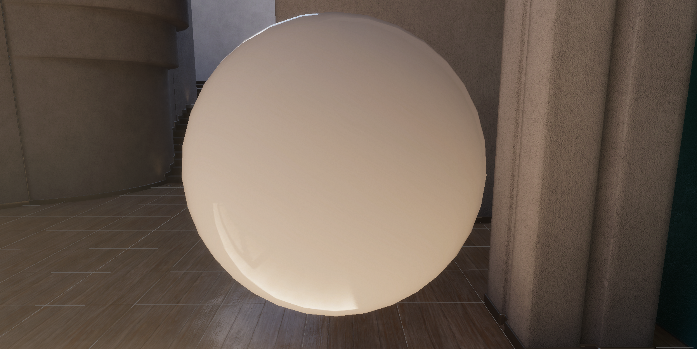
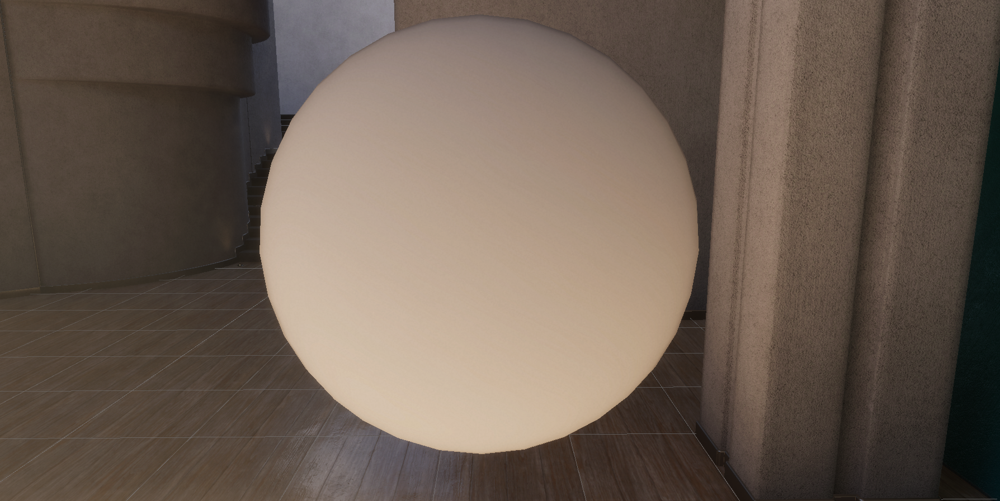
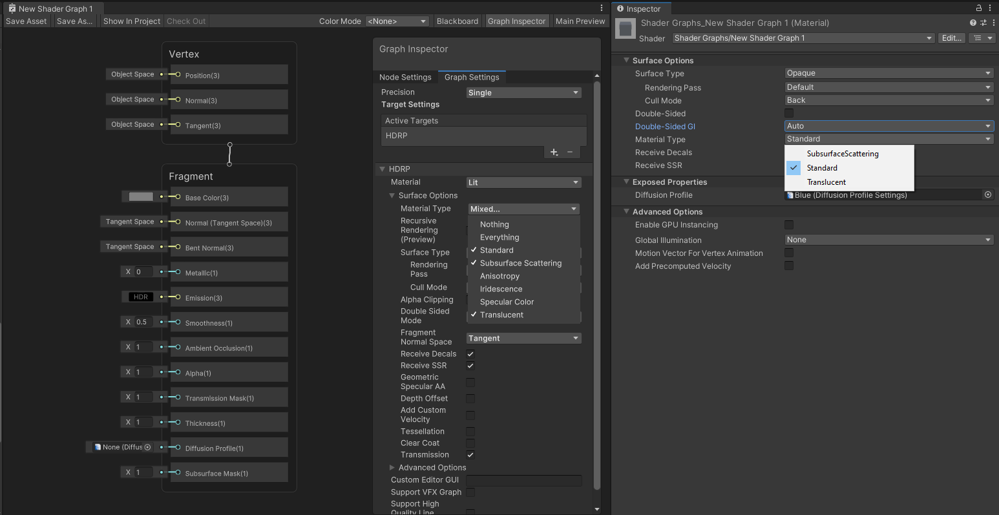
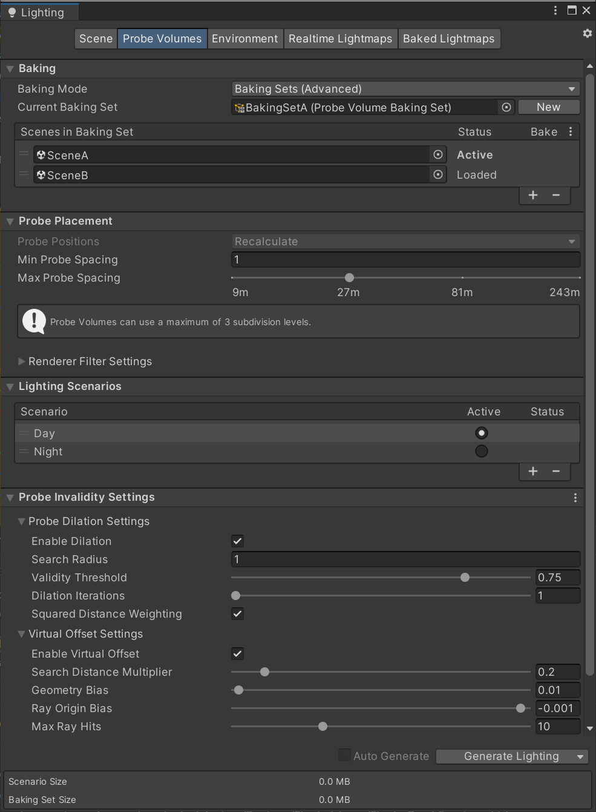

# What's new in HDRP version 15 / Unity 2023.1

This page contains an overview of new features, improvements, and issues resolved in version 15 of the High Definition Render Pipeline (HDRP), embedded in Unity 2023.1.

## Added

### Temporal Anti-Aliasing Sharpening Mode

Starting from HDRP 15, two new options are available to perform sharpening with Temporal Anti-aliasing. The first new option is a post-process pass that will offer higher quality sharpening, control on how much sharpening will happen and an option to reduce possible ringing artifacts. The second option is to run Contrast Adaptive Sharpening from AMD FidelityFX.

### High Quality Line Rendering

Introducing a specialized rendering path for line topology with the **High Quality Line Renderer**. Use this feature to render hair, wires, and other line-based geometry with high quality anti-aliasing and transparency.

|       Hardware Lines       |     High Quality Lines     |
|:--------------------------:|:--------------------------:|
|  |  |

### Specular Fade

Specular light can now completely be faded when using a specular color workflow using the **HDRP/Lit** and **HDRP/StackLit** shaders by toggling a new option that can be found in the HDRP Global Settings under **Miscellaneous/Specular Fade**.

|        With Specular         |        Faded Specular        |
|:----------------------------:|:----------------------------:|
|  |  |

### Screen Space Lens Flare

HDRP 15 includes a new [Screen Space Lens Flare](shared/lens-flare/Override-Screen-Space-Lens-Flare.md) post-processing override, in addition to the existing [Lens Flare (SRP)](shared/lens-flare/lens-flare-component.md) component. The override uses what's on the screen to create multiple types of lens flare, based on the texture from the [Bloom](Post-Processing-Bloom.md) override. Screen space lens flares are useful for bright spots in your scene that appear depending on the camera view, for example a bright specular reflection on a shiny metal object, or a bright outside area viewed from a dark indoor area.

### Material Type in ShaderGraph

From HDRP 15 and above, the **Material Type** property of the Lit ShaderGraph is now exposed to the material. This means that in the ShaderGraph you can select which **Material Types** will be available in the material and on the material side you can dynamically switch between the exposed material types.

### SSS Improvements

Starting from HDRP 15, dual lobe and diffuse power are available on Diffusion Profiles for materials using Subsurface Scattering.
When simulating skin, it is common to use two specular lobes to account for the thin oily layer covering the epidermis.
The diffuse power is used as a way to simulate diffuse lighting on non lambertian surfaces, such as those that exhibit strong subsurface scattering.

## Updated

### Rendering Layers

HDRP 15.0 introduces updates to the managment of Rendering Layers. Light Layers and Decal Layers will now share the first 16 Rendering Layers, instead of using 8 separate bits each.
Additionally, an option was added in the HDRP Asset to allow access to a fullscreen buffer containing the Rendering Layers Masks of rendered Objects. That buffer can be sampled from the ShaderGraph through the __HD Sample Buffer__ node, and be used to implement custom effects, like outlining objects on a specific rendering layer.

### Adaptive Probe Volumes (APV)

From HDRP 15.0, the APV control interface moved from its own panel to the lighting window under the Probe Volume tab and it has been revamped to provide a better experience. This new UI will also include a Single Scene mode that will provide a simplified interface for when your project is comprised with single scenes that are not loaded together.

Also, with HDRP 15.0 a new debugging mode has been added to better understand how the sampling of APV data happens. This can be found in Rendering Debugger -> Probe Volume -> Debug Probe Sampling

### Water System

HDRP 15.0 improves significantly the feature set of the water system, among the major additions:
- Improved geometry (Instanced quads, custom mesh renderers, non horizontal surfaces, etc.).
- Local currents
- Deformers (Shore waves, Bow Waves, etc).
- Water exclusion.
- A local foam system.
- An improved underwater effect (water line, water fog, caustics, etc.)
- Timeline support.
- Various debug modes (water mask, foam mask, deformation, foam).
- Proper interaction between the water and the cloud system (camera above the clouds).

### Volumetric Clouds

HDRP 15.0 adds several improvements to the already existing volumetric clouds feature:
- A third level of noise to achieve even more convincing visual results.
- Improved anti-ghosting for scenarios where the camera flies through the clouds at high speed.
- Peformance improvements for the "Simple" clouds mode.

### Real-time Ray Tracing

HDRP 15.0 improves the overall real-time ray tracing feature fixing several issues related to the ray traced shadows, mixed tracing lighting. It also significantly improves the fallback lighting mechanic with an integration with the Adaptative Probe Volume feature for Ray Traced Reflection, Ray Traced Global Illumination and Recursive Ray Tracing.

### Path Tracing Light Cluster

The Path Tracer now uses the Ray Tracing Light Cluster to store the lights that affect the scene. The Light Cluster grid for the Path Tracer does not use the range parameter; instead it is defined such that it coincides with the axis-aligned bounding box of the extended culling frustum of the camera.

### Compute Thickness

HDRP 15.0 introduces a fullscreen pass to compute the accumulated thickness for objects on a given **LayerMask**. HDRP computes optical path and the overlap count, which can be useful for instance for SubSurface Scattering or Refraction. The overlap count can be used for flat or non-closed objects like vegetation. This thickness can be sampled on a ShaderGraph via the HD Sampler Buffer.
