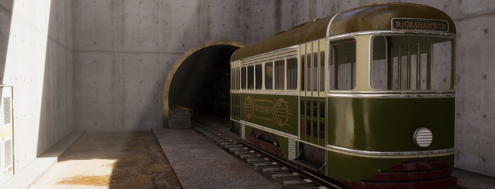
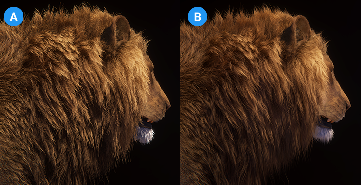
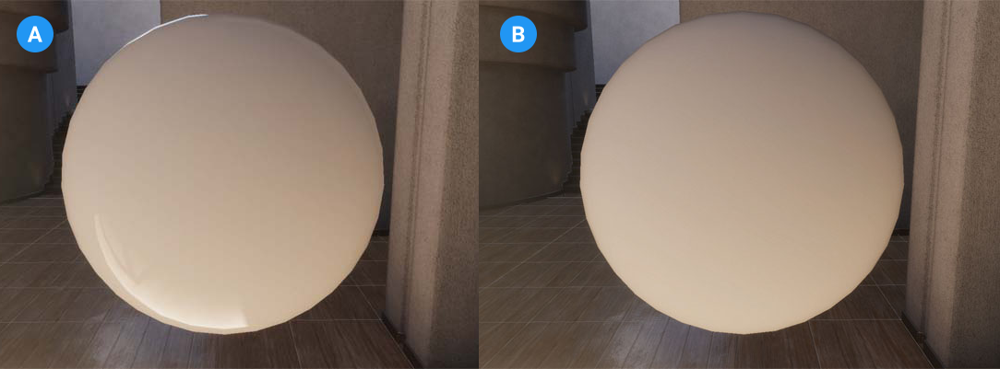
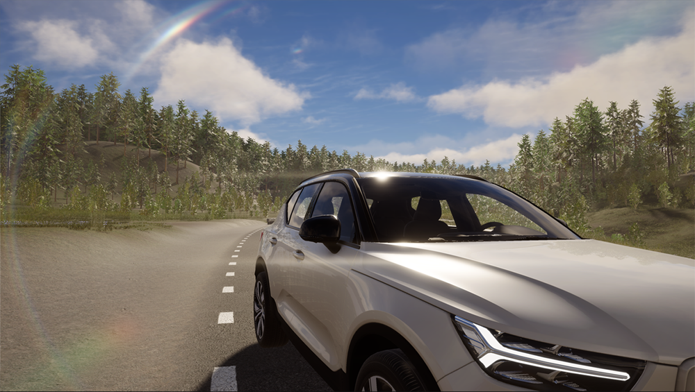
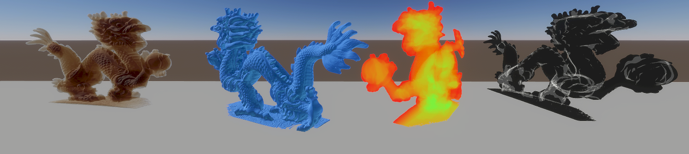
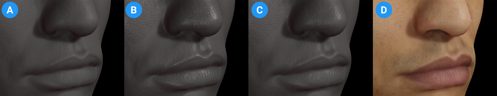

# What's new in HDRP version 15 / Unity 2023.1

This page contains an overview of new features, improvements, and issues resolved in version 15 of the High Definition Render Pipeline (HDRP), embedded in Unity 2023.1.

## Added

### Temporal Anti-Aliasing Sharpening Mode

HDRP 15 adds the following Temporal Anti-Aliasing (TAA) properties: 

- **Post Sharpen**: A post-process pass that improves the sharpening quality. You can also use this pass to control the level of sharpness and reduce ringing artifacts. 

- **Contrast Adaptive Sharpening** from AMD FidelityFX.

### High Quality Line Rendering

HDRP 15 adds the High Quality Line Rendering override that you can use to improve the quality of line topology. Use this override to render hair, wires, and other line-based geometry with high quality anti-aliasing and transparency.

For more information, refer to [High Quality Line Rendering](Override-High-Quality-Lines.md).

An example of High Quality Line Rendering's effect on animal fur. 

A: Hardware rendered fur.
B: Fur that uses the High Quality Line Renderer.

### Specular Fade

From HDRP 15, you can enable the **Specular Fade** property to reduce the effect of specular light on Lit and StackLit shaders that receive specular light. 

An example of the effect of the **Specular Fade** property on a sphere.

A: Specular light has full effect on the sphere.
B: **Specular Fade** reduces the effect of specular light on the sphere.

To enable this property, open the Project Settings window, select **HDRP Global Settings** and go to **Miscellaneous** > **Specular Fade**.

### Screen Space Lens Flare

HDRP 15 includes a new [Screen Space Lens Flare](shared/lens-flare/Override-Screen-Space-Lens-Flare.md) post-processing override, in addition to the existing [Lens Flare (SRP)](shared/lens-flare/lens-flare-component.md) component. The override uses what's on the screen to create multiple types of lens flare, based on the texture from the [Bloom](Post-Processing-Bloom.md) override. Screen space lens flares are useful for bright spots in your scene that appear depending on the camera view, for example a bright specular reflection on a shiny metal object, or a bright outside area viewed from a dark indoor area.

### Compute Thickness

HDRP 15 adds a full-screen pass called Compute Thickness. You can use this to calculate the density of solid or flat GameObjects. This effect improves the appearance of materials that use subsurface scattering or refraction. 

For more information, refer to [Compute Thickness](Compute-Thickness.md)

## Updated

### Subsurface Scattering

HDRP 15 adds the following properties to diffusion profiles for Subsurface Scattering materials:

- **Dual Lobe Multipliers**

- **Diffuse Shading Power**

The mixture of two specular lobes replicates the thin, oily layer that covers the skin.

The effect of two specular lobes on a subsurface scattering material.

**A**: **Dual Lobe Multiplier** first lobe set to 0.8.

**B**: **Dual Lobe Multiplier** second lobe set to 1.2.

**C**: **Lobe Mix** set to 0.5.

**D**: Final result.

For more information, refer to [Diffusion Profile](diffusion-profile-reference.md).

### Adaptive Probe Volumes (APV)

HDRP 15 makes the following changes to APV properties:

- Updates and moves the APV control interface to **Project Settings** > **Quality** > **HDRP** >  **Lighting** > **Light Probe Lighting** when you set **Light Probe System** to **Probe Volumes**. 

- Adds a **Single Scene** option to the **Baking Mode** property to provide a simplified interface for when your project has single scenes that are not loaded together

- Adds a debugging mode to visualize how HDRP samples APV data. To use this mode go to **Rendering Debugger** > **Probe Volume** > **Debug Probe Sampling**.

### Water system

HDRP 15 makes the following improvements and additions to the water system:

- Improves the appearance of water on instanced quads, custom mesh renderers and non-horizontal surfaces.
- Improves how the water and the cloud systems interact.
- Adds the following features: 
  - [Local currents](water-create-a-current-in-the-water-system.md).
  - [Surface deformer](water-deform-a-water-surface.md).
  - [Water excluder](water-exclude-part-of-the-water-surface.md).
  - [Local foam system](water-foam-in-the-water-system.md).
  - Water line, water fog, and caustics in the underwater view.
  - Timeline support.
  - Water mask, foam mask, deformation and foam debug modes.

### Volumetric Clouds

HDRP 15 makes the following improvements to [volumetric clouds](create-realistic-clouds-volumetric-clouds.md):
- Adds a third level of noise to achieve even more convincing results.
- Improves anti-ghosting for scenarios where the camera flies through the clouds at high speed.
- Improves the performance of the **Simple** clouds mode.

### Rendering Layers

HDRP 15 makes the following changes to rendering layer behavior:
- Assigns both Light Layers and Decal Layers to the first 16 Rendering Layers. In previous versions, these layers used 8 separate bits each.
- Adds the **Rendering Layer Mask Buffer** property to the [HDRP Asset](HDRP-Asset.md). Enable this property to access a full screen buffer that contains the Rendering Layer Masks of rendered GameObjects. To sample this buffer in a ShaderGraph, create a create a [HD Sample Buffer](https://docs.unity3d.com/Packages/com.unity.shadergraph@15.0/manual/HD-Sample-Buffer-Node.html) node and set the **Source Buffer** to **RenderingLayerMask**.

### Material Type in ShaderGraph

From HDRP 15 the **Material Type** property of a Lit ShaderGraph appears in the material's Inspector window. This means that you can select which **Material Types** a material can use in ShaderGraph and switch between them in the material's Inspector window.

### Real-time Ray Tracing

HDRP 15 makes the following improvements to real-time ray tracing:
- Fixes issues related to the ray traced shadows and mixed tracing lighting.
- Integrates the fall back lighting mechanic with the Adaptive Probe Volume feature for Ray Traced Reflection, Ray Traced Global Illumination and Recursive Ray Tracing.

### Path Tracing Light Cluster

From HDRP 15 the Path Tracer uses a Ray Tracing Light Cluster to store lights that affect the scene. The Light Cluster grid for the Path Tracer doesn't use the range parameter. Instead, it uses the axis-aligned bounding box of the extended culling frustum of the camera.

### Optimization

HDRP 15 improves the performance of the following features: 
- Shadow request updates are now burst-compiled.
- HD light `LateUpdates`.
