> **Note**: This page contains information about HDRP’s 23.2 beta features which might change. 

# What's new in HDRP version 16 / Unity 2023.2

This page contains an overview of new features, improvements, and issues resolved in version 16 of the High Definition Render Pipeline (HDRP), embedded in Unity 2023.2.

## Added

### Global Custom Pass API

HDRP 16 adds new [Custom Pass Volume](https://docs.unity3d.com/Packages/com.unity.render-pipelines.high-definition@16.0/api/UnityEngine.Rendering.HighDefinition.CustomPassVolume.html) scripting API. Use this API to register a custom pass without instantiating it in the scene. This new API is useful to make an effect active all the time or to control an effect using settings in a separate window.
To learn more about the new Global Custom Pass API, refer to [Global Custom Pass API](https://docs.unity3d.com/Packages/com.unity.render-pipelines.high-definition@16.0/manual/Global-Custom-Pass-API.html) documentation page.

### Dynamic Resolution
HDRP 16 adds a [Dynamic Resolution](https://docs.unity3d.com/Packages/com.unity.render-pipelines.high-definition@16.0/manual/Dynamic-Resolution.html) component.

### Colored translucent material Type

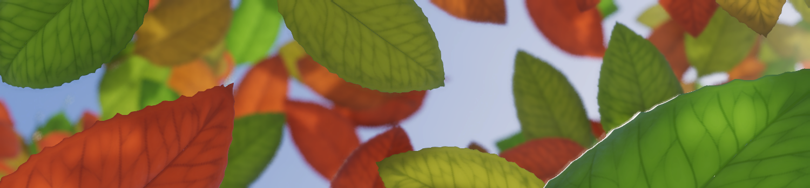

HDRP 16 adds the Colored Translucent material type in Shader Graph. Use this material for thin, double-sided geometry.
This material supports a colored transmission mask and doesn't require a diffusion profile.

### Cinematic Hair Shading

HDRP 16 adds a cinematic mode for the physically-based hair shader. Enable this mode to trade performance for high-quality environment and area lighting with multiple scattering that closely matches a path-traced reference. 

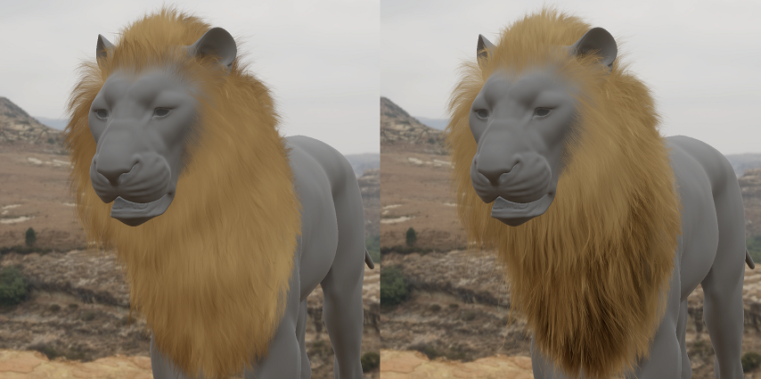

This image shows hair with a single environment light without cinematic shading (left) and with cinematic shading (right). 

This feature requires the [Unity hair system](https://github.com/Unity-Technologies/com.unity.demoteam.hair). 

### ShaderGraph

HDRP 16 adds the [Canvas Master Node](https://docs.unity3d.com/Packages/com.unity.render-pipelines.high-definition@16.0/manual/master-stack-canvas.md) to Shader Graph that you can use to create UI shaders for a Canvas.

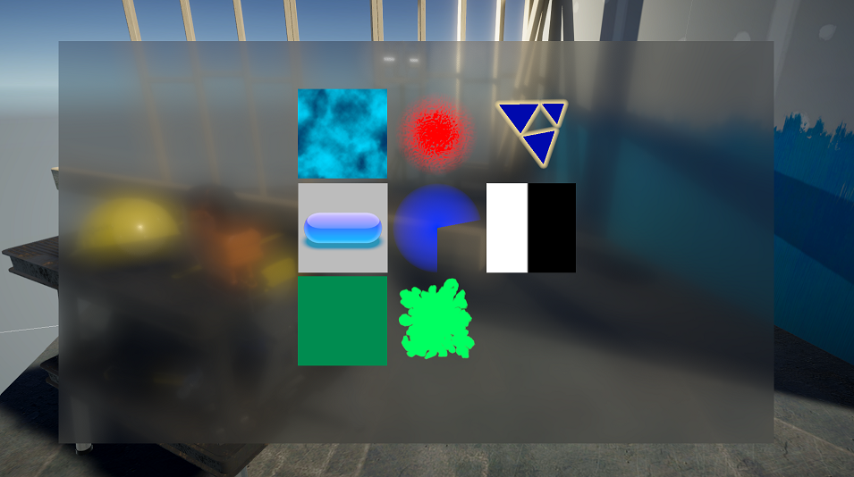

### Path tracer

#### Decals in HDRP Path Tracer

From version 16, the [HDRP Path Tracer](https://docs.unity3d.com/Packages/com.unity.render-pipelines.high-definition@16.0/manual//Ray-Tracing-Path-Tracing.html) supports [Decals](https://docs.unity3d.com/Packages/com.unity.render-pipelines.high-definitio@16.0/manual/manual/Decal.html). HDRP renders decals automatically when you enable path tracing.

To support the decals with path tracing, HDRP regards all decals as clustered decals. This means that HDRP adds them to the [Ray Tracing Light Cluster](https://docs.unity3d.com/Packages/com.unity.render-pipelines.high-definition@16.0/manual/Ray-Tracing-Light-Cluster.html). If a scene includes many decals in a small volume, you might need to increase the following values: 
- [Maximum Lights per Cell (Ray Tracing)](https://docs.unity3d.com/Packages/com.unity.render-pipelines.high-definition@16.0/manual/HDRP-Asset.html#Lights). Futhermore, - The size of the [decal atlas](https://docs.unity3d.com/Packages/com.unity.render-pipelines.high-definition@16.0/manual/HDRP-Asset.html#Decals).

The HDRP Path Tracer does not support emissive decals.

This image displays a puddle and checkerboard decal in a path-traced scene.

#### Henyey-Greenstein Anisotropic Fog

HDRP 16 supports path-traced anisotropic fog. The path tracer uses the Henyey-Greenstein phase function evaluation and sampling. This phase function has an anisotropy parameter that controls the behaviour of the scattering. You can set this parameter between -1 and 1. A negative value corresponds to backward scattering and a positive value corresponds to forward scattering. A value of 0 corresponds to the regular isotropic behavior.
Isotropic scattering (anisotropy=0)
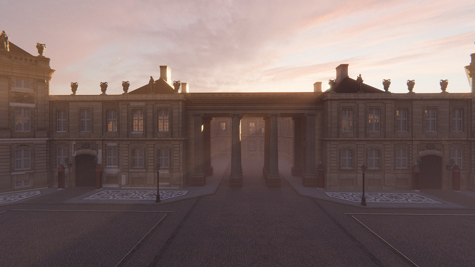

Anisotropic forward scattering (anisotropy=0.75)
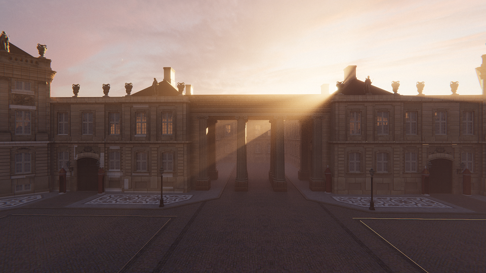

### Volumetric fog output

In version 16, the [Volumetric fog shader graph](https://docs.unity3d.com/Packages/com.unity.render-pipelines.high-definition@16.0/manual/master-stack-fog-volume.html) supports Arbitrary output variable (AOV) output. 

### Color Checker Tool

Use the Color Checker tool to check the calibration of lighting and post processing. To open the color checker tool, go to **GameObject** > **Rendering** > **Color Checker Tool**. HDRP doesn't save any changes you make in the color checker.

### Light Placement Tool

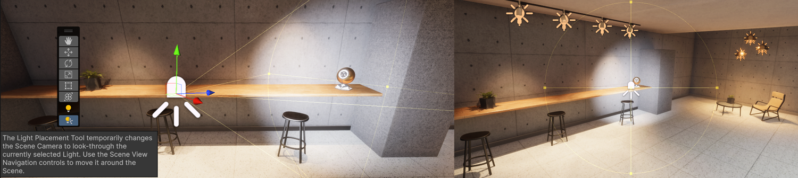

Use the Light Placement Tool to look through a light and use the camera movement controls to move the light around the scene.
To enter this mode select a light GameObject and select the Light Placement Tool button in the Tools Panel. For more information, refer to [Light placement tool](lights-placement-tool.md).

### HDRI Sky Sun Lock

HDRP 16 adds the **lock sun** property to the HDRI Sky component. When you enable this property the sun automatically adjusts its rotation when you rotate the sky in the HDRI Sky Volume Override. If you change the sun rotation value in its transform component, the HDRI Sky also updates its rotation as well.

## Updated

### Night Sky

HDRP 16 updates the Physically Based Sky in the following ways to make it easier to create a night sky:
- Added the PBRSky material type in Shader Graph to allow effects like procedural stars.
- Added an option to mark celestial bodies as moons which makes them receive lighting from the main directional light.

### SpeedTrees

HDRP 16 adds motion vector support for SpeedTrees. To do this, SpeedTree shader graphs use the Transmission Mask input of the Lit master node. This means that speedtrees with a single draw can also recieve vector transmission in the bark and branches.

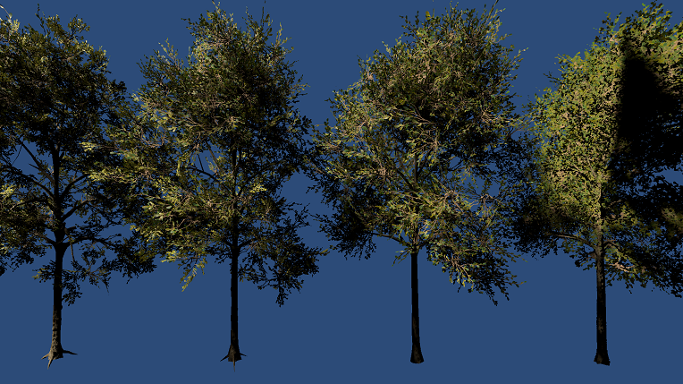
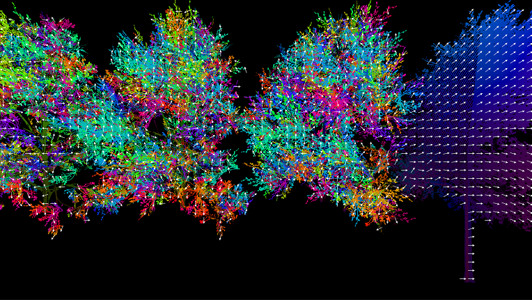

### Shadows

#### Percentage-Closer Soft Shadow (PCSS)
HDRP 16 improves Percentage-Closer Soft Shadow (PCSS) quality for directional. To do this, the shadow samples along a cone instead of a disk. This makes PCSS shadows appear softer. 

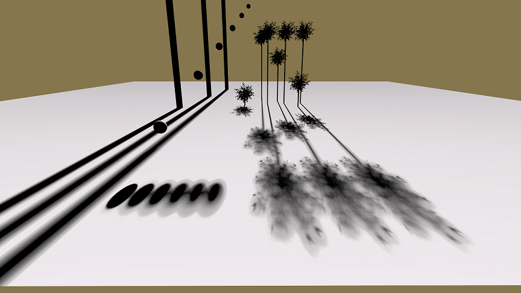
PCSS shadows that sample a disc.
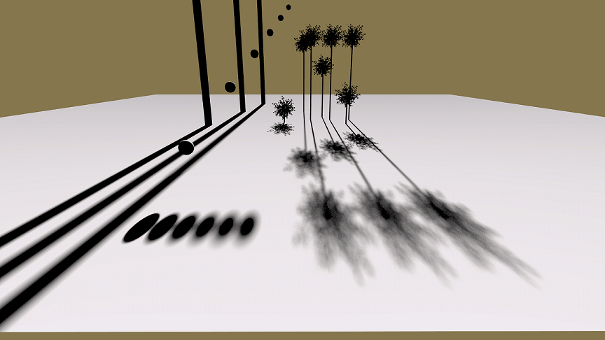
PCSS shadows that sample a cone.

#### Shadow quality 
HDRP 16 adds a 0 Resolution option to shadows. Use this option to disable shadows based on quality level.

Version 16 also splits the **Shadow Filtering Quality** property in the [HDRP Asset](https://docs.unity3d.com/Packages/com.unity.render-pipelines.high-definition@16.0/manual/HDRP-Asset.html) into the following properties: 
- **Punctual Shadow Filtering Quality**. 
- **Directional Shadow Filtering Quality**.

#### Volumetric Clouds Shadows

HDRP 16 updates the algorithm that it uses to render the volumetric clouds shadows. This fixes an issue where clouds cast shadows on objects above the clouds, and softens the shadows that clouds cast.

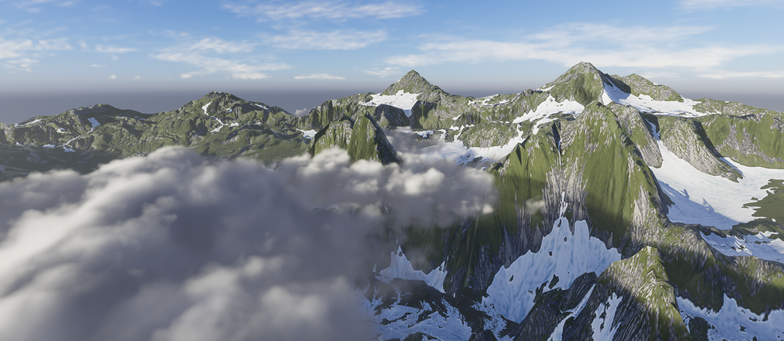

### Ray-Traced reflections ReBLUR denoiser

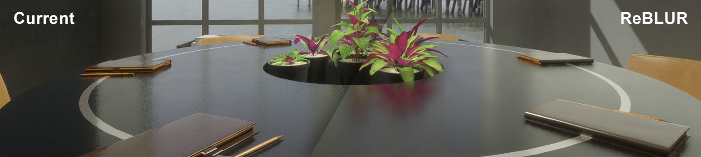

HDRP 16 replaces the Ray-Traced Reflections denoiser with the ReBLUR algorithm. This algorithm includes an anti-flickering setting that improves temporal stability and gives a more even result on rough and smooth objects.
Ray-Traced Reflections uses this denoiser in **Raytracing** mode and **Mixed** mode.

### Disable Planar Probe reflection

In HDRP 16 Reflection, the Planar Probe **Resolution** property has a 0 Resolution option. When you select this property for a quality level, the probe doesn't render reflections on that quality level.

### Probe Volume

From version 16ayou can stream probe volume data directly from a disk. To use disk streaming, enable GPU streaming to be enabled. This reduces the amount of CPU memory probe volumes use.

For more information, refer to [Probe volume streaming](https://docs.unity3d.com/Packages/com.unity.render-pipelines.high-definition@16.0/manual/probevolumes-streaming.html).

### Water system
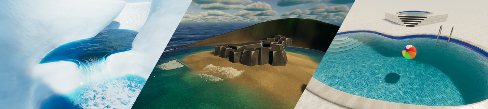

HDRP 16.0 makes the following improvements to the water system:
* Improves performance for rendering surfaces with Instanced Quads.
* Adds an option to disable tessellation.
* Improves interactions between refractive and non-refractive transparent materials. This means that you can see transparent materials that are below a water surface in the pre-refraction pass.
* Fixes how Transparent surfaces receive underwater absorption.
* Adds a set of sample scenes to the [package manager](HDRP-Sample-Content.html#water-samples).
* Adds the [Water Scenes](https://github.com/Unity-Technologies/WaterScenes) [sample project](HDRP-Sample-Projects.html#water-scenes).

### Data Driven Lens Flare XR support

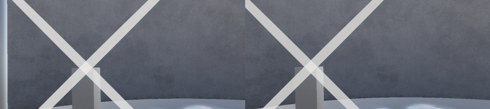

HDRP 16 adds [XR](https://docs.unity3d.com/Manual/xr-graphics.html) support to the data-driven Lens Flare component. This includes single pass instancing and multipass support.

### Volumetric fog fullscreen debug mode

HDRP 16 adds a Volumetric Fog fullscreen debug mode to the [rendering debugger](https://docs.unity3d.com/Packages/com.unity.render-pipelines.high-definition@16.0/manual/Render-Pipeline-Debug-Window.html). This mode displays the fog that affects the opaque geometry. You can control how the fog appears in the debug mode's **Exposure** property. t.

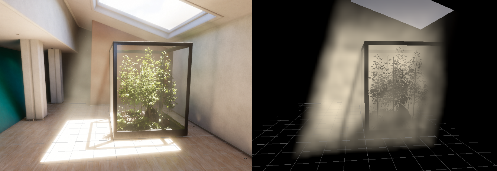

### Render Graph Viewer

Version 16 adds a checkbox to display dependencies between asynchronous passes. When you enable this property, hover over a pass to highlight the last pass on which it depends and the first pass that depends on it.

### HDR screen

HDRP 16 updates its [HDR display](https://docs.unity3d.com/Packages/com.unity.render-pipelines.high-definition@16.0/manual/HDR-Output.html) support to include XR devices that have a HDR display.

### Decals

In HDRP 16.0, the [Decal Master Stack](master-stack-decal.md) can affect transparent objects. The result of a decal shader graph exists in the same decal atlas as [Decal Shader](Decal-Shader.md) materials.
You can also use the **Transparent Dynamic Update** setting in a decal shader graph to animate a decal inside the decal atlas.

