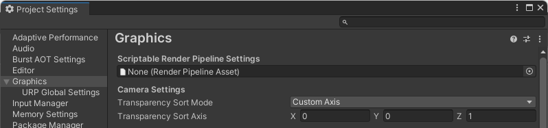
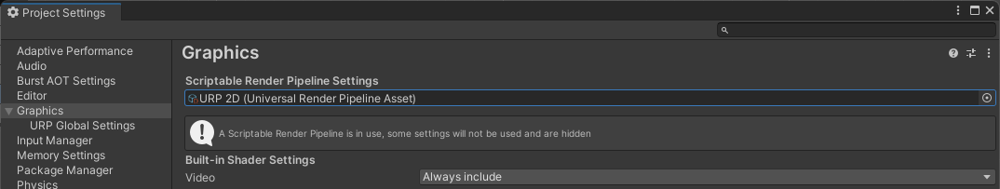
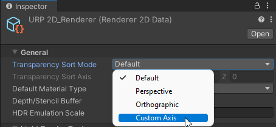
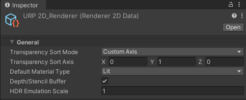

# Using the Tilemap Renderer with URP 2D

Setup and required settings when using the Tilemap Renderer component with URP 2D.

You can use the Tilemap Renderer with URP 2D to enable [2D lighting](../Lights-2D-intro.md) on  [tiles](xref:Tilemap-TileAsset) and [tilemaps](xref:class-Tilemap), especially [isometric tilemaps](xref:Tilemap-Isometric) which simulate pseudo-depth. Doing so requires you to setup your project and adjust the Tilemap Renderer's settings in the following ways.

When you select the [2D Renderer Data asset](../2DRendererData-overview.md) for your project's [Scriptable Render Pipeline](xref:ScriptableRenderPipeline), the Renderer Data asset assumes control of the Tilemap Renderer's **Transparency Sort Mode** property settings and requires you to adjust the settings under the 2D Renderer Data asset's property settings instead of in the Project Settings.

To optimize the rendering of the Tilemap Renderer component with the 2D lighting system, Unity can batch the rendering of the [Tilemap Renderer component](xref:class-TilemapRenderer) with the [Scriptable Render Pipeline Batcher (SRP Batcher)](xref:SRPBatcher) to improve the rendering performance of the Tilemap Renderer with other sprite renderers with the same rendering characteristics.

## Adjusting the Transparency Sort Mode settings in the 2D Renderer Data asset

When you [create an isometric tilemap](xref:Tilemap-Isometric-CreateIso), one of the steps requires you to set the **Transparency Sort Mode** (**Edit** &gt; **Project Settings...** &gt; **Graphics** &gt; **Camera Settings**) to **Custom Axis** and to set it to the [required values](https://docs.unity3d.com/Manual/Tilemap-Isometric-CreateIso.html#customaxis) to have Unity render the Tiles with the pseudo-depth of an isometric perspective.

 *The default location of the* ***Transparency Sort Mode*** *settings when no specific URP Pipeline is selected.*

If you want to use the 2D Renderer with the Tilemap Renderer in your Project, first create the URP Asset and its associated 2D Renderer Data asset by right-clicking the Asset window and go to **Create &gt; Rendering &gt; URP Asset (with 2D Renderer)**. Then go to your Project's **Scriptable Render Pipeline Settings** (menu: **Edit &gt; Project Settings... &gt; Graphics**) and select the Universal Render Pipeline (URP) 2D asset.

When you do so, the **Camera Settings** (including the **Transparency Sort Mode** property become hidden.

 ***Camera Settings*** *hidden after selecting the URP 2D Pipeline Asset.*

The 2D Renderer Data asset now controls the **Transparency Sort Mode** property settings, and the values set in the active Renderer 2D Data asset supersedes the values set in the **Project Settings**. Select the 2D Renderer Data asset go to its Inspector window. In the General section, set **Transparency Sort Mode** to **Custom Axis**.

 *Select* ***Custom Axis*** *in the 2D Renderer Data asset.*

The **Transparency Sort Axis** property settings then become available. Use the same values for the **Transparency Sort Axis** as those used to for the [rendering of tiles on an isometric tilemap](https://docs.unity3d.com/Manual/Tilemap-Isometric-CreateIso.html#customaxis).

 *The generic* ***Transparency Sort Axis*** *setting for isometric tilemaps.*

## Enabling the Scriptable Render Pipeline Batcher

To prepare the Tilemap Renderer for SRP batching:

1. Fulfill the requirements and steps for enabling the [SRP Batcher](https://docs.unity3d.com/Manual/SRPBatcher.html#using-the-srp-batcher) in URP.
2. Select the Tilemap Renderer component and go to its **Mode** property setting.
3. Select either **Individual** or **SRP Batch** (only supported in the Universal Render Pipeline version 15 onwards).

    > **Note**: **Chunk** mode is incompatible with the SRP batcher.

## Additional resources

* [2D Sorting](xref:2DSorting)
* [Scriptable Render Pipeline fundamentals](xref:ScriptableRenderPipeline)
* [Isometric Tilemaps](xref:Tilemap-Isometric)
