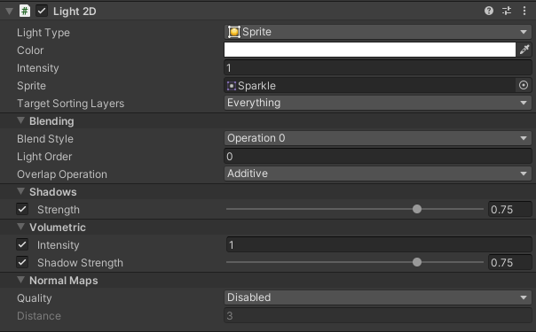

# Common 2D Light Type properties
Each 2D **Light Type** has various properties and options to customize their appearance and behavior. This page documents the properties that are common to all 2D **Light Types**. Select from the list below to refer to the specific properties of each of the available **Light Types**:

* [Freeform](LightTypes.md#freeform)
* [Sprite](LightTypes.md#sprite)
* [Spot](LightTypes.md#spot) (**Note**: The **Point Light 2D** has been renamed to the **Spot Light 2D** from URP 11 onwards.)
* [Global](LightTypes.md#global)

## Creating a Light

Create a **2D Light** GameObject by going to **GameObject > Light** and selecting one of the four available types:

* **Freeform**: You can edit the shape of this Light type with a spline editor.
* **Sprite**: You can select a Sprite to create this Light type.
* **Spot**: You can control the inner and outer radius, direction and angle of this Light type.
* **Global**: This 2D Light affects all rendered Sprites on all targeted sorting layers.

The following are the common properties used by the different Light types.

| Property                                                     | Function                                                     |
| ------------------------------------------------------------ | ------------------------------------------------------------ |
| **Light Type**                                               | Select the type of Light you want the selected Light to be. The available types are **Freeform**, **Sprite**, **Parametric**, **Spot**, and **Global**. |
| **Color**                                                    | Use the color picker to set the color of the emitted light.  |
| **[Intensity](#intensity)**                                  | Enter the desired brightness value of the Light. The default value is 1. |
| **Target Sorting Layers**                                    | Select the sorting layers that this Light targets and affects. |
| **[Blend Style](LightBlendStyles.md)**                       | Select the blend style used by this Light. You can customize different blend styles in the [2D Renderer Asset](2DRendererData-overview.md). |
| **[Light Order](#light-order)** (unavailable for **Global Lights**) | Enter a value here to specify the rendering order of this Light relative to other Lights on the same sorting layer(s). Lights with lower values are rendered first, and negative values are valid. |
| **[Overlap Operation](#overlap-operation)**        | Select the overlap operation used by this light The operations available are **Additive**, and **Alpha Blend**. |
| **Shadow Strength**                                         | Use the slider to control the amount of light that **Shadow Caster 2Ds** block when they obscure this Light. The value scales from 0 (no light is blocked) to 1 (all light is blocked). |
| **Volumtric Intensity**                                           | Use the slider to select the opacity of the volumetric lighting. The value scales from 0 (transparent) to 1 (opaque). |
| **Volumetric Shadow Strength**                                  | Use the slider to control the amount of volumetric light that **Shadow Caster 2Ds** block when they obscure this Light. The value scales from 0 (no light is blocked) to 1 (all light is blocked). |
| **[Normal Map Quality](#quality)**                                      | Select either **Disabled** (default), **Accurate** or **Fast** to adjust the accuracy of the lighting calculations used. |
| **[Normal Map Distance](#distance)**  (available when **Use Normal Map** quality is enabled) | Enter the desired distance (in Unity units) between the Light and the lit Sprite. This does not Transform the position of the Light in the scene. |

## Intensity

Light intensity are available to all types of Lights. Color adjusts the lights color, while intensity allows this color to go above 1. This allows lights which use multiply to brighten a sprite beyond its original color.

## Light Order

The **Light Order** value determines the position of the Light in the Render queue relative to other Lights that target the same sorting layer(s). Lower numbered Lights are rendered first, with higher numbered Lights rendered above those below. This especially affects the appearance of blended Lights when **Overlap Operation** is set to **Alpha Blend**.

## Overlap Operation

This property controls the way in the selected Light interacts with other rendered Lights. You can toggle between the two modes by enabling or disabling this property. The effects of both modes are shown in the examples below:

|  |  |
| ------------------------------------------------------------ | ------------------------------------------------------ |
| **Overlap Operation** set to **Additive** | **Overlap Operation** set to **Alpha Blend**                     |

When **Overlap Operation** is set to **Additive**, the Light is blended with other Lights additively, where the pixel values of intersecting Lights are added together. This is the default Light blending behavior.

When **Overlap Operation** is set to **Alpha Blend**, Lights are blended together based on their alpha values. This can be used to completely overwrite one Light with another where they intersect, but the render order of the Lights is also dependent on the [Light Order](#light-order) of the different Lights.

## Use Normal Map

All lights except for global lights can be toggled to use the normal maps in the sprites material. When enabled, Distance and Accuracy will be visible as new properties.

|  |  |
| ------------------------------------------------ | ------------------------------------------------ |
| **Use Normal Map:** Disabled                     | **Use Normal Map:** Enabled                      |

## Distance

Distance controls the distance between the light and the surface of the Sprite, changing the resulting lighting effect. This distance does not affect intensity, or transform the position of the Light in the scene. The following examples show the effects of changing the Distance values.

|  |  |  |
| ------------------------------------- | ----------------------------------- | ----------------------------------- |
| **Distance**: 0.5                     | **Distance**: 2                     | **Distance**: 8                     |

## Quality

Light quality allows the developer to choose between performance and accuracy. When choosing performance, artefacts may occur. Smaller lights and larger distance values will reduce the difference between fast and accurate.

## Volume Opacity

Volumetric lighting is available to all Light types. Use the **Volume Opacity** slider to control the visibility of the volumetric light. At a value of zero, no Light volume is shown while at a value of one, the Light volume appears at full opacity.

## Shadow Intensity

The Shadow Intensity property controls the amount of light that **Shadow Caster 2Ds** block from the Light source which affects the intensity of their shadows. This is available on all non global Light types. Use this slider to control the amount of light that Shadow Caster 2Ds block when they interact with or block this Light.

The slider ranges from 0 to 1. At 0, Shadow Caster 2Ds do not block any light coming from the Light source and they create no shadows. At the maximum value of 1, Shadow Caster 2Ds block all light from the Light source and create shadows at full intensity.

|  |  |  |
| -------------------------------- | --------------------------------- | ---------------------------------- |
| Shadow Intensity = 0.0           | Shadow Intensity = 0.5            | Shadow Intensity = 1.0             |

## Shadow Volume Intensity

Shadow Volume Intensity determines the amount of volumetric light **Shadow Caster 2Ds** block from the Light source. It is available on all non global lights, and when Volume Opacity is above zero. Use this slider to control the amount of volumetric light that Shadow Caster 2Ds block when they interact with or block this Light.

The slider ranges from 0 to 1. At 0, Shadow Caster 2Ds do not block any light coming from the Light source and they create no shadows. At the maximum value of 1, Shadow Caster 2Ds block all light from the Light source and create shadows at full intensity.

## Target Sorting Layers

Lights only light up the Sprites on their targeted sorting layers. Select the desired sorting layers from the drop-down menu for the selected Light. To add or remove sorting layers, refer to the [Tag Manager - Sorting Layers](https://docs.unity3d.com/Manual/class-TagManager.html#SortingLayers) for more information.
