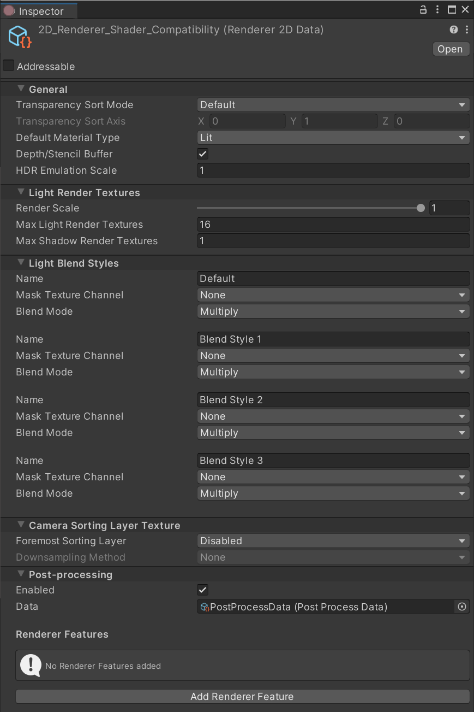
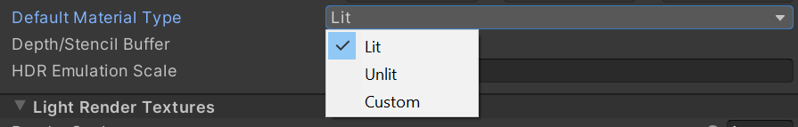
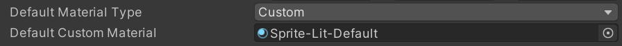

# 2D Renderer Data Asset

The __2D Renderer Data__ Asset contains the settings that affect the way __2D Lights__ are applied to lit Sprites. You can set the way Lights emulate HDR lighting with the [HDR Emulation Scale](HDREmulationScale.md), or customize your own [Light Blend Styles](LightBlendStyles.md). Refer to their respective pages for more information about their properties and options.

## Default Material Type

Unity assigns a Material of the selected __Default Material Type__ to Sprites when they are created. The available options have the following properties and functions.

__Lit__:  Unity assigns a Material with the Lit type (default Material: Sprite-Lit-Default). 2D Lights affect Materials of this type.

__Unlit__: Unity assigns a Material with the Unlit type (default Material:  Sprite-Lit-Default). 2D Lights do not affect Materials of this type.

__Custom__: Unity assigns a Material with the Custom type. When you select this  option, Unity shows the __Default Custom Material__ box. Assign the desired Material to this box.

## Use Depth/Stencil Buffer

This option is enabled by default. Clear this option to disable the Depth/[Stencil](https://docs.unity3d.com/Manual/SL-Stencil.html) Buffer. Doing so might improve your project’s performance, especially on mobile platforms. You should clear this option if you are not using any features that require the Depth/Stencil Buffer (such as [Sprite Mask](https://docs.unity3d.com/Manual/class-SpriteMask.html)).

## Camera Sorting Layer Texture

The __2D Renderer Data__ specifies how Unity supplies the shader variable `CameraSortingLayerTexture` for use in custom shaders. It is recommended that you use this data in the same frame and on the following layers, as using `CameraSortingLayerTexture` before it has been captured may result in unexpected results.

### Foremost Sorting Layer
All Layers captured for use in the supplied Texture will be drawn from the very back Layer up to and including the Layer specified by __Foremost Sorting Layer__.

### Downsampling Method
Downsampling reduces the Texture resolution used by `CameraSortingLayerTexture`. The options are: __None__, __2x Bilinear__, __4x Box__, __4x Bilinear__.

## Renderer Features

The 2D Renderer supports [URP Renderer Features](urp-renderer-feature.md). The setup for the features are called before any of the 2D built-in passes are queued. Refer to the [URP Renderer Features](urp-renderer-feature.md) documentation for more information.
