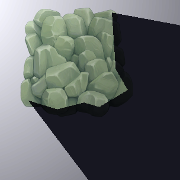
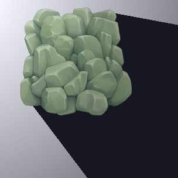
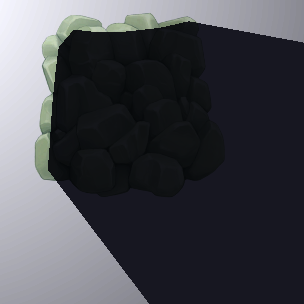
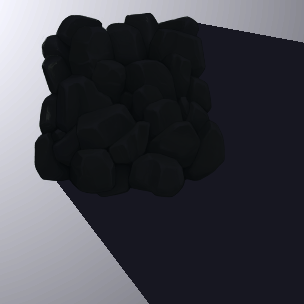
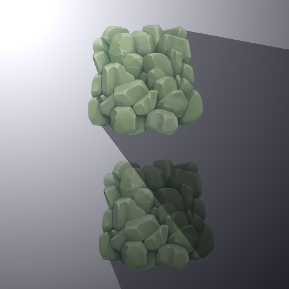
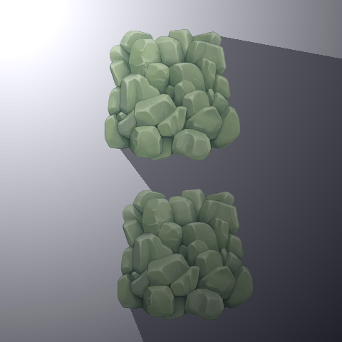

## Create shadows with Shadow Caster 2D

The **Shadow Caster 2D** component defines the shape and properties that a Light uses to determine its cast shadows. Add the **Shadow Caster 2D** component to a GameObject by going to menu: **Component > Rendering > 2D > Shadow Caster 2D**.

| **Property**                | **Function**                                                 |
| --------------------------- | ------------------------------------------------------------ |
| **Use Renderer Silhouette** | Enable this and **Self Shadows** to include the GameObject Renderer's silhouette as part of the shadow. Enable this and disable Self Shadows to exclude the Renderer's silhouette from the shadow. This option is only available when a valid Renderer is present. |
| **Casts Shadows**           | Enable this to have the Renderer cast shadows.               |
| **Self Shadows**            | Enable this to have the Renderer cast shadows on itself.     |

|                  |                   |
| ------------------------------------------------------------ | ------------------------------------------------------------ |
| **Use Renderer Silhouette** disabled, **Self Shadow** disabled | **Use Renderer Silhouette** enabled, **Self Shadow** disabled |
|                  |                    |
| **Use Renderer Silhouette** disabled, **Self Shadows** enabled | **Use Renderer Silhouette** enabled, **Self Shadows** enabled |

## Composite Shadow Caster 2D

The **Composite Shadow Caster 2D** merges the shape of multiple **Shadow Caster 2Ds** together as a single **Shadow Caster 2D**. Add the **Composite Shadow Caster 2D** component to a GameObject by going to menu: **Component > Rendering > 2D > Composite Shadow Caster 2D**, then parent GameObjects with the **Shadow Caster 2D** component to it. The Composite component merges all Shadow Caster 2Ds within this hierarchy, including any Shadow Caster 2Ds on the parent as well.

|     |   |
| -------------------------------------- | ----------------------------------- |
| Without **Composite Shadow Caster 2D** | With **Composite Shadow Caster 2D** |
