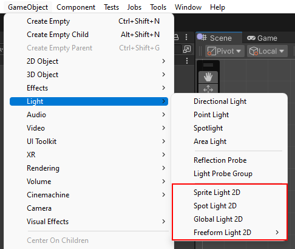

# 2D Graphics Features

2D features included with URP are the [2D Lighting](Lights-2D-intro.md) graphics pipeline which allows you to create 2D Lights and 2D lighting effects; and the [2D Pixel Perfect Camera](2d-pixelperfect.md) for implementing the pixelated visual style with your projects. The following are the different 2D Light Types included in the package's **Light 2D** component:

* [Freeform](LightTypes.md#freeform)
* [Sprite](LightTypes.md#sprite)
* [Spot](LightTypes.md#spot) (**Note**: The **Point** Light Type has been renamed to the **Spot** Light Type from URP 11 onwards.)
* [Global](LightTypes.md#global)

**Important:** The [Parametric Light Type](LightTypes.md#parametric) is deprecated from URP 11 onwards. To convert existing Parametric lights to Freeform lights, go to **Window** &gt; **Rendering** &gt; **Render Pipeline Converter**, change tab to **Upgrade 2D (URP) Assets** and enable the converter **Parametric To Freeform Light Upgrade**.

The package includes the **2D Renderer Data** Asset which contains the **Blend Styles** parameters, and allows you to create up to four custom Light Operations for your Project.
