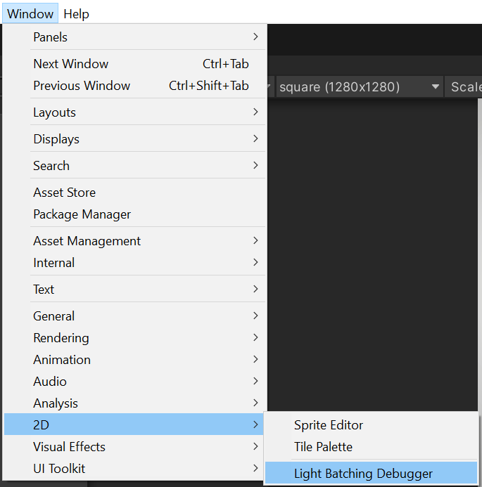

# Using the Light Batching Debugger

The **Light Batching Debugger** visualizes how Unity batches [2D Lights](2DLightProperties.md) and [Shadow Casters](2DShadows.md) according to the [Sorting Layers](https://docs.unity3d.com/Manual/class-TagManager.html#SortingLayers) they target in the scene. For Unity to batch Sorting Layers, the layers need to fulfill the following conditions:

* The layers share the same sets of Lights; that is, the 2D Lights target the same Sorting Layers. 
* The layers share the same sets of Shadow Casters; that is, the Shadow Casters target the same Sorting Layers.

The debugger compares adjacent batches and highlights the Lights or Shadow Casters that target each Sorting Layer, and displays which Lights or Shadow Casters you need to add or remove for Unity to be able to batch the Sorting Layers.

This page explains [how to use the Light Batching Debugger](#how-to-use-the-debugger) and its features, and provides [examples of the different scenarios](#examples-of-different-batching-scenarios) and conditions that determine whether Unity will batch a set of layers.

## How to use the debugger

To use the debugger, follow these steps:

1. Open the debugger window by going to **Window &gt; 2D &gt; Light Batching Debugger**.

2. View the Light Batching Debugger updates in real time by keeping the Game view and the debugger window open at the same time.

3. Select a batch from the left side of the debugger window to view Lights and Shadow Casters in the current batch.

    Sorting Layers that are color coded differently means that they're in different batches with different **Batch IDs** and aren't batched together.

    Sorting Layers that share the same color code are batched together and will share the same **Batch ID**.

4. Select adjacent batches to compare the differences between the selected batches. The debugger window displays the Light(s) and Shadow Caster(s) included in each batch in separate panels.

    In this example, **Light A** exists in **Batch 0** and not in **Batch 1**. The debugger provides instructions at the bottom of the window on what you need to do to have Unity batch the two selected batches together; that is, **Batch 0** contains **Light A** which currently only targets the **BG** Sorting Layer. By having **Light A** also target the **Default** Sorting Layer, Unity may be able to batch both **Batch 0** and **Batch 1** together.

## Examples of different batching scenarios

The following are examples of how Unity batches Lights and Shadow Casters under different conditions. Each example consists of two Sorting Layers named **BG** and **Default**, and two Lights named **A** and **B**.

### Scenario 1
**Conditions:** **Lights A** and **B** target both the **BG** and **Default** Sorting Layers. Shadows are disabled for both Lights; that is, there are no Shadow Casters.

**Result:** Unity batches both Lights together as they target the same layers.

### Scenario 2
**Conditions:** **Light A** targets **BG**, while **Light B** targets **Default**. Shadows are disabled for both Lights.

**Result:** Unity doesn't batch the layers as both Lights target different Sorting Layers.

### Scenario 3
**Conditions:** Both **Lights A** and **B** target both **BG** and **Default** Sorting Layers. Shadows are enabled for both Lights and the Shadow Casters target both the **BG** and **Default** layers.

**Result:** Unity batches the layers as both Lights and sets of Shadow Casters target the same layers.

### Scenario 4
**Conditions:** Both **Lights A** and **B** target both **BG** and **Default**. Shadows are only enabled for **Light A**, and the Shadow Caster targets both  **BG** and **Default**.

**Result:** Unity batches the layers as the Shadow Caster targets both Sorting Layers so that both layers share the same shadow settings, making the light texture the same for both layers.

### Scenario 5
**Conditions:** Both **Lights A** and **B** target both the **BG** and **Default** Sorting Layers. Shadows are enabled for both Lights, and the Shadow Caster only targets the **BG** layer.

**Result:** Unity doesn't batch the layers as the Shadow Caster targets one layer and not the other; this results in the light textures of both layers not being the same and unable to be batched.

 