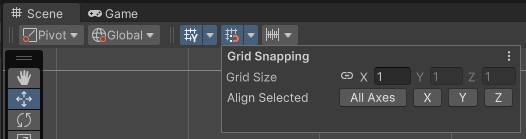
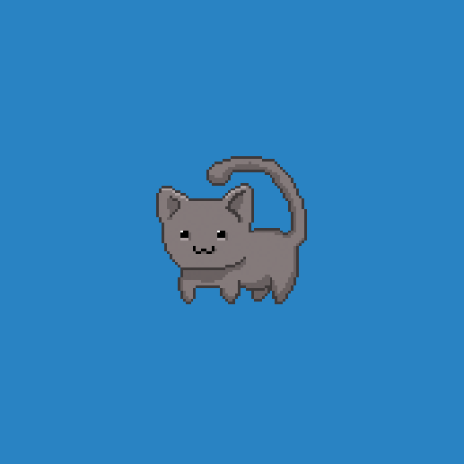

# 2D Pixel Perfect

The **2D Pixel Perfect** package contains the **Pixel Perfect Camera** component, which ensures your pixel art remains crisp and clear at different resolutions, and stable in motion. The component calculates what Unity needs to scale the viewport with resolution changes to maintain the pixel perfect visual style, so that you don’t need to calculate manually. You can use the component settings to adjust the definition of the rendered pixel art within the camera viewport, and preview any changes made in the Game view.

To begin using the component, attach the **Pixel Perfect Camera** component to the main Camera GameObject in the scene. The component is represented by two green bounding boxes centered on the **Camera** Gizmo in the Scene view. The solid green bounding box shows the visible area in Game view, while the dotted bounding box shows the [Reference Resolution](#reference-resolution).

## How to prepare your sprites

Before using the component, follow the steps below to prepare your sprites for compatibility with the Pixel Perfect Camera component:

1. After importing your asset into the project as sprites, set all sprites to the same **Pixels Per Unit** value.

    

2. In the sprites' Inspector window, open the **Filter Mode** dropdown and select **Point**.

    

3. Open the **Compression** dropdown and select **None**.

    

Follow the steps below to set the pivot for a sprite:

1. Open the **Sprite Editor** window for the selected sprite.

2. If the sprite's **Sprite Mode** is set to **Multiple** and there are multiple individual sprite elements in the imported texture, then you need to set a pivot point for each individual sprite element.

3. In the Sprite panel at the lower left of the **Sprite Editor** window, open the **Pivot** dropdown and select **Custom**. Then open the **Pivot Unit Mode** and select **Pixels**. This allows you to set the pivot point's coordinates in pixels, or drag the pivot point around in the **Sprite Editor** and have it automatically snap to pixel corners.
    

4. Repeat step 3 for each sprite element as necessary.

## Set up snap settings

Follow the steps below to set the snap settings for your project to ensure that the movement of pixelated sprites are consistent with each other:

1. To open the **Increment Snapping** settings, go to **Grid and Snap Overlay** in the Scene view.

    

2. Set the **Move X/Y/Z** properties to 1 divided by the Pixel Perfect Camera’s **Asset Pixels Per Unit (PPU)** value. For example, if the Asset **PPU** is 100, you should set the **Move X/Y/Z** properties to 0.01 (1 / 100 = 0.01).

    

3. Select the **Grid Snapping** icon to enable it (highlighted in blue).

4. Unity does not apply Snap settings retroactively. If there are any pre-existing GameObjects in the scene, select each of them and select **All Axes** to apply the updated Snap settings.

## Pixel Perfect Camera component properties

The component's Inspector window

|**Property**|**Function**|
| --- | --- |
|**Asset Pixels Per Unit**|This is the amount of pixels that make up one unit of the scene. Match this value to the **Pixels Per Unit** values of all sprites in the scene.|
|**Reference Resolution**|This is the original resolution your assets are designed for.|
|**Crop Frame**| Select what to do when there is a difference in aspect ratio.
|**Grid Snapping**| Select what to do when snapping.
|**Filter Mode** (Only available when **Stretch Fill** option is selected.)| Select the method Unity uses to upscale the final image.
|**Current Pixel Ratio**|Shows the size ratio of the rendered sprites compared to their original size.|

### Reference Resolution

This is the original resolution your Assets are designed for. Scaling up Scenes and Assets from this resolution preserves your pixel art cleanly at higher resolutions.

### Grid Snapping options
#### Upscale Render Texture

By default, the Scene is rendered at the pixel perfect resolution closest to the full screen resolution.

Enable this option to have the Scene rendered to a temporary texture set as close as possible to the **Reference Resolution**, while maintaining the full screen aspect ratio. This temporary texture is then upscaled to fit the entire screen.

The result is unaliased and unrotated pixels, which may be a desirable visual style for certain game projects.

#### Pixel Snapping

Enable this feature to snap sprite Renderers to a grid in world space at render-time. The grid size is based on the **Assets Pixels Per Unit** value.

**Pixel Snapping** prevents subpixel movement and make sprites appear to move in pixel-by-pixel increments. This does not affect any GameObjects' Transform positions.

### Crop Frame

Crops the viewport based on the option selected, adding black bars to match the **Reference Resolution**. Black bars are added to make the Game view fit the full screen resolution.

|  |  |
| :--------------------------------------------: | :------------------------------------------: |
|                   Uncropped                    |                   Cropped                    |

### Filter Mode

**Filter Mode** is only usable when **Stretch Fill** option is selected.

Defaults to **Retro AA** upscale filtering, where the image is upscaled as close as possible to the screen resolution as a multiple of the **Reference resolution**, followed by a bilinear filtering to upscale to the target screen resolution.

**Point** filtering is also available for user preference. If you upscale the image this way, it can suffer from bad pixel placement, thus losing pixel perfectness.

|  |  |
| :--------------------------------------------: | :------------------------------------------: |
|                   Point                        |                   Retro AA                   |
|  |  |
|         Upscale Render Texture + Point         |      Upscale Render Texture + Retro AA       |
