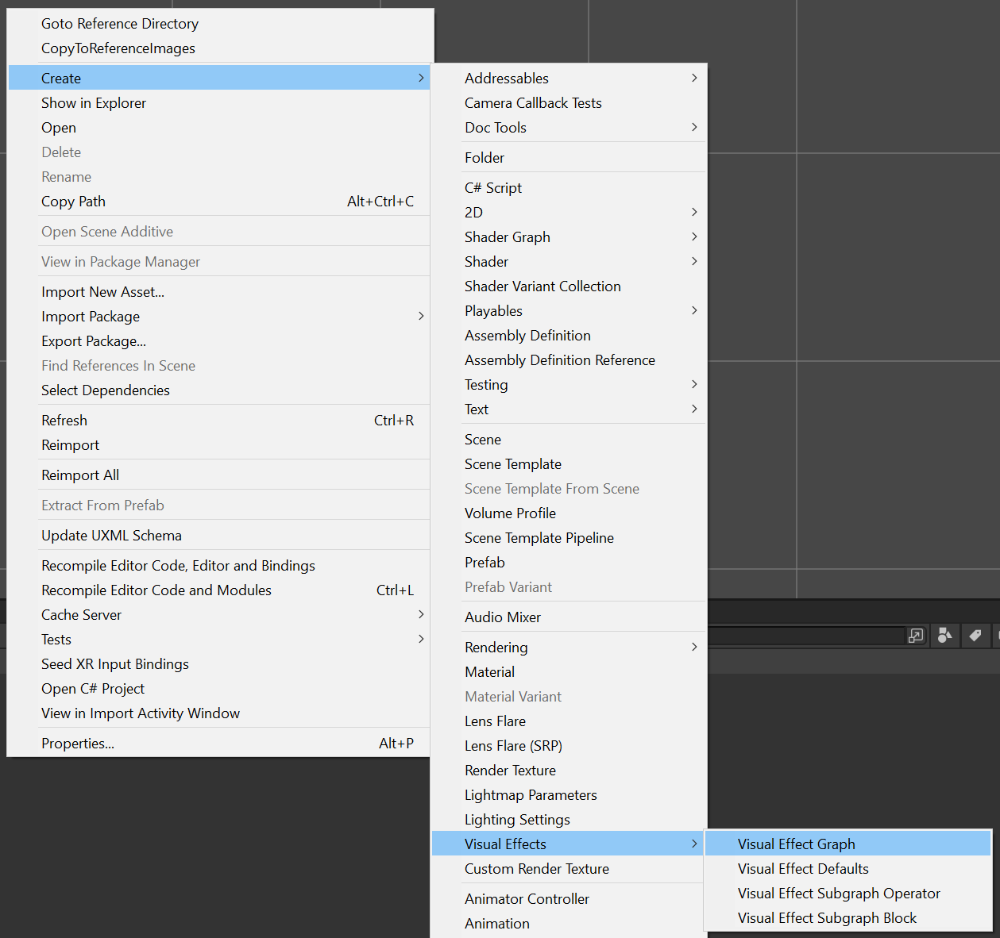
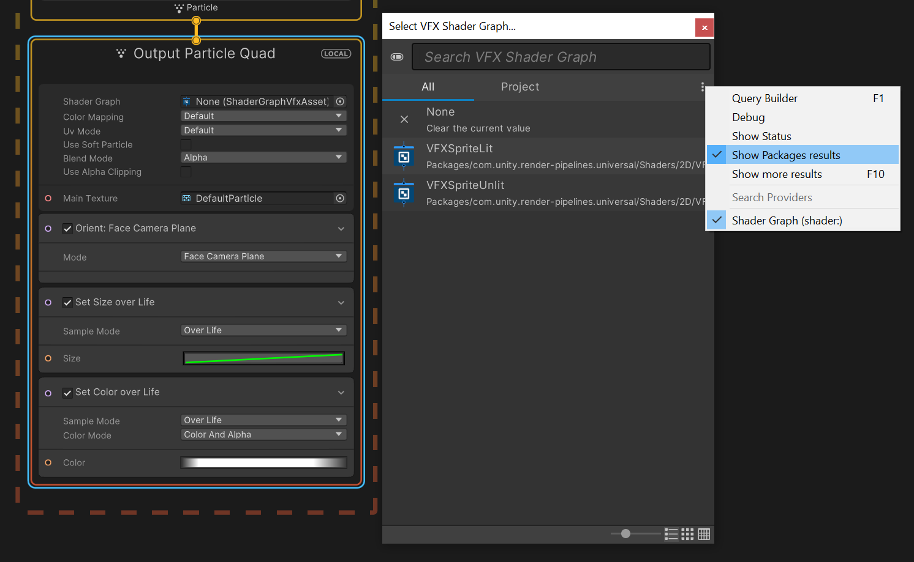
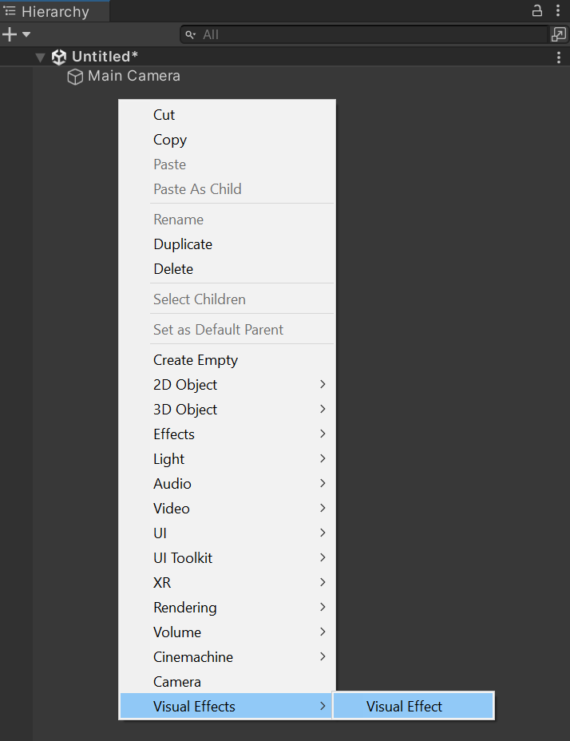

# 2D Visual Effect Graph

Visual Effect Assets are compatible with the 2D Renderer using Shader Graph, see [version requirements](https://docs.unity3d.com/Packages/com.unity.visualeffectgraph@latest?subfolder=/manual/System-Requirements.html). Refer to [Using a Shader Graph in a visual effect](https://docs.unity3d.com/Packages/com.unity.visualeffectgraph@latest?subfolder=/manual/sg-working-with.html#using-a-shader-graph-in-a-visual-effect), to set up the **Visual Effect Graph**.

## Creating a Visual Effect Asset

1. Create a new Visual Effect Asset by selecting **Assets > Create > Visual Effects > Visual Effect Graph**. The Visual Effect Asset is then created in the **Asset** folder of the **Project** window.
   
    

2. Double-click the new Asset to open the **Visual Effect Graph**.
   
    

3. Navigate to Output Particle Quad context, under Shader Graph option select the button to choose a Shader Graph. Enable **Show Packages results** and select **VFXSpriteLit** or **VFXSpriteUnlit** Shader Graph depending if the Visual Effect is affected by lights.
   
    

## Creating a Visual Effect

1. Create a Visual Effect Game Object in the **Hierarchy** view.
   
    

2. Add the newly create **Visual Effect Asset** to the Asset Template property.
   
    

3. Add a Light 2D in the scene, if you want the Visual Effect to be lit.
   
    
