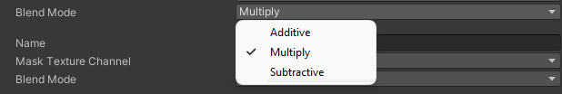

# Light Blend Styles

In the [2D Renderer Data asset](2DRendererData-overview.md), its **Light Blend Styles** determine the way that the light interacts with sprites in the scene. The asset can contain a total of four different **Light Blend Styles**, each with a different combination of Blend Style settings by default. All lights in the scene must pick from one of these available **Light Blend Styles**. When you create a light, it's automatically assigned the first Blend Style listed in the asset.

| **Property**             | **Function**                                                 |
| ------------------------ | ------------------------------------------------------------ |
| **Name**                 | The name that appears when choosing a Blend Style for a Light 2D. |
| **Mask Texture Channel** | Select the channel(s) that the mask texture affects in this Blend Style. |
| **Blend Mode**           | Select [how a 2D Light is blended](#blend-mode) when using this Blend Style. |

## Blend Mode

A **Blend Mode** controls the way a sprite is lit by light. The following examples display the  effects of the four predefined Blend Modes at their default settings.

|  |     |
| ------------------------------------------ | ----------------------------------- |
| Original sprite.                            | **Blend Mode** set to **Multiply**                            |
|            |  |
| **Blend Mode** set to **Additive**                                   | **Blend Mode** set to **Subtractive**                         |

## Mask Texture Channel

A mask controls where lights can affect a sprite. For this property, select which channel(s) of the mask texture will affect the sprite it's masking. These channels comprise the red green blue alpha (RGBA) color model.

## Blend Mode

This property determines how Unity blends the lighting with the colors of the sprite and other GameObjects that the light affects. The following are some examples of how a mask affects the sprite its covering with different **Blend Modes**.

|      |                       |
| ----------------------------------------------- | ------------------------------------------------------ |
| Rock sprite with its original color.                             | Rock with a mask                                       |
|  |  |
| Additive Light Blending                         | Additive Light Blending with a mask                    |