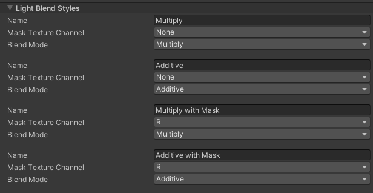

# Light Blend Styles

**Blend Styles** determine the way a particular Light interacts with Sprites in the Scene. All Lights in the Scene must pick from one of the available Blend Styles. The Universal Render Pipeline (URP) 2D Asset can currently contain a total of four different Light Blend Styles, with different default Blend Style settings. Lights created will default to the first Blend Style.

| **Property**             | **Function**                                                 |
| ------------------------ | ------------------------------------------------------------ |
| **Name**                 | The name that appears when choosing a Blend Style for a Light2D. |
| **Mask Texture Channel** | Which mask channel to use when applying this Blend Style to a Sprite. |
| **Render Texture Scale** | Scale for the internal render texture created for this Blend Style. |
| **Blend Mode**           | What blending mode the Light2D uses when this Blend Style is selected. |

## Blend Mode

Blend Modes controls the way a Sprite is lit by light. The following examples show the four predefined Blend Modes:

|  |     |
| ------------------------------------------ | ----------------------------------- |
| Original Sprite                            | Multiply                            |
|            |  |
| Additive                                   | Subtractive                         |

## Mask Texture Channel

Masks control where Lights can affect a Sprite. There are 4 channels to select from as the mask channel - Red, Blue, Green, and Alpha. In a mask max value means full light, min value means no light.

|      |                       |
| ----------------------------------------------- | ------------------------------------------------------ |
| Original Rock Color                             | Rock with a mask                                       |
|  |  |
| Additive Light Blending                         | Additive Light Blending with a mask                    |

## Render Texture Scale

Render Texture Scale adjusts the size of the internal render Texture used for a given Blend Mode. Lowering the Render Texture Scale can increase performance and decrease memory usage for Scenes that contain large Lights. Lowering the Texture Scale to too low a value may cause visual artefacts or a shimmering effect when there is motion in the Scene.
