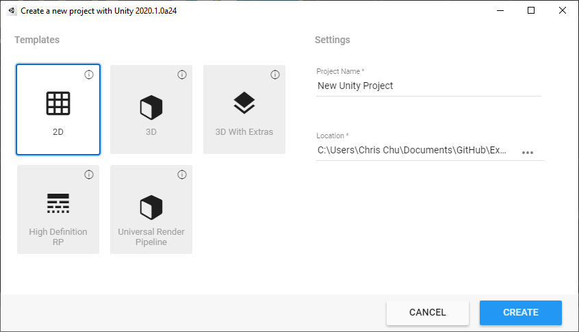
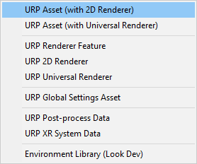
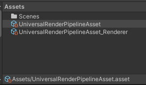
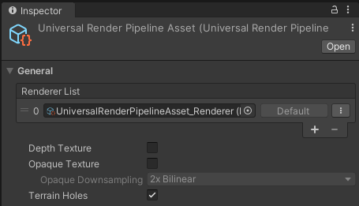
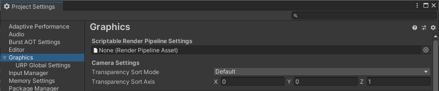
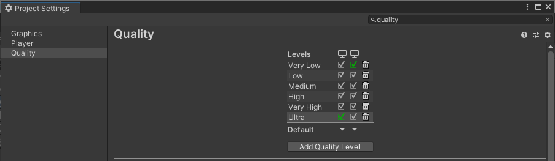
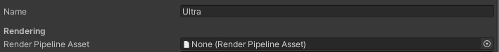

# Requirements and setup

Install the following Editor and package versions to begin working with the __2D Renderer__:

- __Unity 2021.2.0b1__ or later

- __Universal Render Pipeline__ version 10 or higher (available via the Package Manager)

## 2D Renderer Setup
1. Create a new Project using the [2D template](https://docs.unity3d.com/Manual/ProjectTemplates.html).

2. Create a new __Pipeline Asset__ and __Renderer Asset__ by going to the __Assets__ menu and selecting __Create > Rendering > URP Asset (with 2D Renderer)__.
   
    

3. Enter the name for both the Pipeline and Renderer Assets. The name is automatically applied to both, with "_Renderer" appended to the name of the Renderer Asset.
   
    

4. The Renderer Asset is automatically assigned to the Pipeline Asset.
   
    

5. To set the graphics quality settings, there are two options:

   __Option 1: For a single setting across all platforms__
   1. Go to __Edit > Project Settings__ and select the __Graphics__ category.
   
    
   2. Drag the __Pipeline Asset__ created earlier to the __Scriptable Render Pipeline Settings__ box, and adjust the quality settings.
    

   __Option 2: For settings per quality level__
   1. Go to __Edit > Project Settings__ and select the [Quality](https://docs.unity3d.com/Manual/class-QualitySettings.html) category.
   
    
   2. Select the quality levels to be included in your Project.
   3. Drag the __Pipeline Asset__ created earlier to the __Rendering__ box.
   
    
   4. Repeat steps 2-3 for each quality level and platform included in your Project.

The __2D Renderer__ is now set up for your Project.

__Note:__ If you use the __2D Renderer__ in your Project, some of the options related to 3D rendering in the __Universal Render Pipeline Asset__ will not affect or impact on your final app or game.
