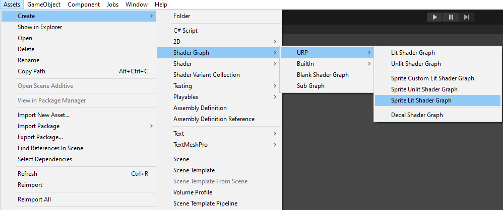
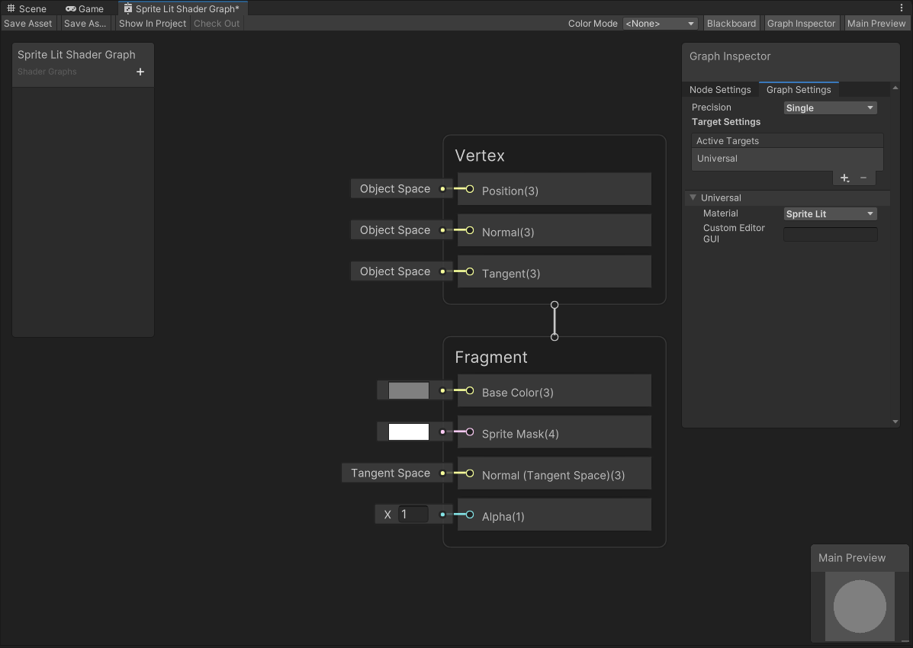
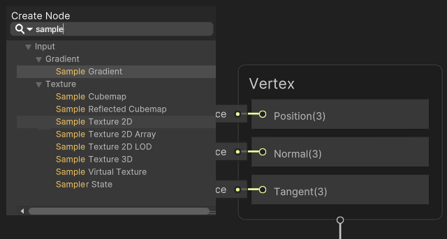
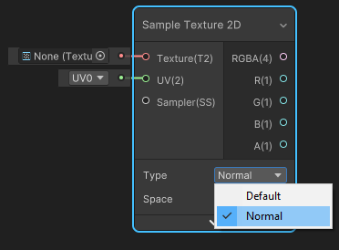
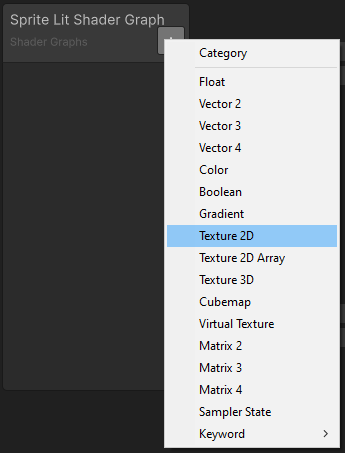
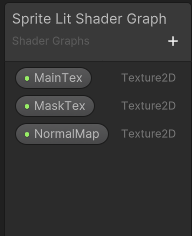
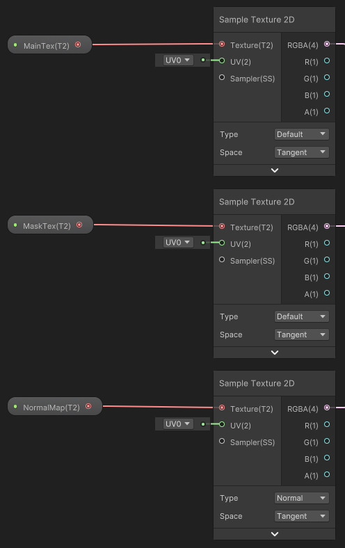
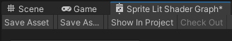

# 2D Renderer and Shader Graph

## Creating a Lit Shader

1. Create a new Asset by selecting __Assets > Create > Shader Graph > URP > Sprite Lit Shader Graph__. The Shader Graph Asset is then created in the Asset window.

   
    

2. Double-click the new Asset to open the __Shader Graph__.
   
    

3. Create three **Sample Texture 2D** Nodes by right-clicking on the Shader Graph window and selecting **Create Node**, then search for and select the **Sample Texture 2D** option.
   
    

4. Change the **Type** of one of the Nodes to **Normal**.
   
    

5. Attach the RGBA(4) **Output Slot** of the **Default Type** Nodes as shown below. Note that you should attach the **Normal Type** Node's Output Slot to the **Normal(Tangent Space)(3)** Input Slot.
      
       

6. Create three **Texture 2D** properties by selecting the **+** on the [Blackboard](http://docs.unity3d.com/Packages/com.unity.shadergraph@12.0/manual/Blackboard.html), and then select **Texture 2D**. Name them 'MainTex', 'MaskTex', and 'NormalMap' for this example.
    
    

7. Drag each of the **Texture 2D** properties onto the editor window. Attach each of the properties to the **Input Slots** of the Sample Texture 2D Nodes as shown below. Note that the 'NormalMap' property must be attached to the **Normal Type** Node only.
   
    

8. Select the **NormalMap** property, then in the **Graph Inspector** set **Mode** to **Normal Map**.

9. If your sprite texture has transparency, attach the alpha (**A**) output of the **Base Color** texture to the **Alpha** input of the **Fragment** context.

10. Select **Save Asset** to save the Shader.
   

You can now apply the newly built Shader to materials.
