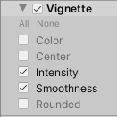

# Volume Overrides

__Volume Overrides__ let you change or extend the default properties in a [Volume Profile](Volume-Profile.md).

URP implements post-processing effects as Volume Overrides. For example, the following image shows the Vignette post-processing effect in the URP Template SampleScene.

In a the Volume Override, checkboxes to the left of each property let you enable or disable specific properties. If you disable a property, URP uses the Volume’s default value for that property instead. To turn all properties on or off, use the __All__ or __None__ shortcuts above the property list.

## How to add a Volume Override to a Volume component

To add a Volume Override to a Volume component:

1. Select a GameObject with the Volume component.

2. In the Inspector window, click Add Override.

    

    Use the search field to search for an Override, or select an Override from the menu.
