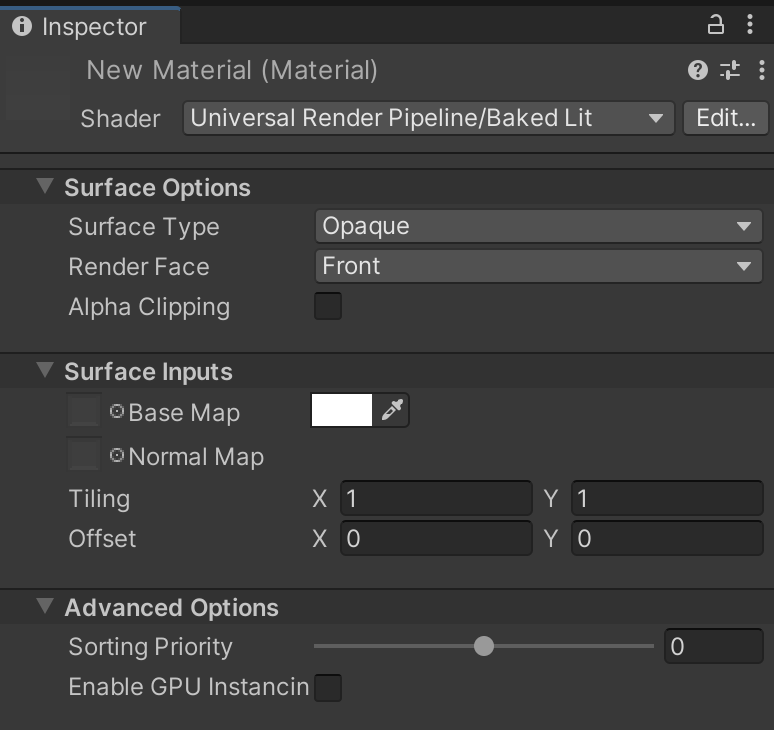
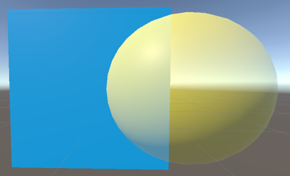
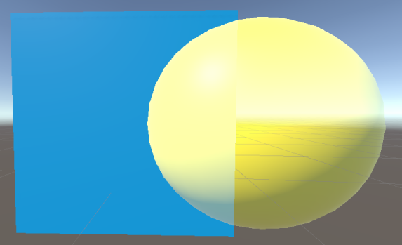
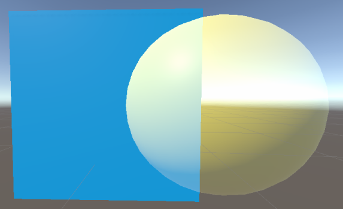
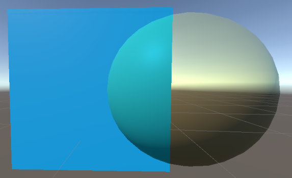

# Baked Lit Shader

In the Universal Render Pipeline (URP), use this Shader for stylised games or apps that only require [baked lighting](https://docs.unity3d.com/Manual/LightMode-Baked.html)via [lightmaps](https://docs.unity3d.com/Manual/Lightmapping.html) and [Light Probes](https://docs.unity3d.com/Manual/LightProbes.html). This shader does not use [Physically Based Shading](shading-model.md#physically-based-shading) and has no real-time lighting, so all real-time relevant shader keywords and variants are [stripped](shader-stripping.md) from the Shader code, which makes it faster to calculate.

## Using the Baked Lit Shader in the Editor

To select and use this Shader:

1. In your Project, create or find the Material you want to use the Shader on.  Select the __Material__. A Material Inspector window opens.
2. Click __Shader__, and select __Universal Render Pipeline__ > __Baked Lit__.

## UI overview

The Inspector window for this Shader contains these elements:

- __[Surface Options](#surface-options)__
- __[Surface Inputs](#surface-inputs)__
- __[Advanced](#advanced)__

### Surface Options

The __Surface Options__ control how the Material is rendered on a screen.

| Property           | Description                                                  |
| ------------------ | ------------------------------------------------------------ |
| __Surface Type__   | Use this drop-down to apply an __Opaque__ or __Transparent__ surface type to the Material. This determines which render pass URP renders the material in. __Opaque__ surface types are always fully visible, regardless of what’s behind them. URP renders opaque Materials first. __Transparent__ surface types are affected by their background, and they can vary according to which type of transparent surface type you choose. URP renders transparent Materials in a separate pass after opaque objects.  If you select __Transparent__, the __Blending Mode__ drop-down appears. |
| __Blending Mode__   | Select how Unity calculates the color of each pixel of a transparent Material when it blends the Material with the background.  In the context of Blending Modes, Source refers to the transparent Material where the Blending Mode is set and Destination refers to anything that Material overlaps with. |
|&#160;&#160;&#160;&#160;Alpha |  *Alpha blending mode.*  __Alpha__ uses the Material's alpha value to change how transparent an object is. 0 is fully transparent. 255 is fully opaque, this is translated to a value of 1 when used with the blending equations. The Material is always rendered in the Transparent render pass regardless of it's alpha value.  Alpha equation: *OutputRGBA* = (*SourceRGB* &#215; *SourceAlpha*) + *DestinationRGB* &#215; (1 &#8722; *SourceAlpha*) |
|&#160;&#160;&#160;&#160;Premultiply |  *Premultiply blending mode.*  __Premultiply__ first multiplies the RGB values of the transparent Material by its alpha value then applies a similar effect to the Material as __Alpha__. The equation for __Premultiply__ also allows areas of the transparent Material with an alpha value of 0 to have an additive blend effect. This can help reduce artifacts that may appear at the edge of the overlap between opaque and transparent pixels.  Premultiply equation: *OutputRGBA* = *SourceRGB* + *DestinationRGB* &#215; (1 &#8722; *SourceAlpha*) |
|&#160;&#160;&#160;&#160;Additive |  *Additive blending mode.*  __Additive__ adds the color values of the Materials together to create the blend effect. The alpha value determines the strength of the source Material's color before the blend is calculated.  Additive equation: *OutputRGBA* = (*SourceRGB* &#215; *SourceAlpha*) + *DestinationRGB* |
|&#160;&#160;&#160;&#160;Multiply |  *Multiply blending mode.*  __Multiply__ multiplies the color of the Material with the color behind the surface. This creates a darker effect, like when you look through colored glass. This mode uses the Material’s alpha value to adjust how much the colors blend. An alpha value of 1 results in unadjusted multiplication of the colors while lower values blend the colors towards white.  Multiply equation: *OutputRGBA* = *SourceRGB* &#215; *DestinationRGB* |
| __Render Face__    | Use this drop-down to determine which sides of your geometry to render. __Front Face__ renders the front face of your geometry and [culls](https://docs.unity3d.com/Manual/SL-CullAndDepth.html) the back face. This is the default setting.  __Back Face__ renders the front face of your geometry and culls the front face.  __Both__ makes URP render both faces of the geometry. This is good for small, flat objects, like leaves, where you might want both sides visible. |
| __Alpha Clipping__ | Makes your Material act like a [Cutout](https://docs.unity3d.com/Manual/StandardShaderMaterialParameterRenderingMode.html) Shader. Use this to create a transparent effect with hard edges between the opaque and transparent areas. For example, to create blades of grass. To achieve this effect, URP does not render alpha values below the specified __Threshold__, which appears when you enable __Alpha Clipping__.  You can set the __Threshold__ by moving the slider, which accepts values from 0 to 1. All values above your threshold are fully opaque, and all values below your threshold are invisible. For example, a threshold of 0.1 means that URP doesn't render alpha values below 0.1. The default value is 0.5. |

### Surface Inputs

The __Surface Inputs__ describe the surface itself. For example, you can use these properties to make your surface look wet, dry, rough, or smooth.

| Property       | Description                                                  |
| -------------- | ------------------------------------------------------------ |
| __Base Map__   | Adds color to the surface, also known as the diffuse map. To assign a Texture to the __Base Map__ setting, click the object picker next to it. This opens the Asset Browser, where you can select from the Textures in your Project. Alternatively, you can use the [color picker](https://docs.unity3d.com/Manual/EditingValueProperties.html). The color next to the setting shows the tint on top of your assigned Texture. To assign another tint, you can click this color swatch. If you select __Transparent__ or __Alpha Clipping__ under __Surface Options__, your Material uses the Texture’s alpha channel or color. |
| __Normal Map__ | Adds a normal map to the surface. With a [normal map](https://docs.unity3d.com/Manual/StandardShaderMaterialParameterNormalMap.html?), you can add surface details like bumps, scratches and grooves. To add the map, click the object picker next to it. The normal map picks up ambient lighting in the environment. |
| __Tiling__     | A 2D multiplier value that scales the Texture to fit across a mesh according to the U and V axes. This is good for surfaces like floors and walls. The default value is 1, which means no scaling. Set a higher value to make the Texture repeat across your mesh. Set a lower value to stretch the Texture. Try different values until you reach your desired effect. |
| __Offset__     | The 2D offset that positions the Texture on the mesh.  To adjust the position on your mesh, move the Texture across the U or V axes. |

### Advanced

The __Advanced__ settings affect the underlying calculations of your rendering. They do not have a visible effect on your surface.

| Property                  | Description                                                  |
| ------------------------- | ------------------------------------------------------------ |
| __Enable GPU Instancing__ | Makes URP render meshes with the same geometry and Material in one batch, when possible. This makes rendering faster. URP cannot render Meshes in one batch if they have different Materials or if the hardware does not support GPU instancing. |
| __Sorting Priority__              | Use this slider to determine the chronological rendering order for a Material. URP renders Materials with lower values first. You can use this to reduce overdraw on devices by making the pipeline render Materials in front of other Materials first, so it doesn't have to render overlapping areas twice. This works similarly to the [render queue](https://docs.unity3d.com/ScriptReference/Material-renderQueue.html) in the built-in Unity render pipeline. |
