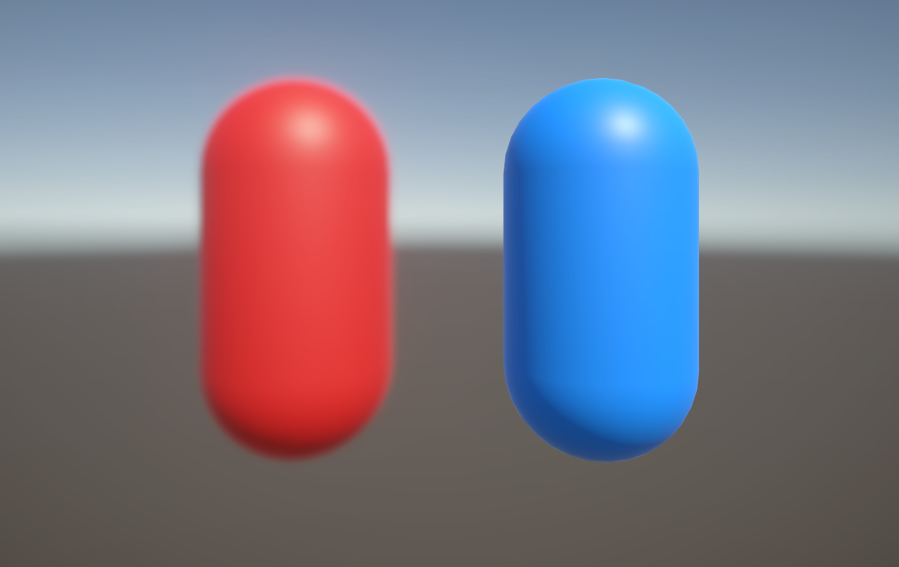

# Set up a camera stack

This page describes how to use a camera stack to layer outputs from multiple cameras to the same render target. For more information on camera stacking, refer to [Understand camera stacking](cameras/camera-stacking-concepts.md).

 *An example of a scene that uses camera stacking to render a red capsule with a post-processing effect, and a blue capsule with no post-processing.*

Follow these steps to set up a camera stack:

1. [Create a camera stack](#create-a-camera-stack).
2. [Set up layers and culling masks](#set-up-layers-and-culling-masks).

## Create a camera stack

Create a camera stack with a Base Camera and one or more Overlay Cameras.

For more information on how to do this, refer to [Add a camera to a camera stack](cameras/add-and-remove-cameras-in-a-stack.md#add-a-camera-to-a-camera-stack).

## Set up layers and culling masks

Once you create your camera stack, you must assign any GameObjects the Overlay Cameras need to render to a [layer](xref:Layers), then set the **Culling Mask** of each camera to match the layer.

To do this use the following steps:

1. Add as many layers as your project requires. For information on how to do this, refer to [Add a new layer](xref:create-layers).
2. For each GameObject you want an Overlay Camera to render, assign the GameObject to the appropriate layer.
3. Select the Base Camera of your camera stack and navigate to **Rendering** > **Culling Mask** in the Inspector Window.
4. Remove any layers you don't want the Base Camera to render, such as layers that contain objects only an Overlay Camera should render.
5. Select the first Overlay Camera in the camera stack and navigate to **Rendering** > **Culling Mask** in the Inspector window.
6. Remove all layers except for the layers that contain GameObjects you want this camera to render.
7. Repeat Step 5 and Step 6 for each Overlay Camera in the camera stack.

> [!NOTE]
> You don't need to configure the **Culling Mask** property of the cameras. However, cameras in URP render all layers by default, so rendering is faster if you remove layers that contain unneeded GameObjects.
