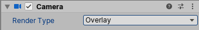

# Render Type

There are two types of Camera in the Universal Render Pipeline (URP):

* A [Base Camera](#base-camera) is a general purpose Camera that renders to a render target (a screen, or a [Render Texture](https://docs.unity3d.com/Manual/class-RenderTexture.html)).
* An [Overlay Camera](#overlay-camera) renders on top of another Camera's output. You can combine the output of a Base Camera with the output of one or more Overlay Cameras. This is called [Camera stacking](camera-stacking.md).

Use a Camera’s **Render Type** property to make it a Base Camera or an Overlay Camera.

To change the type of a Camera in the Unity Editor:

1. Create or select a Camera in your scene.

2. In the Camera Inspector, use the **Render Type** drop-down menu to select a different type of Camera. Select either:

    * **Base** to change the Camera to a Base Camera

    * **Overlay** to change the Camera to an Overlay Camera



You can change a Camera’s type in a script, by setting the `renderType` property of the Camera's [Universal Additional Camera Data](xref:UnityEngine.Rendering.Universal.UniversalAdditionalCameraData) component, like this:

```
var cameraData = camera.GetUniversalAdditionalCameraData();
cameraData.renderType = CameraRenderType.Base;
```

## <a name="base-camera"></a>Base Camera

Base Camera is the default type of Camera in URP. A Base Camera is a general purpose Camera that renders to a given render target.

To render anything in URP, you must have at least one Base Camera in your scene. You can have multiple Base Cameras in a scene. You can use a Base Camera on its own, or you can use it in a [Camera stack](camera-stacking.md). For more information on working with multiple Cameras in URP, refer to [Working with multiple cameras](cameras-multiple.md).

When you have an active Base Camera in your scene, this icon appears next to the Camera Gizmo in the Scene view:


For information on the properties that Unity exposes in the Inspector for a Base Camera, refer to the [Camera component reference](camera-component-reference.md).

<a name="overlay-camera"></a>

## Overlay Camera

An Overlay Camera is a Camera that renders its view on top of another Camera's output. You can use Overlay Cameras to create effects such as 3D objects in a 2D UI, or a cockpit in a vehicle.

You must use Overlay Cameras in conjunction with one or more Base Cameras using the [Camera Stacking](camera-stacking.md) system. You cannot use Overlay Cameras on their own. An Overlay Camera that is not part of a Camera Stack does not perform any steps of its render loop, and is known as an orphan Camera.

> **Note**: In this version of URP, Overlay Cameras and Camera Stacking are supported only when using the Universal Renderer.

When you have an active Overlay Camera in your scene, this icon appears next to the Camera Gizmo in the Scene view:


The Base Camera in a Camera Stack determines most of the properties of the Camera Stack. Because you can only use Overlay Cameras in a Camera Stack, URP uses only the following properties of an Overlay Camera when rendering the scene:

* Projection
* FOV Axis
* Field of View
* Physical Camera properties
* Clipping plans
* Renderer
* Clear Depth
* Render Shadows
* Culling Mask
* Occlusion Culling

Unity hides all of the other unused properties in the Inspector. You can access unused properties using a script, but any changes you make to these unused properties will not affect the visual output of any Camera Stacks that use the Overlay Camera.

You cannot apply post-processing to an individual Overlay Camera. You can apply post-processing to an individual Base Camera, or to a Camera Stack.

For information on the properties that Unity exposes in the Inspector of an Overlay Camera, refer to the [Camera component reference](camera-component-reference.md).
