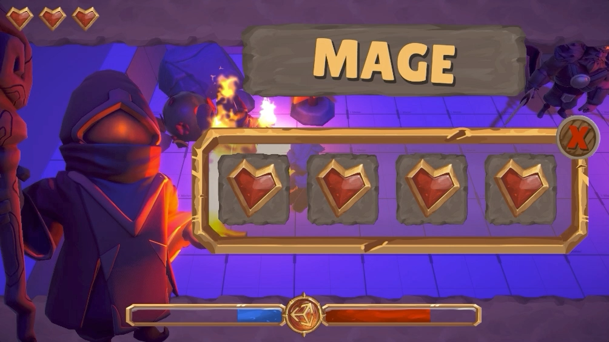

# Use multiple cameras

In the Universal Render Pipeline (URP), you can use multiple cameras to work with multiple camera outputs and targets, as well as different output resolutions and post-processing effects.

> [!NOTE]
> If you use multiple cameras, it might make rendering slower. An active camera runs through the entire rendering loop even if it renders nothing.

 *An example of the effect camera stacking can produce in URP.*

You can combine these ways of working for more complex effects. For example, you can define two camera stacks, and then set each of those to camera stacks that render to a different area of the same render target.

For information on Camera rendering order when working with multiple Cameras, refer to [Understand camera render order](cameras-advanced.md).

| Page | Description |
|-|-|
| [Understand camera stacking](cameras/camera-stacking-concepts.md)| Learn the fundamental concepts of camera stacking. |
| [Set up a camera stack](camera-stacking.md)| Stack cameras to layer the outputs of multiple cameras into a single combined output. |
| [Add and remove cameras in a camera stack](cameras/add-and-remove-cameras-in-a-stack.md)| Add, remove, and reorder cameras within a camera stack. |
| [Set up split-screen rendering](rendering-to-the-same-render-target.md) | Render multiple camera outputs to a single render target to create effects such as split screen rendering. |
| [Render a camera's output to a Render Texture](rendering-to-a-render-texture.md) | Render to a Render Texture to create effects such as in-game CCTV monitors. |
