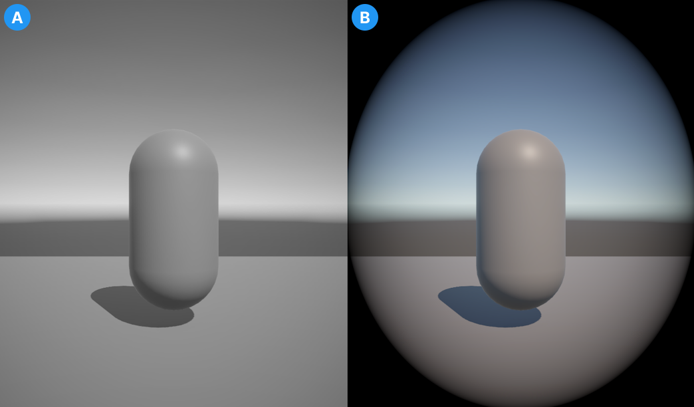

# Apply different post processing effects to separate cameras

In the Universal Render Pipeline (URP) you can apply separate post processing effects to different cameras in the same scene.

 *The output of two cameras. Image A shows a camera with a Color Adjustment override. Image B shows the second camera with a Vignette override.*

## Set up your scene

To set up your scene for multiple post-processing effects on different cameras, use the following steps:

1. Create multiple cameras in your scene (**GameObject** > **Camera**).
2. Enable **Post Processing** on each camera.
3. Create an empty GameObject for each separate post-processing effect you want.
4. Add a volume component to each empty GameObject. To do this, select the GameObject and in the Inspector window select **Add Component** > **Volume**.
5. Create a volume profile for each empty GameObject. In the GameObject's **Volume** component, go to the **Profile** property and select **New**.
6. Create new layer for each post-processing effect. For more information, refer to [Layers](xref:Layers).

## Apply different post processing effects to each camera

With the scene set up, the following steps show how to create and apply a post-processing effect to each camera in the scene.

1. Select one of the GameObjects with a volume component and select **Add Override**.
2. Choose a [post-processing effect](../EffectList.md) from the dropdown.
3. Select the **Layer** dropdown and choose one of the layers created when you set up the scene.
4. Select the camera you want to apply this effect to.
5. In the Inspector window, go to **Environment** > **Volume Mask** and select the same layer that you chose for the GameObject.
6. Repeat steps 1-5 for each GameObject and Camera pair that your scene requires.

    > [!NOTE]
    > Some effects apply to all cameras in a scene by default. As a result of this, you might need to add the same effect to each volume. This overrides the effects from other volumes on individual cameras with the new values that you set.

Each camera now applies post-processing as assigned to it by the GameObject on the same layer as it's volume mask.

> [!NOTE]
> The Scene Camera might display some post-processing effects from the Default layer. To avoid this and create a clear view of your scene, open the Effects dropdown in the View options overlay in the Scene view and turn off **Post Processing**.
