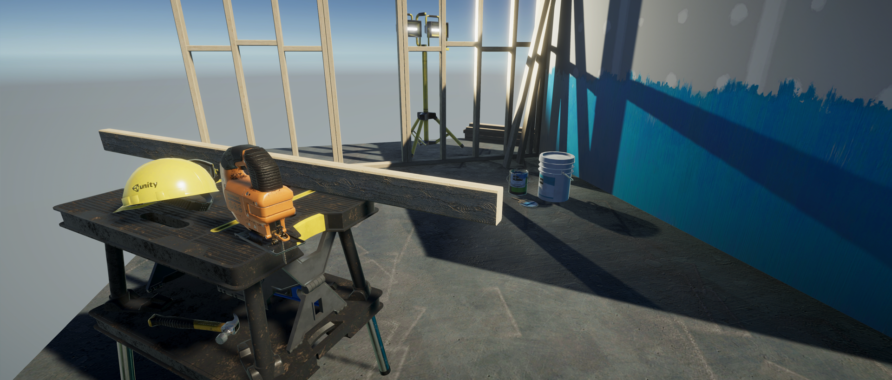

# Using the Universal Render Pipeline in a new Project

If you want to use the Universal Render Pipeline (URP) in a new Project, you can create a new Project using a Template.

To create a URP Project using a Template:

1. Open the Unity Hub.
2. On the Home page, click **New** to start a new Project. The Templates popup appears.
3. Select the Universal Render Pipeline Template.
4. Click **Create**. Unity creates a new Project for you. The new Project has URP installed and configured, and includes some example content that demonstrates URP's functionality.
5. In the Project window, navigate to the _Assets_ folder, and select the **Readme** Asset. Unity will show information about the Project in the Inspector window.
