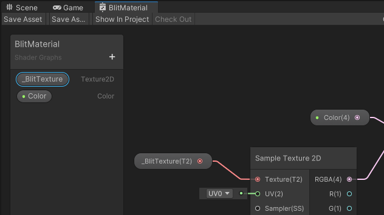

# Blit Camera color texture to RTHandle

This page describes the operation of blitting a camera color texture to an output texture, and setting the output texture as a global property. The shaders in the Scene use the global texture.
The description uses the [BlitToRTHandle](../package-sample-urp-package-samples.md#renderer-features) scene from the URP package samples.

The code samples on the page are from the following Scene from the [URP Package Samples](../package-sample-urp-package-samples.md):

    * Assets > Samples > Universal RP > 14.0.9 > URP Package Samples > RendererFeatures > BlitToRTHandle

The sample Scene uses the following assets to perform the blit operation:

* A [scriptable Renderer Feature](xref:UnityEngine.Rendering.Universal.ScriptableRendererFeature) that enqueues a [render pass](xref:UnityEngine.Rendering.Universal.ScriptableRenderPass) for execution.

* A [render pass](xref:UnityEngine.Rendering.Universal.ScriptableRenderPass) that blits a camera color texture to an output texture, and sets the output texture as a global property.

Import [URP Package Samples](../package-sample-urp-package-samples.md) to access the complete source code and the Scene.

For general information on the blit operation, refer to [URP blit best practices](../customize/blit-overview.md).

## Define RTHandles in a render pass

The [ScriptableRenderPass](xref:UnityEngine.Rendering.Universal.ScriptableRenderPass) in the sample implementation defines the `RTHandle` variables for storing the input and the output textures.

```C#
private RTHandle m_InputHandle;
private RTHandle m_OutputHandle;
```

## Configure the input and output textures

This section describes how the sample uses the `RTHandle` variables to configure the input and output textures.

### Input texture

In this example, the [Renderer Feature](xref:UnityEngine.Rendering.Universal.ScriptableRendererFeature) uses the `SetInput` method in the render pass to set the input texture:

```C#
public void SetInput(RTHandle src)
{
    // The Renderer Feature uses this variable to set the input RTHandle.
    m_InputHandle = src;
}
```

The Renderer Feature calls the `SetInput` method in the `SetupRenderPasses` method:

```C#
public override void SetupRenderPasses(ScriptableRenderer renderer, in RenderingData renderingData)
{
    if (renderingData.cameraData.cameraType != CameraType.Game)
        return;
    
    m_CopyColorPass.SetInput(renderer.cameraColorTargetHandle);
}
```

> [!NOTE]
> To set the `m_InputHandle` variable directly in the render pass, without calling the `SetInput` method, use the following code in the `Execute` method:
> ```C#
> m_InputHandle = renderingData.cameraData.renderer.cameraColorTargetHandle;
> ```

### Output texture

The `Configure` method configures the output texture for the blit operation.

The `ReAllocateIfNeeded` method creates a temporary render texture within the RTHandle system.

```C#
public override void Configure(CommandBuffer cmd, RenderTextureDescriptor cameraTextureDescriptor)
{
    // Configure the custom RTHandle
    var desc = cameraTextureDescriptor;
    desc.depthBufferBits = 0;
    desc.msaaSamples = 1;
    RenderingUtils.ReAllocateIfNeeded(ref m_OutputHandle, desc, FilterMode.Bilinear, TextureWrapMode.Clamp, name: k_OutputName );
    
    // Set the RTHandle as the output target
    ConfigureTarget(m_OutputHandle);
}
```

## Bind a source texture with the Blitter API

By default, the **Blitter** API binds a source texture with the name `_BlitTexture` in the `Blitter.BlitCameraTexture` method. The example uses this texture for the `m_InputHandle` variable.

The Shader Graph for the Material that the Renderer Feature uses contains the `_BlitTexture` property:

<br/>*_BlitTexture property in Shader Graph*

> [!NOTE]
> In this particular example, you can achieve the same effect by using the **URP Sample Buffer** node instead of the **Sample Texture 2D** node. In the **URP Sample Buffer** node, set **Source Buffer** to `BlitSource`, and the input value to `Default`.

> [!NOTE]
> If you want to perform a direct copy of the input texture without applying any effects, it's not necessary to provide a Material as a parameter to the `BlitCameraTexture` method. You can use the following code instead of the `Blitter.BlitCameraTexture` line in the sample:
> ```C#
> Blitter.BlitCameraTexture(cmd, m_InputHandle, m_OutputHandle, 0, true);
> ```

Refer to the following page for more information on the **Blitter** API: [UnityEngine.Rendering.Blitter](xref:UnityEngine.Rendering.Blitter).

## Perform the blit operation

In the render pass, the `BlitCameraTexture` method from the [Blitter API](xref:UnityEngine.Rendering.Blitter) performs the blit operation.

```C#
using (new ProfilingScope(cmd, m_ProfilingSampler))
{
    // Blit the input RTHandle to the output one
    Blitter.BlitCameraTexture(cmd, m_InputHandle, m_OutputHandle, m_Material, 0);

    // Make the output texture available for the shaders in the scene
    cmd.SetGlobalTexture(m_OutputId, m_OutputHandle.nameID);
}
```

## Additional resources

* [Perform a full screen blit in URP](../renderer-features/how-to-fullscreen-blit.md)

    This page describes a basic blit operation and provides a complete step-by-step description of the implementation.

* [Blit multiple RTHandle textures and draw them on the screen](blit-multiple-rthandles.md)

    This page describes a more complex blit operation that uses multiple textures defined as `RTHandle`.