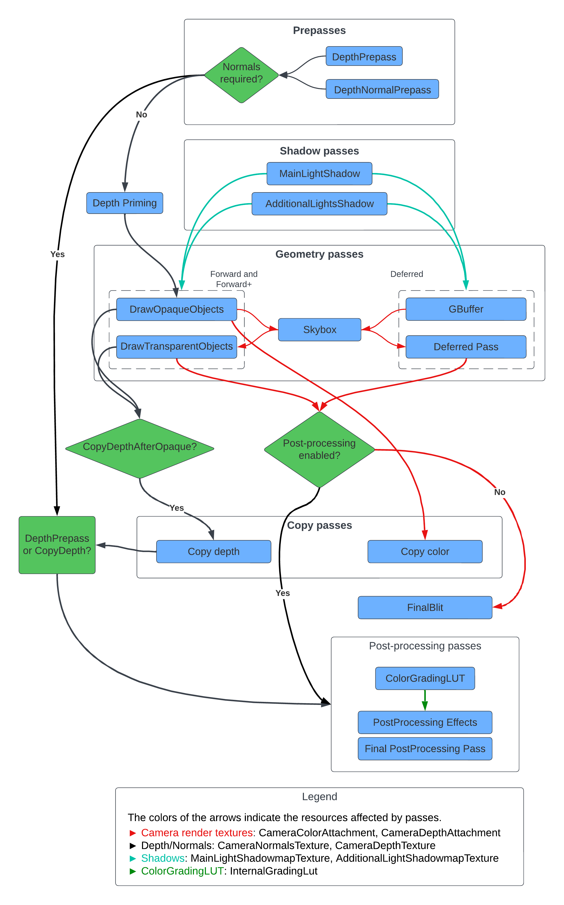

# Injection points

URP contains multiple injection points that let you inject render passes into the frame rendering loop and execute them upon different events.

Injection points give a custom render pass access to URP buffers. A render pass has read and write access to all buffers at each injection point.

Unity provides the following events in the rendering loop. You can use these events to inject your custom passes.

| **Injection point** | **Description** |
|---------------------|-----------------|
| BeforeRendering | Executes a `ScriptableRenderPass` instance before rendering any other passes in the pipeline for the current Camera. Camera matrices and stereo rendering are not setup at this point. You can use this injection point to draw to custom input textures used later in the pipeline, for example, LUT textures. |
| BeforeRenderingShadows | Executes a `ScriptableRenderPass` instance before rendering shadow maps (**MainLightShadow**, **AdditionalLightsShadow** passes). Camera matrices and stereo rendering are not set up at this point. |
| AfterRenderingShadows | Executes a `ScriptableRenderPass` instance after rendering shadow maps (**MainLightShadow**, **AdditionalLightsShadow** passes). Camera matrices and stereo rendering are not set up this point. |
| BeforeRenderingPrePasses | Executes a `ScriptableRenderPass` instance before rendering prepasses (**DepthPrepass**, **DepthNormalPrepass** passes). Camera matrices and stereo rendering are already set up at this point. |
| AfterRenderingPrePasses | Executes a `ScriptableRenderPass` instance after rendering prepasses (**DepthPrepass**, **DepthNormalPrepass** passes). Camera matrices and stereo rendering are set up at this point. |
| BeforeRenderingGbuffer | Executes a `ScriptableRenderPass` instance before rendering the **GBuffer** pass. |
| AfterRenderingGbuffer | Executes a `ScriptableRenderPass` instance after rendering the **GBuffer** pass. |
| BeforeRenderingDeferredLights | Executes a `ScriptableRenderPass` instance before rendering the **Deferred** pass. |
| AfterRenderingDeferredLights | Executes a `ScriptableRenderPass` instance after rendering the **Deferred** pass. |
| BeforeRenderingOpaques | Executes a `ScriptableRenderPass` instance before rendering opaque objects (**DrawOpaqueObjects** pass). |
| AfterRenderingOpaques | Executes a `ScriptableRenderPass` instance after rendering opaque objects (**DrawOpaqueObjects** pass). |
| BeforeRenderingSkybox | Executes a `ScriptableRenderPass` instance before rendering the skybox (**Camera.RenderSkybox** pass). |
| AfterRenderingSkybox | Executes a `ScriptableRenderPass` instance after rendering the skybox (**Camera.RenderSkybox** pass). |
| BeforeRenderingTransparents | Executes a `ScriptableRenderPass` instance before rendering transparent objects (**DrawTransparentObjects** pass). |
| AfterRenderingTransparents | Executes a `ScriptableRenderPass` instance after rendering transparent objects (**DrawTransparentObjects** pass). |
| BeforeRenderingPostProcessing | Executes a `ScriptableRenderPass` instance before rendering post-processing effects (**Render PostProcessing Effects** pass). |
| AfterRenderingPostProcessing | Executes a `ScriptableRenderPass` instance after rendering post-processing effects but before the final blit, post-processing anti-aliasing effects, and color grading. |
| AfterRendering | Executes `ScriptableRenderPass` instance after rendering all other passes. |

The following diagram shows the passes and the flow of frame resources in a URP frame:

