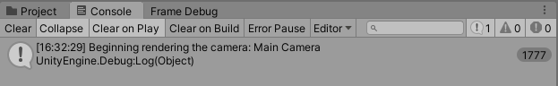
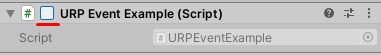

# Inject a render pass via scripting

Unity raises a [beginCameraRendering](https://docs.unity3d.com/ScriptReference/Rendering.RenderPipelineManager-beginCameraRendering.html) event before it renders each active Camera in every frame. If a Camera is inactive (for example, if the **Camera** component checkbox is cleared on a Camera GameObject), Unity does not raise a `beginCameraRendering` event for this Camera.

When you subscribe a method to this event, you can execute custom logic before Unity renders the Camera. Examples of custom logic include rendering extra Cameras to Render Textures, and using those Textures for effects like planar reflections or surveillance camera views.

Other events in the [RenderPipelineManager](https://docs.unity3d.com/ScriptReference/Rendering.RenderPipelineManager.html) class provide more ways to customize URP. You can also use the principles described in this article with those events.

## Use the RenderPipelineManager API

1. Subscribe a method to one of the events in the [RenderPipelineManager](https://docs.unity3d.com/ScriptReference/Rendering.RenderPipelineManager.html) class.

2. In the subscribed method, use the `EnqueuePass` method of a `ScriptableRenderer` instance to inject a custom render pass into the URP frame rendering.

Example code:

```C#
public class EnqueuePass : MonoBehaviour
{
    [SerializeField] private BlurSettings settings;    
    private BlurRenderPass blurRenderPass;

    private void OnEnable()
    {
        ...
        blurRenderPass = new BlurRenderPass(settings);
        // Subscribe the OnBeginCamera method to the beginCameraRendering event.
        RenderPipelineManager.beginCameraRendering += OnBeginCamera;
    }

    private void OnDisable()
    {
        RenderPipelineManager.beginCameraRendering -= OnBeginCamera;
        blurRenderPass.Dispose();
        ...
    }

    private void OnBeginCamera(ScriptableRenderContext context, Camera cam)
    {
        ...
        // Use the EnqueuePass method to inject a custom render pass
        cam.GetUniversalAdditionalCameraData()
            .scriptableRenderer.EnqueuePass(blurRenderPass);
    }
}
```

## Example

This example demonstrates how to subscribe a method to the `beginCameraRendering` event.

To follow the steps in this example, create a [new Unity project using the **Universal Project Template**](../creating-a-new-project-with-urp.md)

1. In the scene, create a Cube. Name it Example Cube.
2. In your Project, create a C# script. Call it `URPCallbackExample`.
3. Copy and paste the following code into the script.
    ```C#
    using UnityEngine;
    using UnityEngine.Rendering;

    public class URPCallbackExample : MonoBehaviour
    {
        // Unity calls this method automatically when it enables this component
        private void OnEnable()
        {
            // Add WriteLogMessage as a delegate of the RenderPipelineManager.beginCameraRendering event
            RenderPipelineManager.beginCameraRendering += WriteLogMessage;
        }

        // Unity calls this method automatically when it disables this component
        private void OnDisable()
        {
            // Remove WriteLogMessage as a delegate of the  RenderPipelineManager.beginCameraRendering event
            RenderPipelineManager.beginCameraRendering -= WriteLogMessage;
        }

        // When this method is a delegate of RenderPipeline.beginCameraRendering event, Unity calls this method every time it raises the beginCameraRendering event
        void WriteLogMessage(ScriptableRenderContext context, Camera camera)
        {
            // Write text to the console
            Debug.Log($"Beginning rendering the camera: {camera.name}");
        }
    }
    ```
    > **Note**: When you subscribe to an event, your handler method (in this example, `WriteLogMessage`) must accept the parameters defined in the event delegate. In this example, the event delegate is `RenderPipeline.BeginCameraRendering`, which expects the following parameters: `<ScriptableRenderContext, Camera>`.

4. Attach the `URPCallbackExample` script to Example Cube.

5. Select **Play**. Unity prints the message from the script in the Console window each time Unity raises the `beginCameraRendering` event.

    

6. To raise a call to the `OnDisable()` method: In the Play mode, select Example Cube and clear the checkbox next to the script component title. Unity unsubscribes `WriteLogMessage` from the `RenderPipelineManager.beginCameraRendering` event and stops printing the message in the Console window.

    
