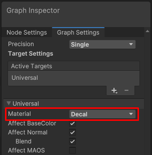
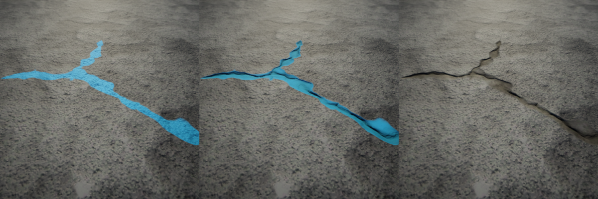

# Decal Shader Graph

The [Decal Projector](renderer-feature-decal.md#decal-projector-component) component can project a Material as a decal if the Material uses a Shader Graph with the Decal Material type.

 *Shader Graph with the Decal Material type*

URP contains the pre-built Decal Shader (`Shader Graphs/Decal`).

 *Decal Material properties and advanced options.*

You can assign a Material that uses a Decal Shader Graph to a GameObject directly. For example, you can [use a Quad as the Decal GameObject](renderer-feature-decal.md#decal-gameobject).

The pre-built Decal Shader has the following properties:

* **Base Map**: the Base texture of the Material.

* **Normal Map**: the normal texture of the Material.

* **Normal Blend**: this property defines the proportion in which the the normal texture selected in the Normal Map property blends with the normal map of the Material that the decal is projected on. 0: the decal does not affect the Material it's projected on. 1: the normal map of the decal replaces the normal map of the Material it's projected on.

You can [create your own Shader Graphs](#create-decal-shaders) that render decals in a way that suits your project best.

The Decal Material properties above are defined in the pre-built Shader Graph. Custom decal Material properties depend on a custom Shader Graph.

The following table describes the properties in the **Advanced Options** section. These properties are common for all decal shaders.

| **Property** | **Description** |
|---|---|
| **Enable GPU&#160;Instancing** | Enabling this option lets URP render meshes with the same geometry and Material in one batch, when possible. This makes rendering faster. URP cannot render Meshes in one batch if they have different Materials or if the hardware does not support GPU instancing. |
| **Priority** | This property defines the order in which URP draws decals in the scene. URP draws decals with lower Priority values first, and draws decals with higher Priority values on top of those with lower values.  If there are multiple Decal Materials with the same **Priority** in the scene, URP renders them in the order in which the Materials were created. |
| **Mesh Bias Type**  | Select the Mesh bias type. The Mesh bias lets you prevent z-fighting between the Decal GameObject and the GameObject it overlaps. This property is only applicable for GameObjects with a [Decal Material type assigned directly](renderer-feature-decal.md#decal-gameobject). |
| _View Bias_         | A world-space bias (in meters). When drawing the Decal GameObject, Unity shifts each pixel of the GameObject by this value along the view vector. A positive value shifts pixels closer to the Camera, so that Unity draws the Decal GameObject on top of the overlapping Mesh, which prevents z-fighting. Decal Projectors ignore this property. |
| _Depth Bias_        | When drawing the Decal GameObject, Unity changes the depth value of each pixel of the GameObject by this value. A negative value shifts pixels closer to the Camera, so that Unity draws the Decal GameObject on top of the overlapping Mesh, which prevents z-fighting. Decal Projectors ignore this property. |

## Create custom Decal shaders

The pre-built `Shader Graphs/Decal` shader serves as a simple example. You can create your own decal shaders that render decals in a way that suits your project best.

To create a custom decal Shader Graph, select the **Decal** value in Material property of the shader target.

Enabling one of the following properties override the equivalent Lit Shader property on the surface of the Material.

| **Property** | **Description** |
|---|---|
| **Affect&#160;BaseColor** | When enabled, the shader affects the base color. Most decals make use of this option. An exception is a surface damage effect, were you might want to manipulate other properties, such as normals.  *From left to right: shader affecting only the color, affecting all properties, affecting all properties but color.*|
| **Affect Normal** | When enabled, the shader affects normals. Use cases:  adding damage effects to materials, for example, bullet holes or cracks. Use the **Blend** property to blend the normals of the decal with the normals of the surface it's projected to. If the **Blend** property is disabled, the decal overrides the normals all over the surface it's projected to.  *From left to right: Affect Normal is off; Affect Normal is on, Blend is off; Affect Normal and Blend are on.* |
| **Affect MAOS** | MOAS stands for Metallic, Ambient Occlusion, and Smoothness. These properties are grouped together to save memory. You can change values of each property separately in the shader, but all properties are blended with a single common alpha value. Use cases: Override smoothness to highlight puddles or wet paint. Override metallic values with lower values to render rust. Override AO to give the decal more depth.  *Left: the decal does not affect MAOS. Right: the decal affects MAOS.* |
| **Affect&#160;Emission** | Use cases: you can affect the emission values to make surfaces seem like they are emitting light, or to make surfaces seem like they are being lit by light.   *Left: Affect Emission is off. Right: Affect Emission is on.*|

To improve performance, pack data for different surface properties into a single texture. This way the shader performs fewer samples and Unity stores fewer textures.

For example, the following Shader Graph uses a normal map and a mask map to drive all properties in the shader. This decal is used for the damaged tarmac effect, and a hardcoded roughness value of 0 suites the use case.

The shader samples the mask and uses the color for setting the Ambient Occlusion values (Red channel), smoothness values (Green channel), Emission intensity values (Blue channel), and alpha values for the entire decal. Decals are often blended using single alpha values for all properties. The following image shows the mask map for the example tarmac cracks: 
 *Example of mask map that packs Ambient Occlusion, Smoothness, Emission, and alpha values of a decal atlas into a single texture.*
