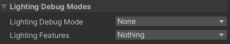
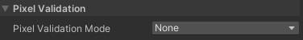

# Rendering Debugger

The **Rendering Debugger** window lets you visualize various lighting, rendering, and Material properties. The visualizations help you identify rendering issues and optimize Scenes and rendering configurations.

This section contains the following topics:

* [How to access the Rendering Debugger window](#how-to-access).

    Information on how to access the **Rendering Debugger** window in the Editor, in the Play mode, and at runtime in Development builds.

* [Rendering Debugger window sections](#ui-sections)

    Descriptions of the elements and properties in the **Rendering Debugger** window.

* [Navigation at runtime](#navigation-at-runtime)

    How to navigate the **Rendering Debugger** interface at runtime.

## How to access the Rendering Debugger window

The Rendering Debugger window is available in the following modes:

* The Editor.

* The Play mode.

* At runtime in the standalone Unity Player, on any device. The window is only available in **Development builds**.

To enable all the sections of the **Rendering Debugger** in your built application, disable **Strip Debug Variants** in **Project Settings > Graphics > URP Global Settings**. Otherwise you can only use the [Display Stats](#display-stats) section.

Use one of the following options to open the **Rendering Debugger** window.

**In the Editor**:

* Select **Window > Analysis > Rendering Debugger**.

* Press **Ctrl+Backspace** (**Ctrl+Delete** on macOS).

**In the Play mode or at runtime in a Development build**:

* On a desktop or laptop computer, press **LeftCtrl+Backspace** (**LeftCtrl+Delete** on macOS).

* On a console controller, press L3 and R3 (Left Stick and Right Stick).

* On a mobile device, use a three-finger double tap.

You can disable the runtime UI using the [enableRuntimeUI](https://docs.unity3d.com/Packages/com.unity.render-pipelines.core@14.0/api/UnityEngine.Rendering.DebugManager.html#UnityEngine_Rendering_DebugManager_enableRuntimeUI) property.

## Rendering Debugger window sections

The **Rendering Debugger** window contains the following sections:

* [Display Stats](#display-stats)

* [Frequently Used](#frequently-used)

* [Material](#material)

* [Lighting](#lighting)

* [Rendering](#rendering)

The following illustration shows the Rendering Debugger window in the Scene view.

### Display Stats

The **Display Stats** panel shows statistics relevant to debugging performance issues in your project. You can only view this section of the Rendering Debugger in Play mode.

Use the [runtime shortcuts](#Navigation at runtime) to open the Display stats window in the scene view at runtime. 

### Frame Stats

The Frame Stats section displays the average, minimum, and maximum value of each property. HDRP calculates each Frame Stat value over the 30 most recent frames.

| **Property**                 | **Description**                                              |
| ---------------------------- | ------------------------------------------------------------ |
| **Frame Rate**               | The frame rate (in frames per second) for the current camera view. |
| **Frame Time**               | The total frame time for the current camera view.            |
| **CPU Main Thread Frame**    | The total time (in milliseconds) between the start of the frame and the time when the Main Thread finished the job. |
| **CPU  Render Thread Frame** | The time (in milliseconds) between the start of the work on the Render Thread and the time Unity waits to render the present frame ([Gfx.PresentFrame](https://docs.unity3d.com/2022.1/Documentation/Manual/profiler-markers.html)). |
| **CPU Present Wait**         | The time (in milliseconds) that the CPU spent waiting for Unity to render the present frame ([Gfx.PresentFrame](https://docs.unity3d.com/2022.1/Documentation/Manual/profiler-markers.html)) during the last frame. |
| **GPU Frame**                | The amount of time (in milliseconds) the GPU takes to render a given frame. |
| **Debug XR Layout**          | Display debug information for XR passes.  This mode is only available in editor and development builds. |

### Bottlenecks

A bottleneck is a condition that occurs when one process performs significantly slower than other components, and other components depend on it. 

The **Bottlenecks** section describes the distribution of the last 60 frames across the CPU and GPU. You can only see the Bottleneck information when you build your player on a device. 

**Note**: Vsync limits the **Frame Rate** based on the refresh rate of your device’s screen. This means when you enable Vsync, the **Present Limited** category is 100% in most cases. To turn Vsync off, go to **Edit** > **Project settings** > **Quality** > **Current Active Quality Level** and set the **Vsync Count** set to **Don't Sync**.

#### Bottleneck categories

| **Category**        | **Description**                                              |
| ------------------- | ------------------------------------------------------------ |
| **CPU**             | The percentage of the last 60 frames in which the CPU limited the frame time. |
| **GPU**             | The percentage of the last 60 frames in which the GPU limited the frame time. |
| **Present limited** | The percentage of the last 60 frames in which the frame time was limited by the following presentation constraints: &bull; Vertical Sync (Vsync): Vsync synchronizes rendering to the refresh rate of your display. &bull;[Target framerate]([Application.targetFrameRate](https://docs.unity3d.com/ScriptReference/Application-targetFrameRate.html)): A function that you can use to manually limit the frame rate of an application. If a frame is ready before the time you specify in targetFrameRate, Unity waits before presenting the frame. |
| **Balanced**        | This percentage of the last 60 frames in which the frame time was not limited by any of the above categories. A frame that is 100% balanced indicates the processing time for both CPU and GPU is approximately equal. |

#### Bottleneck example

If Vsync limited 20 of the 60 most recent frames, the Bottleneck section might appear as follows: 

- **CPU** 0.0%: This indicates that HDRP did not render any of the last 60 frames on the CPU.
- **GPU** 66.6%: This indicates that the GPU limited 66.6% of the 60 most recent frames rendered by HDRP.
- **Present Limited** 33.3%: This indicates that presentation constraints (Vsync or the [target framerate](https://docs.unity3d.com/ScriptReference/Application-targetFrameRate.html)) limited 33.3% of the last 60 frames.
- **Balanced** 0.0%: This indicates that in the last 60 frames, there were 0 frames where the CPU processing time and GPU processing time were the same.

In this example, the bottleneck is the GPU.

### Detailed Stats

The Detailed Stats section displays the amount of time in milliseconds that each rendering step takes on the CPU and GPU. HDRP updates these values once every frame based on the previous frame. 

| **Property**                     | **Description**                                              |
| -------------------------------- | ------------------------------------------------------------ |
| Update every second with average | Calculate average values over one second and update every second. |
| Hide empty scopes                | Hide profiling scopes that use 0.00ms of processing time on the CPU and GPU. |
| Debug XR Layout                  | Enable to display debug information for [XR](https://docs.unity3d.com/Manual/XR.html) passes. This mode only appears in the editor and development builds. |

### Frequently Used

This section contains a selection of properties that users use often. The properties are from the other sections in the Rendering Debugger window. For information about the properties, see the sections [Material](#material), [Lighting](#lighting), and [Rendering](#rendering).

### Material

The properties in this section let you visualize different Material properties.

 *Rendering Debugger, Material section*

#### Material Filters

| **Property** | **Description** |
| --- | --- |
| **Material&#160;Override** | Select a Material property to visualize on every GameObject on screen. The available options are:<ul><li>Albedo</li><li>Specular</li><li>Alpha</li><li>Smoothness</li><li>AmbientOcclusion</li><li>Emission</li><li>NormalWorldSpace</li><li>NormalTangentSpace</li><li>LightingComplexity</li><li>Metallic</li><li>SpriteMask</li></ul>With the **LightingComplexity** value selected, Unity shows how many Lights affect areas of the screen space. |
| **Vertex&#160;Attribute** | Select a vertex attribute of GameObjects to visualize on screen. The available options are:<ul><li>Texcoord0</li><li>Texcoord1</li><li>Texcoord2</li><li>Texcoord3</li><li>Color</li><li>Tangent</li><li>Normal</li></ul> |

#### Material Validation

| **Property** | **Description** |
| --- | --- |
| **Material&#160;Validation Mode** | Select which Material properties to visualize: Albedo, or Metallic. Selecting one of the properties shows the new context menu. |
| &#160;&#160;&#160;&#160;**Validation&#160;Mode:&#160;Albedo** | Selecting **Albedo** in the Material&#160;Validation Mode property shows the **Albedo Settings** section with the following properties: **Validation&#160;Preset**: Select a pre-configured material, or Default Luminance to visualize luminance ranges. **Min Luminance**: Unity draws pixels where the luminance is lower than this value with red color. **Max Luminance**: Unity draws pixels where the luminance is higher than this value with blue color. **Hue Tolerance**: available only when you select a pre-set material. Unity adds the hue tolerance to the minimum and maximum luminance values. **Saturation Tolerance**: available only when you select a pre-set material. Unity adds the saturation tolerance to the minimum and maximum luminance values. |
| &#160;&#160;&#160;&#160;**Validation&#160;Mode:&#160;Metallic** | Selecting **Metallic** in the Material&#160;Validation Mode property shows the **Metallic Settings** section with the following properties: **Min Value**: Unity draws pixels where the metallic value is lower than this value with red color. **Max Value**: Unity draws pixels where the metallic value is higher than this value with blue color. |

### Lighting

The properties in this section let you visualize different settings and elements related to the lighting system, such as shadow cascades, reflections, contributions of the Main and the Additional Lights, and so on.

#### Lighting Debug Modes

 *The Lighting Debug Modes subsection.*

| **Property**            | **Description**                                              |
| ----------------------- | ------------------------------------------------------------ |
| **Lighting Debug Mode** | Specifies which lighting and shadow information to overlay on-screen to debug. The options are:<ul><li>**None**: Renders the scene normally without a debug overlay.</li><li>**Shadow Cascades**: Overlays shadow cascade information so you can see which shadow cascade each pixel uses. Use this to debug shadow cascade distances. For information on which color represents which shadow cascade, see the [Shadows section of the URP Asset](../universalrp-asset.md#shadows).</li><li>**Lighting Without Normal Maps**: Renders the scene to visualize lighting. This mode uses neutral materials and disables normal maps. This and the **Lighting With Normal Maps** mode are useful for debugging lighting issues caused by normal maps.</li><li>**Lighting With Normal Maps**: Renders the scene to visualize lighting. This mode uses neutral materials and allows normal maps.</li><li>**Reflections**: Renders the scene to visualize reflections. This mode applies perfectly smooth, reflective materials to every Mesh Renderer.</li><li>**Reflections With Smoothness**: Renders the scene to visualize reflections. This mode applies reflective materials without an overridden smoothness to every GameObject.</li></ul> |
| **Lighting Features**   | Specifies flags for which lighting features contribute to the final lighting result. Use this to view and debug specific lighting features in your scene. The options are:<ul><li>**Nothing**: Shortcut to disable all flags.</li><li>**Everything**: Shortcut to enable all flags.</li><li>**Global Illumination**: Indicates whether to render [global illumination](https://docs.unity3d.com/Manual/realtime-gi-using-enlighten.html).</li><li>**Main Light**: Indicates whether the main directional [Light](../light-component.md) contributes to lighting.</li><li>**Additional Lights**: Indicates whether lights other than the main directional light contribute to lighting.</li><li>**Vertex Lighting**: Indicates whether additional lights that use per-vertex lighting contribute to lighting.</li><li>**Emission**: Indicates whether [emissive](https://docs.unity3d.com/Manual/StandardShaderMaterialParameterEmission.html) materials contribute to lighting.</li><li>**Ambient Occlusion**: Indicates whether [ambient occlusion](../post-processing-ssao.md) contributes to lighting.</li></ul> |

### Rendering

The properties in this section let you visualize different rendering features.

#### Rendering Debug

 *The Rendering Debug subsection.*

| **Property**                   | **Description**                                              |
| ------------------------------ | ------------------------------------------------------------ |
| **Map Overlays**               | Specifies which render pipeline texture to overlay on the screen. The options are:<ul><li>**None**: Renders the scene normally without a texture overlay.</li><li>**Depth**: Overlays the camera's depth texture on the screen.</li><li>**Additional Lights Shadow Map**: Overlays the [shadow map](https://docs.unity3d.com/Manual/shadow-mapping.html) that contains shadows cast by lights other than the main directional light.</li><li>**Main Light Shadow Map**: Overlays the shadow map that contains shadows cast by the main directional light.</li></ul> |
| **&nbsp;&nbsp;Map Size**       | The width and height of the overlay texture as a percentage of the view window URP displays it in. For example, a value of **50** fills up a quarter of the screen (50% of the width and 50% of the height). |
| **HDR**                        | Indicates whether to use [high dynamic range (HDR)](https://docs.unity3d.com/Manual/HDR.html) to render the scene. Enabling this property only has an effect if you enable **HDR** in your URP Asset. |
| **MSAA**                       | Indicates whether to use [Multisample Anti-aliasing (MSAA)](./../anti-aliasing.md#msaa) to render the scene. Enabling this property only has an effect if:<ul><li>You set **Anti Aliasing (MSAA)** to a value other than **Disabled** in your URP Asset.</li><li>You use the Game View. MSAA has no effect in the Scene View.</li></ul> |
| **Post-processing**            | Specifies how URP applies post-processing. The options are:<ul><li>**Disabled**: Disables post-processing.</li><li>**Auto**: Unity enables or disables post-processing depending on the currently active debug modes. If color changes from post-processing would change the meaning of a debug mode's pixel, Unity disables post-processing. If no debug modes are active, or if color changes from post-processing don't change the meaning of the active debug modes' pixels, Unity enables post-processing.</li><li>**Enabled**: Applies post-processing to the image that the camera captures.</li></ul> |
| **Additional Wireframe Modes** | Specifies whether and how to render wireframes for meshes in your scene. The options are:<ul><li>**None**: Doesn't render wireframes.</li><li>**Wireframe**: Exclusively renders edges for meshes in your scene. In this mode, you can see the wireframe for meshes through the wireframe for closer meshes.</li><li>**Solid Wireframe**: Exclusively renders edges and faces for meshes in your scene. In this mode, the faces of each wireframe mesh hide edges behind them.</li><li>**Shaded Wireframe**: Renders edges for meshes as an overlay. In this mode, Unity renders the scene in color and overlays the wireframe over the top.</li></ul> |
| **Overdraw**                   | Indicates whether to render the overdraw debug view. This is useful to see where Unity draws pixels over one other. |

#### Pixel Validation

 *The Pixel Validation subsection.*

| **Property**                     | **Description**                                              |
| -------------------------------- | ------------------------------------------------------------ |
| **Pixel Validation Mode**        | Specifies which mode Unity uses to validate pixel color values. The options are:<ul><li>**None**: Renders the scene normally and doesn't validate any pixels.</li><li>**Highlight NaN, Inf and Negative Values**: Highlights pixels that have color values that are NaN, Inf, or negative.</li><li>**Highlight Values Outside Range**: Highlights pixels that have color values outside a particular range. Use **Value Range Min** and **Value Range Max**.</li></ul> |
| **&nbsp;&nbsp;Channels**         | Specifies which value to use for the pixel value range validation. The options are:<ul><li>**RGB**: Validates the pixel using the luminance value calculated from the red, green, and blue color channels.</li><li>**R**: Validates the pixel using the value from the red color channel.</li><li>**G**: Validates the pixel using the value from the green color channel.</li><li>**B**: Validates the pixel using the value from the blue color channel.</li><li>**A**: Validates the pixel using the value from the alpha channel.</li></ul>This property only appears if you set **Pixel Validation Mode** to **Highlight Values Outside Range**. |
| **&nbsp;&nbsp; Value Range Min** | The minimum valid color value. Unity highlights color values that are less than this value.  This property only appears if you set **Pixel Validation Mode** to **Highlight Values Outside Range**. |
| **&nbsp;&nbsp; Value Range Max** | The maximum valid color value. Unity highlights color values that are greater than this value.  This property only appears if you set **Pixel Validation Mode** to **Highlight Values Outside Range**. |

## Navigation at runtime

This section describes how to navigate the **Rendering Debugger** interface at runtime.

To change the current active item:

* **Keyboard**: use the arrow keys.

* **Touch screen**: tap the arrows next to properties.

* **Xbox controller**: use the Directional pad (D-Pad).

* **PlayStation controller**: use the Directional buttons.

To change the current tab:

* **Keyboard**: use the Page up and Page down keys (Fn + Up and Fn + Down keys for MacOS).

* **Touch screen**: tap the arrows next to tab title.

* **Xbox controller**: use the Left Bumper and Right Bumper.

* **PlayStation controller**: use the L1 button and R1 button.

To display the current active item independently of the debug window:

* **Keyboard**: press the right Shift key.

* **Xbox controller**: press the X button.

* **PlayStation controller**: press the Square button.
