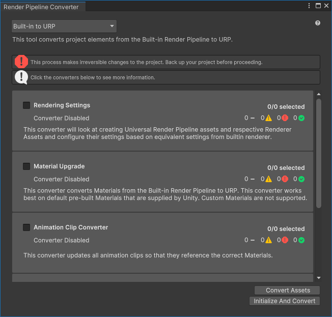
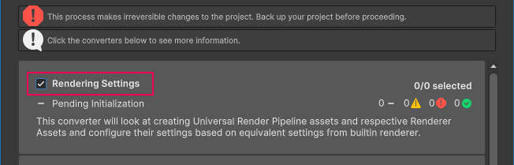
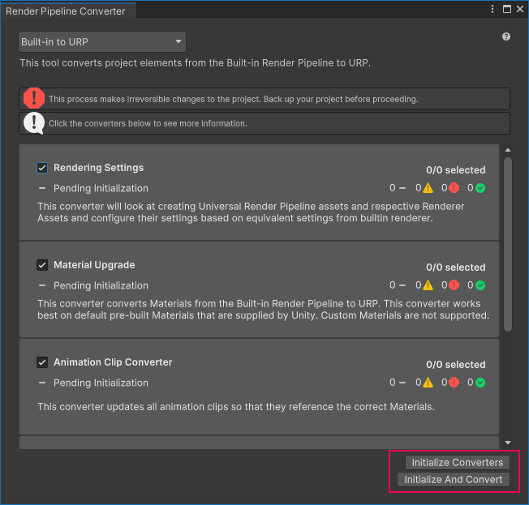

# Render Pipeline Converter

The **Render Pipeline Converter** converts assets made for a Built-in Render Pipeline project to assets compatible with URP.

> **Note**: The conversion process makes irreversible changes to the project. Back up your project before the conversion.

## How to use the Render Pipeline Converter

To convert project assets:

1. Select **Window** > **Rendering** > **Render Pipeline Converter**. Unity opens the Render Pipeline Converter window.

    

2. Select the conversion type.

    

3. Depending on the conversion type, the dialog shows the available converters. Select or clear the check boxes next to converter names to enable or disable the converters.

    

    For the list of available converters, refer to the section [Converters](#converters).

4. Click **Initialize Converters**. The Render Pipeline Converter preprocesses the assets in the project and shows the list of elements to convert. Select or clear check boxes next to assets to include or exclude them from the conversion process.

    

    The following illustration shows initialized converters.

    

    Click a converter to check the list of items that a converter is about to convert.

    

    **Yellow icon**: a yellow icon next to an element indicates that a user action might be required to run the conversion. Hover the mouse pointer over the icon to check the description of the issue.

5. Click **Convert Assets** to start the conversion process.

    > **Note**: The conversion process makes irreversible changes to the project. Back up your project before the conversion.

    When the conversion process finishes, the window shows the status of each converter.

    

    **Green check mark**: the conversion went without issues.

    **Yellow icon**: the conversion finished with warnings and might require user action.

    **Red icon**: the conversion failed.

6. Click a converter to check the list of processed items in that converter.

    

    After reviewing the converted project, close the Render Pipeline Converter window.

## <a name="converters"></a>Conversion types and converters

The Render Pipeline Converter let's you select one of the following conversion types:

* Built-in Render Pipeline to URP

* Built-in Render Pipeline 2D to URP 2D

* Upgrade 2D URP Assets

When you select on of the conversion types, the tool shows you the available converters.

The following sections describe the converters available for each conversion type.

### Built-in Render Pipeline to URP

This conversion type converts project elements from the Built-in Render Pipeline to URP.

Available converters:

* **Rendering Settings**

    This converter creates the URP Asset and Renderer assets. Then the converter evaluates the settings in the Built-in Render Pipeline project and converts them into equivalent properties in the URP assets.

* **Material Upgrade**

    This converter converts the Materials. The converter works on pre-built Materials that are supplied by Unity, it does not support Materials with custom shaders.

* **Animation Clip Converter**

    This converter converts the animation clips. It runs after the **Material Upgrade** converter finishes.

    > **Note**: This converter is available only if the project contains animations that affect the properties of Materials, or Post-processing Stack v2 properties.

* **Read-only Material Converter**

    This converter converts the pre-built read-only Materials, where the **Material Upgrade** converter cannot replace the shader. This converter indexes the project and creates a temporary `.index` file, which might take a significant time.

    Examples of read-only Materials: `Default-Diffuse`, `Default-Line`, `Dafault-Terrain-Diffuse`, etc.

* **Post-Processing Stack v2 Converter**

    This converter converts PPv2 Volumes, Profiles, and Layers to URP Volumes, Profiles, and Cameras. This converter indexes the project and creates a temporary `.index` file, which might take a significant time.

### Built-in Render Pipeline 2D to URP 2D

This conversion type converts elements of a project from Built-in Render Pipeline 2D to URP 2D.

Available converters:

* **Material and Material Reference Upgrade**

    This converter converts all Materials and Material references from Built-in Render Pipeline 2D to URP 2D.

### Upgrade 2D URP Assets

This conversion type upgrades assets of a 2D project from an earlier URP version to the current URP version.

Available converters:

* **Parametric to Freeform Light Upgrade**

    This converter converts all parametric lights to freeform lights.

# Run conversion using API or CLI

The Render Pipeline Converter implements the [Converters](xref:UnityEditor.Rendering.Universal.Converters) class with [RunInBatchMode](xref:UnityEditor.Rendering.Universal.Converters.RunInBatchMode(UnityEditor.Rendering.Universal.ConverterContainerId)) methods that let you run the conversion process from a command line.

For example, the following script initializes and executes the converters **Material Upgrade**, and **Read-only Material Converter**.

```C#
using System.Collections;
using System.Collections.Generic;
using UnityEditor;
using UnityEditor.Rendering.Universal;
using UnityEngine;

public class MyUpgradeScript : MonoBehaviour
{
    public static void ConvertBuiltinToURPMaterials()
    {
        Converters.RunInBatchMode(
            ConverterContainerId.BuiltInToURP
            , new List<ConverterId> {
                ConverterId.Material,
                ConverterId.ReadonlyMaterial
            }
            , ConverterFilter.Inclusive
        );
        EditorApplication.Exit(0);
    }
}
```

To run the example conversion from the command line, use the following command:

```
"<path to Unity application> -projectPath <project path> -batchmode -executeMethod MyUpgradeScript.ConvertBuiltinToURPMaterials
```

Also check: [Unity Editor command line arguments](https://docs.unity3d.com/Manual/EditorCommandLineArguments.html).
