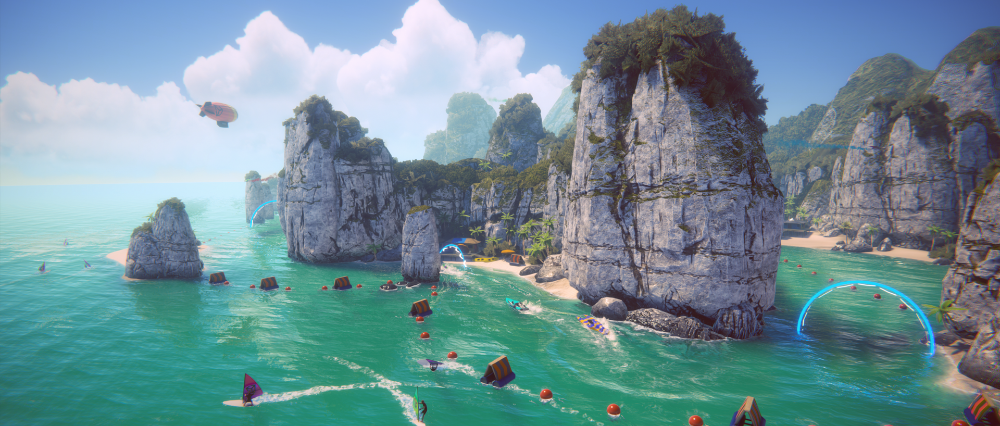

#  Universal Render Pipeline overview

The Universal Render Pipeline (URP) is a prebuilt Scriptable Render Pipeline, made by Unity. URP provides artist-friendly workflows that let you quickly and easily create optimized graphics across a range of platforms, from mobile to high-end consoles and PCs.

## Requirements

For information about requirements and compatibility, refer to the [Requirements](requirements.md) section.

## What's new in URP

For information on what's new in the latest version of URP, refer to [What's new in URP](whats-new/urp-whats-new.md).

## Getting started with URP
For information on starting a new URP Project from scratch, or about installing URP in an existing Unity Project, refer to [Getting started](InstallingAndConfiguringURP.md).

## Upgrading
For information on upgrading from a previous version of URP to the current version, or for information about upgrading from the Lightweight Render Pipeline (LWRP) to URP, refer to the [Upgrade guides](upgrade-guides.md).
